<meta charset="UTF-8">
<link rel="stylesheet" type="text/css" href="simple_turtle_tutorial.css">

# A Simple Tutorial for Python's turtle.py Module

## Table of Contents

1. [Introduction](#introduction)
1. [Examples](#examples)
1. [Beginning with turtle.py](#beginning-with-turtle.py)
1. [Moving](#moving)
1. [Drawing](#drawing)
1. [Color](#color)
1. [Filling in Shapes](#filling-in-shapes)
1. [Stamping](#stamping)
1. [Animation](#animation)
1. [Turtle Status](#turtle-status)
1. [Input](#input)
1. [Events](#events)
1. [The Turtle](#the-turtle)
1. [The World](#the-world)

## Introduction

Turtle graphics is a popular way for introducing programming to kids. Virtual turtles can be programmed to move around the screen. The turtle draws lines as it moves. The "turtle" could look like the turtle animal, an arrow, or be invisibile. The user can write turtle programs that draw beautiful shapes and learn to program at the same time.

The original Turtle software was developed by Wally Feurzig and Seymour Papert in 1966.

This tutorial only explains Python's turtle.py module. It does not explain the Python programming language.

## Quickstart

TODO - explain how to install python, run IDLE

In IDLE, click on File > New File. Then enter the following:

```python
from turtle import *

forward(100)
left(90)
forward(100)
left(90)
forward(100)
left(90)
forward(100)
```

Click on File > Save and save this program. Then press F5 to run the program. The output of this program will look like this:

[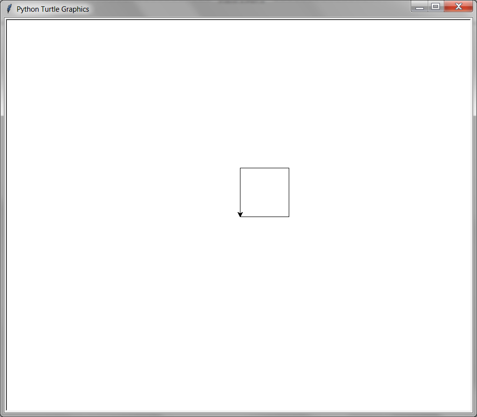](square_spiral.png)

The instructions in your program tell the "turtle" how to move. The turtle draws a line behind it as it moves. This program draws a square. The steps given to the program are:

1. Move forward 100 steps. (In the beginning, the turtle is facing to the right.)
1. Turn 90 degrees to the left.
1. Move forward 100 steps.
1. Turn 90 degrees to the left.
1. Move forward 100 steps.
1. Turn 90 degrees to the left.
1. Move forward 100 steps. The turtle has ended up where it started.

With these seven steps, the turtle draws a square. The `from turtle import *` is an instruction needed at the beginning of all of your turtle programs. It imports the turtle module so you can do the turtle instructions.

There are many instructions like left() and forward(). These instructions are called functions. This tutorial explains many of the functions in the turtle module. When you learn more of these functions, you will be able to draw many different shapes and beautiful pictures!

## Examples

A square spiral program:

```python
from turtle import *
for i in range(500): # this "for" loop will repeat these functions 500 times
    forward(i)
    left(91)
```

[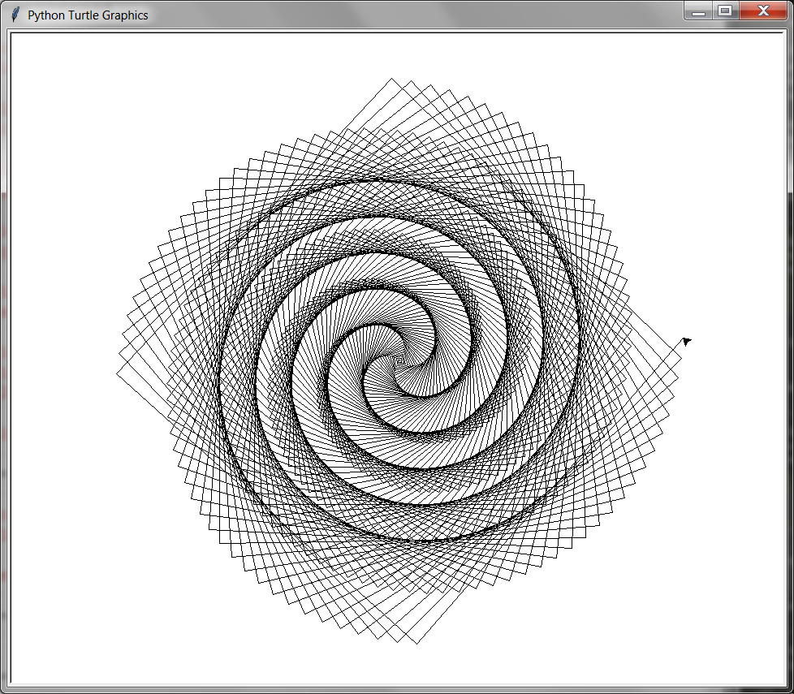](square_spiral.png)

A colorful hexagon spiral program:

```python
from turtle import *
colors = ['red', 'purple', 'blue', 'green', 'yellow', 'orange']
for x in range(360):
    pencolor(colors[x % 6])
    width(x / 100 + 1)
    forward(x)
    left(59)
```

[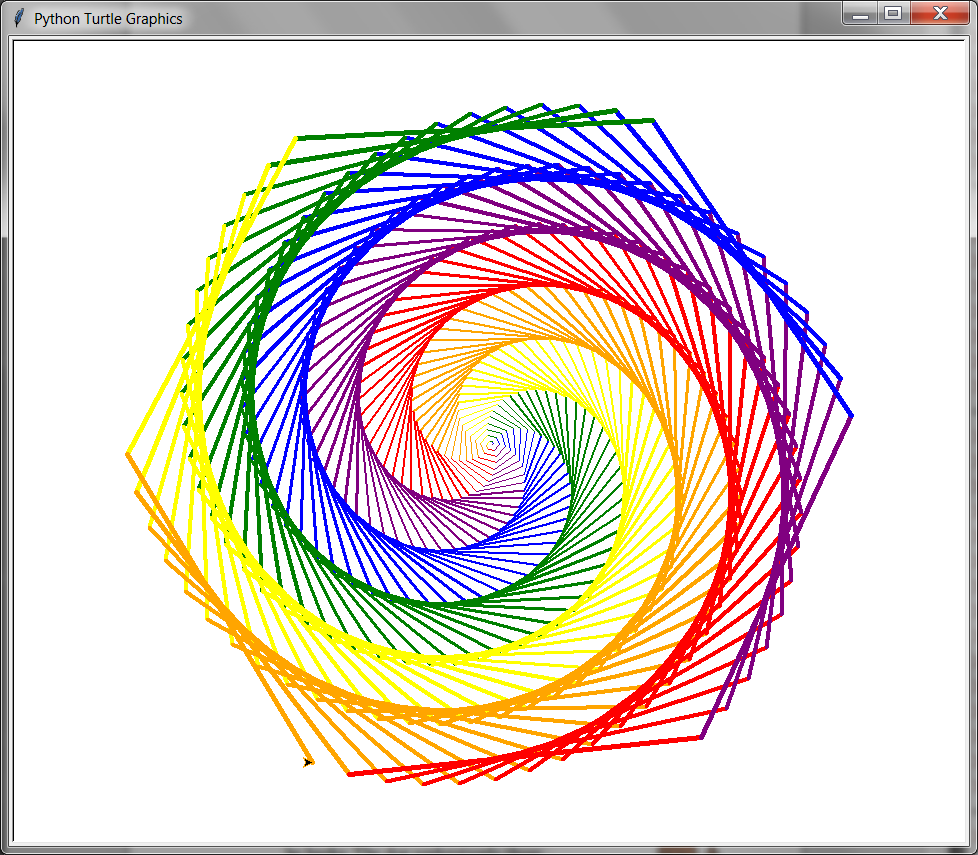](colorful_hex.png)

A blue flowers program:

```python
from turtle import *
import random

for n in range(60):
    penup()
    goto(random.randint(-400, 400), random.randint(-400, 400))
    pendown()

    red_amount   = random.randint( 0,  30) / 100.0
    blue_amount  = random.randint(50, 100) / 100.0
    green_amount = random.randint( 0,  30) / 100.0
    pencolor((red_amount, green_amount, blue_amount))

    circle_size = random.randint(10, 40)
    pensize(random.randint(1, 5))

    for i in range(6):
        circle(circle_size)
        left(60)
```

[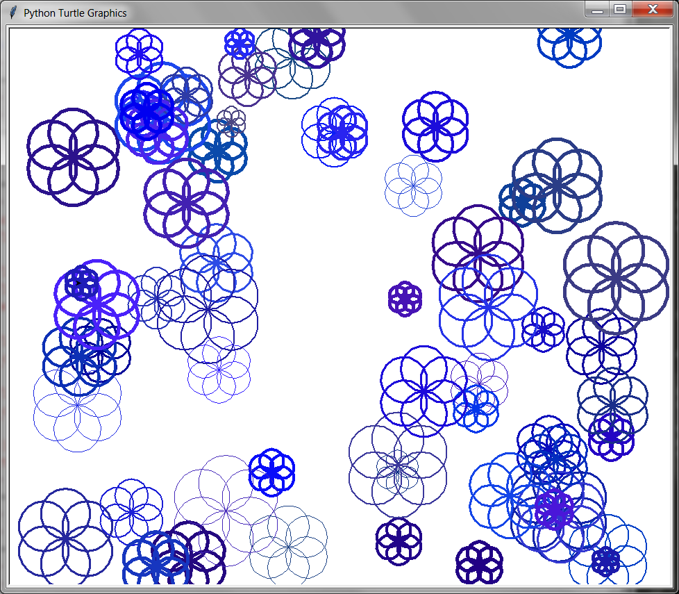](blue_flowers.png)

## Moving

By calling these functions, the turtle can be made to move around the screen. Imagine the turtle holding a pen down on the ground and drawing a line as it moves around.

The turtle's position is two numbers: the X coordinate and Y coordinate. The turtle also

### forward(*distance*)

The forward() function moves the turtle *distance* number of steps in the current direction. If the pen is down (see pendown() and penup()) a line will be drawn as the turtle moves forward. If *distance* is a negative number, the turtle will move backwards.

### backward(*distance*)

The backward() function moves the turtle *distance* number of steps in **opposite direction** the current direction. If the pen is down (see pendown() and penup()) a line will be drawn as the turtle moves backward. If *distance* is a negative number, the turtle will move forward.

### right(*angle*)

The right() function will change the current direction clockwise by *angle* degrees. If you imagine being above the turtle looking down, the turtle turning right looks like it is turning clockwise. The turtle will not move; it will only change the direction it is facing.

This example moves the turtle forward, then turns right by 90 degrees, then moves forward again:

This example moves the turtle forward, then turns left by 90 degrees, then moves forward again:

```python
from turtle import *
forward(100)
right(90)
forward(100)
```

[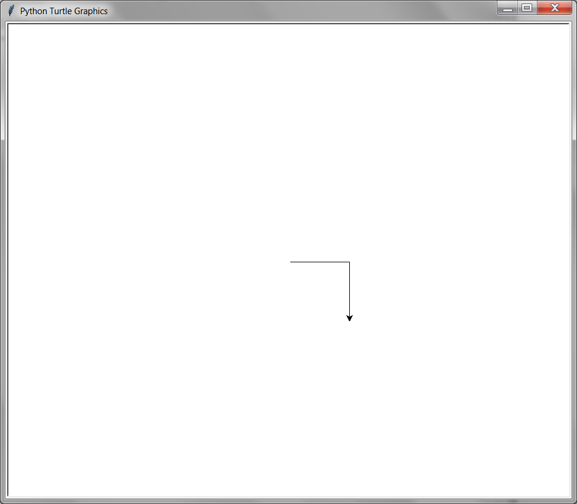](turn_right.png)

### left(*angle*)

The left() function will change the current direction counter-clockwise or anti-clockwise by *angle* degrees. If you imagine being above the turtle looking down, the turtle turning left looks like it is turning counter-clockwise or anti-clockwise. The turtle will not move; it will only change the direction it is facing.

This example moves the turtle forward, then turns left by 90 degrees, then moves forward again:

```python
from turtle import *
forward(100)
left(90)
forward(100)
```

[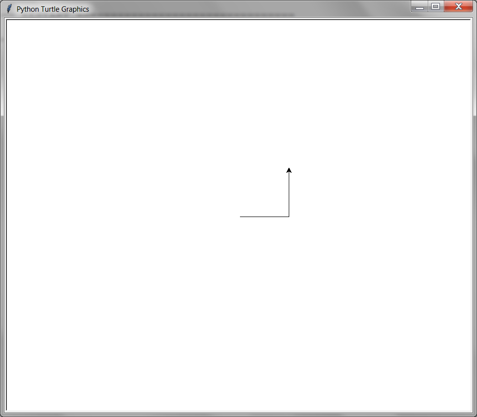](turn_left.png)

### goto(*x*, *y*)

The goto() function will immediately move the turtle to the given *x* and *y* coordinates. If the pen is down (see pendown() and penup()) a line will be drawn from the previous coordinates to the new coordinates.

This example moves the to several x and y coordinates while drawing a line behind it:

```python
from turtle import *

goto(50, 50)
goto(-50, 50)
goto(100, -50)
goto(-50, -50)
```

[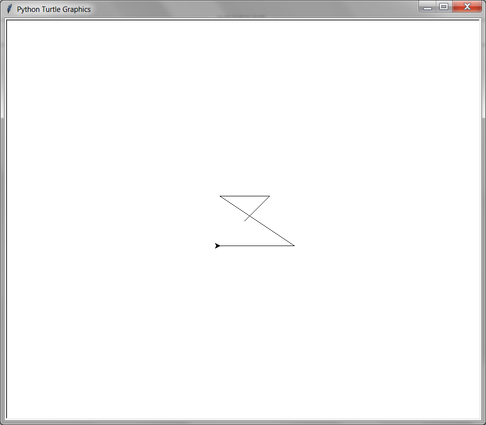](goto.png)

### setx(*x*)

The goto() function will immediately move the turtle to the given *x* coordinate. The turtle's y coordinate will stay the same. If the pen is down (see pendown() and penup()) a line will be drawn from the previous coordinates to the new coordinates.

### sety(*y*)

The goto() function will immediately move the turtle to the given *y *coordinate. The turtle's x coordinate will stay the same. If the pen is down (see pendown() and penup()) a line will be drawn from the previous coordinates to the new coordinates.

### setheading(*heading*)

The setheading() function will change the current direction to the *heading* angle. If you imagine being above the turtle looking down, the turtle turning left looks like it is turning counter-clockwise or anti-clockwise. The turtle will not move; it will only change the heading it is facing.

```python
from turtle import *

for angle in range(0, 360, 15):
    setheading(angle)
    forward(100)
    write(str(angle) + '°')
    backward(100)
```

[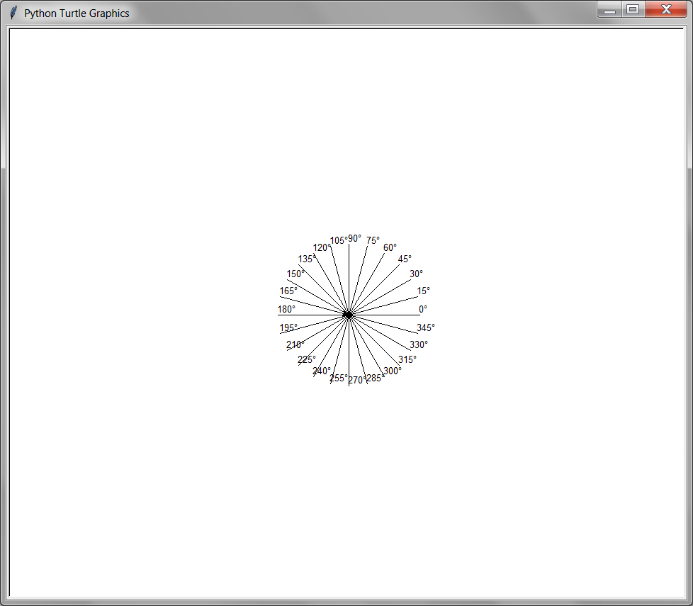](setheading.png)

### undo()

The undo() function will undo the turtle's last action. It will be as though the last action was never made. For example, if the last action was a call to the forward(100) function, calling undo will move the turtle backwards 100 steps and erase any line that was drawn. The undo() function can be called many times to erase more and more of the turtle

```python
from turtle import *

for i in range(10):
    forward(100)
    left(90)
    forward(10)
    left(90)
    forward(100)
    right(90)
    forward(10)
    right(90)

for i in range(30):
    undo()
```

[](undo_before.png) [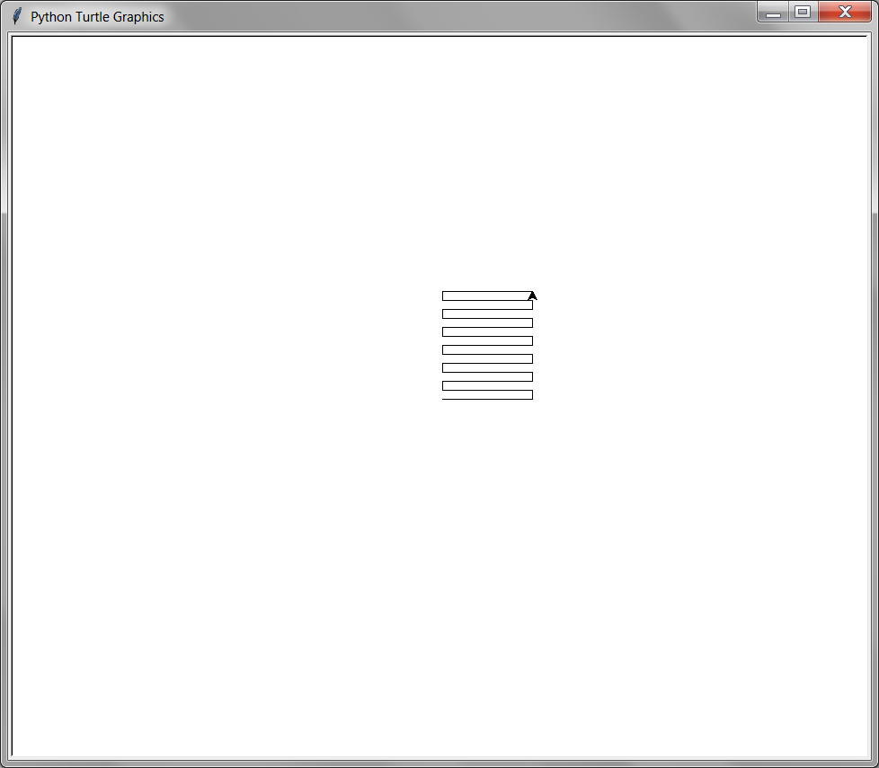](undo_after.png)


### home()

The home() function will move the turtle to it's original position at the coordinates (0, 0) and set it's direction to 0 degrees. Calling home() is the same as calling goto(0, 0) and setheading(0). If the pen is down (see pendown() and penup()) a line will be drawn as the turtle moves back home.

```python
from turtle import *

forward(100)
right(90)
forward(100)
home()
```

[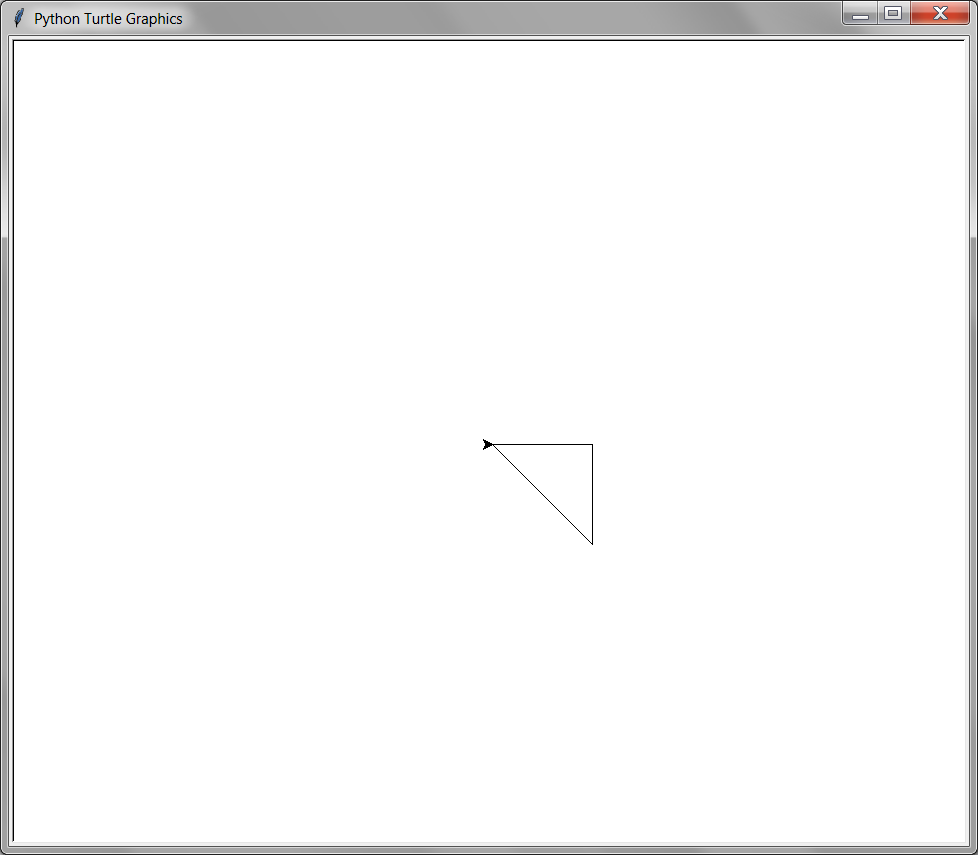](home.png)

## Drawing

### pendown()

The pendown() function will cause the turtle to draw as it moves around. The line it draws can be set with the pencolor() and pensize() functions.

### penup()

The penup() function will cause the turtle to draw as it moves around. The line it draws can be set with the pencolor() and pensize() functions.

### pensize(*size*)

The pensize() function sets the width of the line that the turtle draws as it moves.

[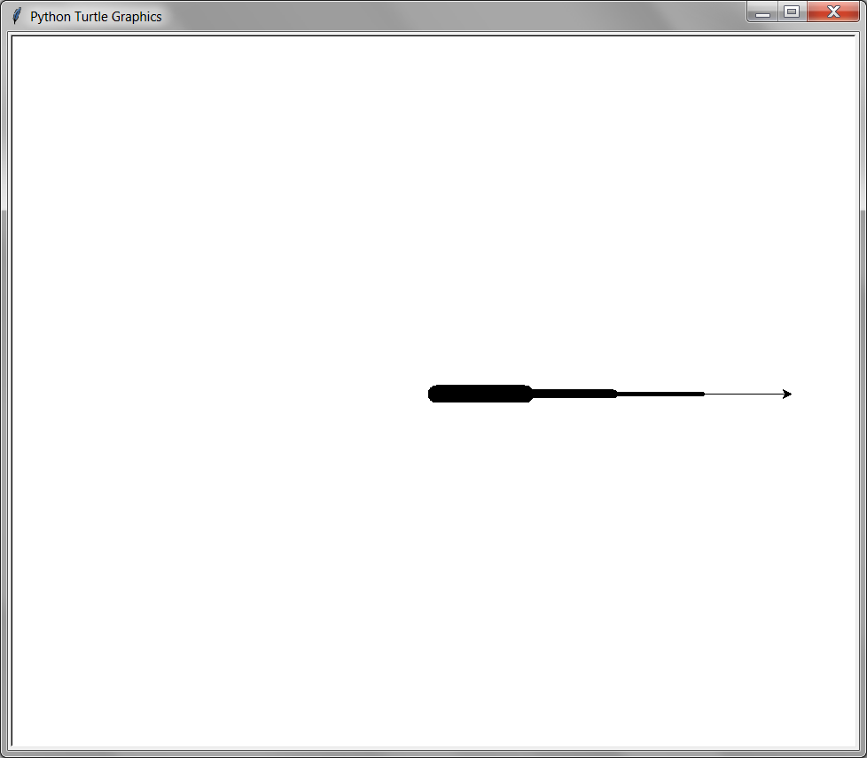](pensize.png)

### pencolor(), pencolor(*color*), pencolor((*red*, *green*, *blue*)), pencolor(*red*, *green*, *blue*)

The pencolor() function sets the color of the line that the turtle draws. The pencolor() function can be passed a string of the color, such as 'red' or 'black'. Or, the pencolor() function can be passed an "RGB color tuple" (see the [Color](#color) section).

```python
from turtle import *

pensize(20)
pencolor('red')
forward(50)
pencolor(0, 1.0, 0)
forward(50)
pencolor((0, 0.5, 0.5))
forward(50)

pensize(10)
goto(-400, 50)

for red in range(4):
    for green in range(4):
        for blue in range(4):
            pencolor(red / 4.0, green / 4.0, blue / 4.0)
            forward(10)
```

[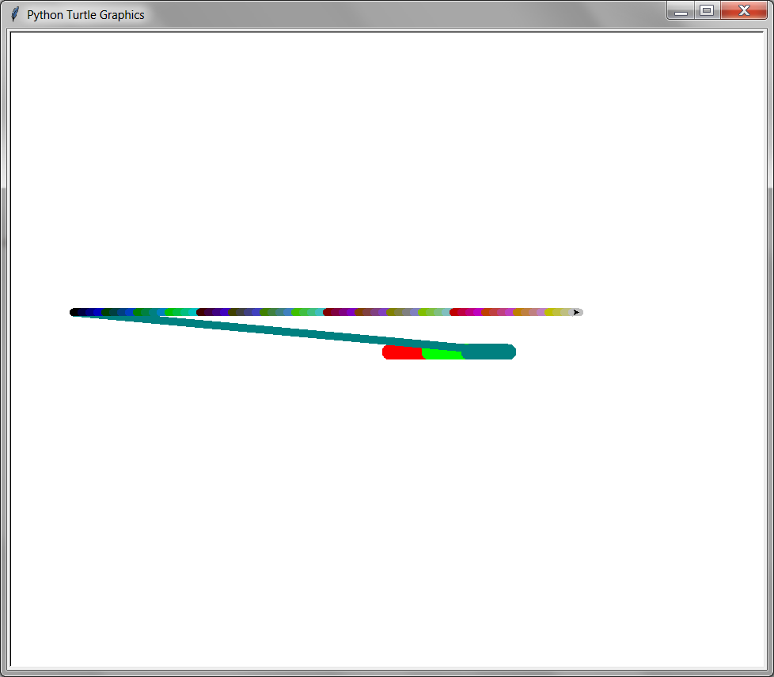](pencolor.png)

### clear()

The clear() function will erase all the line drawings on the screen. This function does not move the turtle.

### reset()

The reset()) function will erase all the line drawings on the screen and return the turtle to the (0, 0) coordinate and facing 0 degrees. This function does the same thing as calling the clear() and home() function.

## Color

Red, green, and blue are the three primary colors of light.

The float value 0.0 represents no brightness of that color. The float value 1.0 represents full brightness of that color. So the color red is represented by the RGB color tuple (1.0, 0, 0). The color purple is half-bright red and half-bright blue, so it is represented by the RGB color tuple (0.5, 0.0, 0.5). Full brightness of red and blue makes pink: (1.0, 0.0, 1.0)

Here are some RGB color tuples:


<table>
<tbody><tr>
<td class="color_td" style="background:#330000; color: #FFFFFF">(0.2, 0.0, 0.0)</td>
<td class="color_td" style="background:#331900; color: #FFFFFF">(0.2, 0.1, 0.0)</td>
<td class="color_td" style="background:#333300; color: #FFFFFF">(0.2, 0.2, 0.0)</td>
<td class="color_td" style="background:#193300; color: #FFFFFF">(0.1, 0.2, 0.0)</td>
<td class="color_td" style="background:#003300; color: #FFFFFF">(0.0, 0.2, 0.0)</td>
<td class="color_td" style="background:#003319; color: #FFFFFF">(0.0, 0.2, 0.1)</td>
<td class="color_td" style="background:#003333; color: #FFFFFF">(0.0, 0.2, 0.2)</td>
<td class="color_td" style="background:#001933; color: #FFFFFF">(0.0, 0.1, 0.2)</td>
<td class="color_td" style="background:#000033; color: #FFFFFF">(0.0, 0.0, 0.2)</td>
<td class="color_td" style="background:#190033; color: #FFFFFF">(0.1, 0.0, 0.2)</td>
<td class="color_td" style="background:#330033; color: #FFFFFF">(0.2, 0.0, 0.2)</td>
<td class="color_td" style="background:#330019; color: #FFFFFF">(0.2, 0.0, 0.1)</td>
<td class="color_td" style="background:#000000; color: #FFFFFF">(0.0, 0.0, 0.0)</td>
</tr>
<tr>
<td class="color_td" style="background:#660000; color: #FFFFFF">(0.4, 0.0, 0.0)</td>
<td class="color_td" style="background:#663300; color: #FFFFFF">(0.4, 0.2, 0.0)</td>
<td class="color_td" style="background:#666600; color: #FFFFFF">(0.4, 0.4, 0.0)</td>
<td class="color_td" style="background:#336600; color: #FFFFFF">(0.2, 0.4, 0.0)</td>
<td class="color_td" style="background:#006600; color: #FFFFFF">(0.0, 0.4, 0.0)</td>
<td class="color_td" style="background:#006633; color: #FFFFFF">(0.0, 0.4, 0.2)</td>
<td class="color_td" style="background:#006666; color: #FFFFFF">(0.0, 0.4, 0.4)</td>
<td class="color_td" style="background:#003366; color: #FFFFFF">(0.0, 0.2, 0.4)</td>
<td class="color_td" style="background:#000066; color: #FFFFFF">(0.0, 0.0, 0.4)</td>
<td class="color_td" style="background:#330066; color: #FFFFFF">(0.2, 0.0, 0.4)</td>
<td class="color_td" style="background:#660066; color: #FFFFFF">(0.4, 0.0, 0.4)</td>
<td class="color_td" style="background:#660033; color: #FFFFFF">(0.4, 0.0, 0.2)</td>
<td class="color_td" style="background:#202020; color: #FFFFFF">(0.13, 0.13, 0.13)</td>
</tr>
<tr>
<td class="color_td" style="background:#990000; color: #FFFFFF">(0.6, 0.0, 0.0)</td>
<td class="color_td" style="background:#994C00; color: #FFFFFF">(0.6, 0.3, 0.0)</td>
<td class="color_td" style="background:#999900; color: #FFFFFF">(0.6, 0.6, 0.0)</td>
<td class="color_td" style="background:#4C9900; color: #FFFFFF">(0.3, 0.6, 0.0)</td>
<td class="color_td" style="background:#009900; color: #FFFFFF">(0.0, 0.6, 0.0)</td>
<td class="color_td" style="background:#00994C; color: #FFFFFF">(0.0, 0.6, 0.3)</td>
<td class="color_td" style="background:#009999; color: #FFFFFF">(0.0, 0.6, 0.6)</td>
<td class="color_td" style="background:#004C99; color: #FFFFFF">(0.0, 0.3, 0.6)</td>
<td class="color_td" style="background:#000099; color: #FFFFFF">(0.0, 0.0, 0.6)</td>
<td class="color_td" style="background:#4C0099; color: #FFFFFF">(0.3, 0.0, 0.6)</td>
<td class="color_td" style="background:#990099; color: #FFFFFF">(0.6, 0.0, 0.6)</td>
<td class="color_td" style="background:#99004C; color: #FFFFFF">(0.6, 0.0, 0.3)</td>
<td class="color_td" style="background:#404040; color: #FFFFFF">(0.25, 0.25, 0.25)</td>
</tr>
<tr>
<td class="color_td" style="background:#CC0000; color: #FFFFFF">(0.8, 0.0, 0.0)</td>
<td class="color_td" style="background:#CC6600; color: #FFFFFF">(0.8, 0.4, 0.0)</td>
<td class="color_td" style="background:#CCCC00; color: #FFFFFF">(0.8, 0.8, 0.0)</td>
<td class="color_td" style="background:#66CC00; color: #FFFFFF">(0.4, 0.8, 0.0)</td>
<td class="color_td" style="background:#00CC00; color: #FFFFFF">(0.0, 0.8, 0.0)</td>
<td class="color_td" style="background:#00CC66; color: #FFFFFF">(0.0, 0.8, 0.4)</td>
<td class="color_td" style="background:#00CCCC; color: #FFFFFF">(0.0, 0.8, 0.8)</td>
<td class="color_td" style="background:#0066CC; color: #FFFFFF">(0.0, 0.4, 0.8)</td>
<td class="color_td" style="background:#0000CC; color: #FFFFFF">(0.0, 0.0, 0.8)</td>
<td class="color_td" style="background:#6600CC; color: #FFFFFF">(0.4, 0.0, 0.8)</td>
<td class="color_td" style="background:#CC00CC; color: #FFFFFF">(0.8, 0.0, 0.8)</td>
<td class="color_td" style="background:#CC0066; color: #FFFFFF">(0.8, 0.0, 0.4)</td>
<td class="color_td" style="background:#606060; color: #FFFFFF">(0.38, 0.38, 0.38)</td>
</tr>
<tr>
<td class="color_td" style="background:#FF0000">(1.0, 0.0, 0.0)</td>
<td class="color_td" style="background:#FF8000">(1.0, 0.5, 0.0)</td>
<td class="color_td" style="background:#FFFF00">(1.0, 1.0, 0.0)</td>
<td class="color_td" style="background:#80FF00">(0.5, 1.0, 0.0)</td>
<td class="color_td" style="background:#00FF00">(0.0, 1.0, 0.0)</td>
<td class="color_td" style="background:#00FF80">(0.0, 1.0, 0.5)</td>
<td class="color_td" style="background:#00FFFF">(0.0, 1.0, 1.0)</td>
<td class="color_td" style="background:#0080FF">(0.0, 0.5, 1.0)</td>
<td class="color_td" style="background:#0000FF">(0.0, 0.0, 1.0)</td>
<td class="color_td" style="background:#7F00FF">(0.5, 0.0, 1.0)</td>
<td class="color_td" style="background:#FF00FF">(1.0, 0.0, 1.0)</td>
<td class="color_td" style="background:#FF007F">(1.0, 0.0, 0.5)</td>
<td class="color_td" style="background:#808080">(0.5, 0.5, 0.5)</td>
</tr>
<tr>
<td class="color_td" style="background:#FF3333">(1.0, 0.2, 0.2)</td>
<td class="color_td" style="background:#FF9933">(1.0, 0.6, 0.2)</td>
<td class="color_td" style="background:#FFFF33">(1.0, 1.0, 0.2)</td>
<td class="color_td" style="background:#99FF33">(0.6, 1.0, 0.2)</td>
<td class="color_td" style="background:#33FF33">(0.2, 1.0, 0.2)</td>
<td class="color_td" style="background:#33FF99">(0.2, 1.0, 0.6)</td>
<td class="color_td" style="background:#33FFFF">(0.2, 1.0, 1.0)</td>
<td class="color_td" style="background:#3399FF">(0.2, 0.6, 1.0)</td>
<td class="color_td" style="background:#3333FF">(0.2, 0.2, 1.0)</td>
<td class="color_td" style="background:#9933FF">(0.6, 0.2, 1.0)</td>
<td class="color_td" style="background:#FF33FF">(1.0, 0.2, 1.0)</td>
<td class="color_td" style="background:#FF3399">(1.0, 0.2, 0.6)</td>
<td class="color_td" style="background:#A0A0A0">(0.63, 0.63, 0.63)</td>
</tr>
<tr>
<td class="color_td" style="background:#FF6666">(1.0, 0.4, 0.4)</td>
<td class="color_td" style="background:#FFB266">(1.0, 0.7, 0.4)</td>
<td class="color_td" style="background:#FFFF66">(1.0, 1.0, 0.4)</td>
<td class="color_td" style="background:#B2FF66">(0.7, 1.0, 0.4)</td>
<td class="color_td" style="background:#66FF66">(0.4, 1.0, 0.4)</td>
<td class="color_td" style="background:#66FFB2">(0.4, 1.0, 0.7)</td>
<td class="color_td" style="background:#66FFFF">(0.4, 1.0, 1.0)</td>
<td class="color_td" style="background:#66B2FF">(0.4, 0.7, 1.0)</td>
<td class="color_td" style="background:#6666FF">(0.4, 0.4, 1.0)</td>
<td class="color_td" style="background:#B266FF">(0.7, 0.4, 1.0)</td>
<td class="color_td" style="background:#FF66FF">(1.0, 0.4, 1.0)</td>
<td class="color_td" style="background:#FF66B2">(1.0, 0.4, 0.7)</td>
<td class="color_td" style="background:#C0C0C0">(0.75, 0.75, 0.75)</td>
</tr>
<tr>
<td class="color_td" style="background:#FF9999">(1.0, 0.6, 0.6)</td>
<td class="color_td" style="background:#FFCC99">(1.0, 0.8, 0.6)</td>
<td class="color_td" style="background:#FFFF99">(1.0, 1.0, 0.6)</td>
<td class="color_td" style="background:#CCFF99">(0.8, 1.0, 0.6)</td>
<td class="color_td" style="background:#99FF99">(0.6, 1.0, 0.6)</td>
<td class="color_td" style="background:#99FFCC">(0.6, 1.0, 0.8)</td>
<td class="color_td" style="background:#99FFFF">(0.6, 1.0, 1.0)</td>
<td class="color_td" style="background:#99CCFF">(0.6, 0.8, 1.0)</td>
<td class="color_td" style="background:#9999FF">(0.6, 0.6, 1.0)</td>
<td class="color_td" style="background:#CC99FF">(0.8, 0.6, 1.0)</td>
<td class="color_td" style="background:#FF99FF">(1.0, 0.6, 1.0)</td>
<td class="color_td" style="background:#FF99CC">(1.0, 0.6, 0.8)</td>
<td class="color_td" style="background:#E0E0E0">(0.88, 0.88, 0.88)</td>
</tr>
<tr>
<td class="color_td" style="background:#FFCCCC">(1.0, 0.8, 0.8)</td>
<td class="color_td" style="background:#FFE5CC">(1.0, 0.9, 0.8)</td>
<td class="color_td" style="background:#FFFFCC">(1.0, 1.0, 0.8)</td>
<td class="color_td" style="background:#E5FFCC">(0.9, 1.0, 0.8)</td>
<td class="color_td" style="background:#CCFFCC">(0.8, 1.0, 0.8)</td>
<td class="color_td" style="background:#CCFFE5">(0.8, 1.0, 0.9)</td>
<td class="color_td" style="background:#CCFFFF">(0.8, 1.0, 1.0)</td>
<td class="color_td" style="background:#CCE5FF">(0.8, 0.9, 1.0)</td>
<td class="color_td" style="background:#CCCCFF">(0.8, 0.8, 1.0)</td>
<td class="color_td" style="background:#E5CCFF">(0.9, 0.8, 1.0)</td>
<td class="color_td" style="background:#FFCCFF">(1.0, 0.8, 1.0)</td>
<td class="color_td" style="background:#FFCCE5">(1.0, 0.8, 0.9)</td>
<td class="color_td" style="background:#FFFFFF">(1.0, 1.0, 1.0)</td>
</tr>
</tbody></table>

RGB Color Tuple: <input type="text" id="RGBTupleField" />


## Filling in Shapes

The turtle can draw the outline of a shape and then fill it in with color using the fill functions. The filling process starts when the begin_color() function is called. The turtle can move around as normal. When the end_fill() function is called, the shape the turtle was drawing will be filled with the fill color. The fill color is separate from the pen color.

```python
from turtle import *

fillcolor('purple')
pensize(10)
pencolor('black')
forward(100)

begin_fill()
forward(100)
left(90)
forward(100)
left(90)
forward(100)
left(90)
forward(100)
left(90)
end_fill()
```

[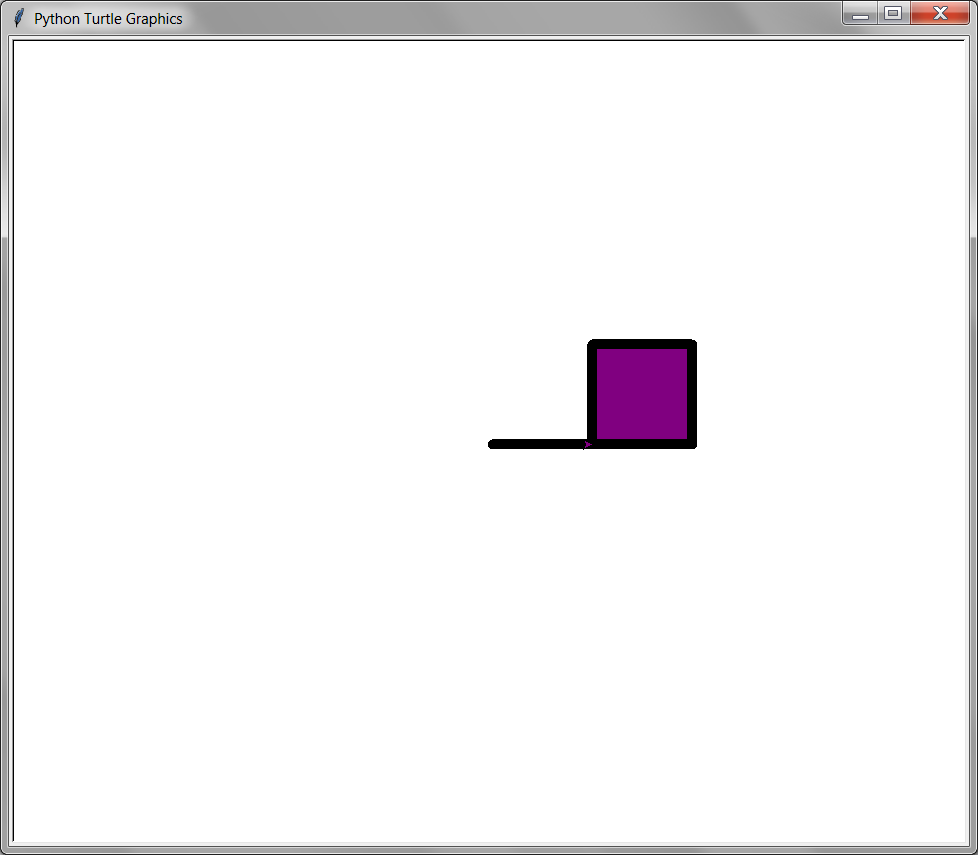](fill.png)

### fillcolor(), fillcolor(*color*), fillcolor((*red*, *green*, *blue*)), fillcolor(*red*, *green*, *blue*)

The fillcolor() function sets the color of the filled in shape when end_fill() is called. The fillcolor() function can be passed a string of the color, such as 'red' or 'black'. Or, the fillcolor() function can be passed an "RGB color tuple" (see the [Color](#color) section).

### begin_fill()

The begin_fill() starts recording the moves that will be the outline of the filled-in shape. The filled-in shape will not be drawn until end_fill() is called.

### end_fill()

The end_fill() function will stop recording the moves for the filled-in shape and draw the shape.


## Stamping

### stamp()

```python
from turtle import *

penup()

for i in range(30, -1, -1):
    stamp()
    left(i)
    forward(20)
```

[](stamp.png)

### clearstamp()

### clearstamps()


## Animation

### tracer()


## Turtle Status

### position()

### towards()

### distance()

### degrees()

### radians()

### isdown()

### isvisible()


## Input


## Events

### listen()

### onkey()

```python
from turtle import *

def up():
    setheading(90)
    forward(100)

def down():
    setheading(270)
    forward(100)

def left():
    setheading(180)
    forward(100)

def right():
    setheading(0)
    forward(100)

listen()

onkey(up, 'Up')
onkey(down, 'Down')
onkey(left, 'Left')
onkey(right, 'Right')

onkey(up, 'w')
onkey(down, 's')
onkey(left, 'a')
onkey(right, 'd')
```

[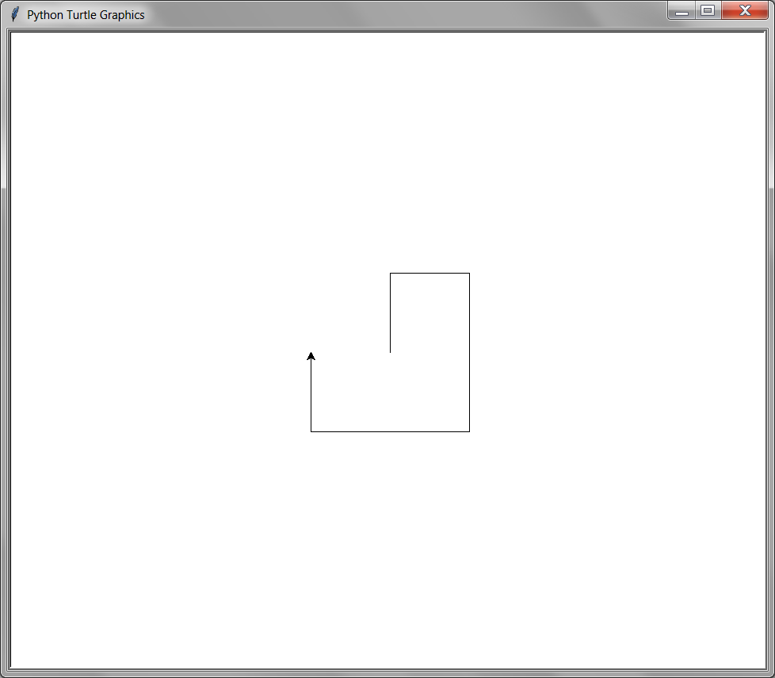](onkey.png)

up, right, down, down, left, left, up


### onkeypress()

```python
from turtle import *

def blue_screen():
    bgcolor(0.7, 1.0, 1.0)

def white_screen():
    bgcolor(1.0, 1.0, 1.0)

listen()
onkeypress(blue_screen, 'space')
onkey(white_screen, 'space')
```

### onclick()

### ontimer()

### done()

### exitonclick()


## The Turtle

### showturtle()

### hideturtle()

### shape()


## The World

### bgcolor()

### bgpic()

### title()

### screensize()

### window_height()

### window_width()

### listen()