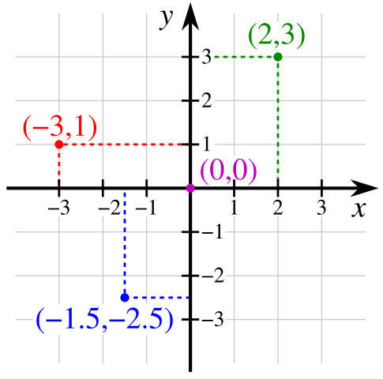

<meta charset="UTF-8">

<!-- TODO: Create HTML and PDF versions in all languages.
Add a part that explains how to take screenshots in all OSes?
Keep high-resolution screenshots for print editions.

Possible titles:
Turtorial: Learn to Program in Python with Turtle Graphics
-->

# A Simple Turtle Tutorial for Python's turtle.py Module

*A programming guide for students and their parents, teachers, and instructors.*

This is a Turtle programming tutorial written by Al Sweigart, author of *Automate the Boring Stuff with Python* and other programming books. You can read all of his books for free at https://inventwithpython.com.


## Table of Contents

1. [Introduction](#Introduction)
1. [Drawing a Square](#Drawing-a-Square)
1. [Drawing a Smaller Square](#Drawing-a-Smaller-Square)
1. [Common Bugs and Error Messages](#Common-Bugs-and-Error-Messages)
1. [Draw a Square with a Loop](#Draw-a-Square-with-a-Loop)
1. [Quick Review 1](#Quick-Review-1)
1. [Practice Exercises 1](#Practice-Exercises-1)
1. [Writing Text in the Turtle Window](#Writing-Text-in-the-Turtle-Window)
1. [Angles](#Angles)
1. [XY Cartesian Coordinates](#XY-Cartesian-Coordinates)
1. [Home, Clear, Reset, Undo](#Home-Clear-Reset-Undo)
1. [Quick Review 2](#Quick-Review-2)
1. [Practice Exercises 2](#Practice-Exercises-2)
1. [Colors](#Colors)
1. [Raising and Lowering the Pen](#Raising-and-Lowering-the-Pen)
1. [Square Spirals Examples](#Square-Spirals-Examples)
1. [Drawing Very Fast](#Drawing-Very-Fast)
1. [Interactive Drawing](#Interactive-Drawing)
1. [Draw Curves and Circles](#Draw-Curves-and-Circles)
1. [Blue Flowers Program](#Blue-Flowers-Program)
1. [Filled-In Shapes](#Filled-In-Shapes)
1. [For More Information](#For-More-Information)
1. [Advanced Turtle Challenges](#Advanced-Turtle-Challenges)
1. [Solutions](#Solutions)
1. [Contact the Author](#Contact-the-Author)
1. [List of Website URLs in this Tutorial](#List-of-Website-URLs-in-this-Tutorial)


## Introduction

Turtle graphics is an easy way to learn programming by drawing with code. You program a virtual pen, called the *turtle*, to move around the screen and draw lines. You make pictures with a computer while learning how to program. You can think of the turtle as an [Etch A Sketch](https://en.wikipedia.org/wiki/Etch_A_Sketch) controlled by your Python program.

This guide explains how to use Python's `turtle` module. It does not teach the Python language itself. It's good to already know some basic Python ideas, like variables, operators, loops, functions, importing modules, and random numbers. The free book *Automate the Boring Stuff with Python* at https://automatetheboringstuff.com/ is an introduction for complete beginners new to programming. If you are more interested in programming video games, you can read *Invent Your Own Computer Games with Python* at https://inventwithpython.com.

Before starting, you need to download and install the *Python interpreter* (the software that runs Python code) from https://python.org. There is a guide to installing Python on the website, Real Python, at https://realpython.com/installing-python/.

You also need to install a *code editor* such as:

* IDLE, which comes with the Python interpreter.
* Mu, which is free at https://codewith.mu/.
* Visual Studio Code, which is free at https://code.visualstudio.com/download. 

There is a guide to using IDLE on the website, Real Python, at https://realpython.com/python-idle/.

Programs written in the Python language are called *Python programs*. Not all Python programs use turtle graphics. But in this guide, we will call programs that use Python's `turtle` module, "Turtle programs."

Even if you don't know how to program in Python, you can still copy the code in this tutorial into your code editor and run them.

<div style="page-break-after: always;"></div>

## Drawing a Square

Let's make a program that draws a square. Create a new file in your code editor. Save it as *first_square.py*. Enter the following Python code:

```python
# first_square.py

# This is a comment.
# Everything after # is a "comment" and is not run as code.
# Use comments to make notes to yourself about your code.

from turtle import *

pensize(4)  # Make the lines thicker than normal.

forward(200)  # Move the turtle forward 200 steps.
left(90)  # Turn the turtle left by 90 degrees.

# Move forward and turn three more times:
forward(200)
left(90)
forward(200)
left(90)
forward(200)
left(90)

done()  # Without this, the Turtle window may immediately close before you can see the picture.
```

Save the file after entering the code. Then run the program. (If you are using IDLE for your code editor, you can press F5 or click the **Run > Run Module**) menu item. In Visual Studio Code, click the **Run > Run Without Debugging** menu item. In other editors, the steps to run a program may be different.)

When you run this program, a new window (which we will call the *Turtle window*) will appear with the following drawing:

[](https://raw.githubusercontent.com/asweigart/simple-turtle-tutorial-for-python/refs/heads/master/orig_screenshot_first_square.webp)

In the Turtle window, the turtle appears as a triangle. Imagine the turtle is holding a pen on the ground and drawing as it moves. The Python code tells it how to move:

1. Move forward 200 steps. (The turtle starts facing to the right.)
1. Turn 90 degrees to the left.
1. Move forward 200 steps.
1. Turn 90 degrees to the left.
1. Move forward 200 steps.
1. Turn 90 degrees to the left.
1. Move forward 200 steps. (The turtle is where it started.)
1. Turn 90 degrees to the left. (The turtle is facing the original direction.)
1. The program is done but the Turtle window should remain open so the user can look at the drawing.

With these nine steps, the turtle draws a square. Here is what you need to understand about each instruction in the program:

```python
# first_square.py

# This is a comment.
# Everything after # is a "comment" and is not run as code.
# Use comments to make notes to yourself about your code.
```

The `# first_square.py` line is a *comment* (see below) that is ignored by the Python interpreter. You don't need to copy the comments into your program. This is here only to help identify the program names in this tutorial.

Blank lines are skipped by the Python interpreter.

```python
from turtle import *
```

You MUST have `from turtle import *` at the top of all of your turtle programs. It imports the `turtle` module so you can call the turtle functions in the rest of the programs. (The turtle functions include `pensize()`, `forward()`, `left()`, and `done()`.) If you forget this line, your program will stop with a `NameError: name is not defined` error.

```python
pensize(4)  # Make the lines thicker than normal.
```

`pensize` is a function and `pensize(4)` is a function call. A *function* is like a mini-program that contains code. Your program can run the code in functions by making a *function call*. Function calls can have values passed to them, like the `4` in `pensize(4)`. These are called *function arguments* or just *arguments*.

In this tutorial, we always add parentheses to the name of a function so it is easy to see that it is a function: "the `pensize()` function"

```python
forward(200)  # Move the turtle forward 200 steps.
left(90)  # Turn the turtle left by 90 degrees.

# Move forward and turn three more times:
forward(200)
left(90)
forward(200)
left(90)
forward(200)
left(90)
```

The `forward(100)` makes the turtle move forward in its current direction by 100 steps. As the turtle moves, it draws a line behind it. Imagine a turtle animal with a black marker in its mouth, drawing lines on the ground as it moves.

The `left()` function makes the turtle turn its direction its left. Imagine we are in the sky looking down at the turtle in the program's window. The turtle's left is counterclockwise. The `left(90)` function call in our program makes the turtle turn left 90 degrees.

(If you want the turtle to turn right or clockwise, there is also a `right()` function.)

```python
done()  # Without this, the Turtle window may immediately close before you can see the picture.
```

The `done()` function pauses the program until you close the Turtle window. Python programs end immediately after the last instruction runs. This can cause the Turtle window to close as soon as your drawing has finished. You should always add `done()` at the end of your Turtle programs so the window stays open and the user can see the drawing.

The `done()` function call has no arguments, but you still need to type the `()` parentheses after `done`.

There are many functions like `left()`, `forward()`, and `done()`. This tutorial explains many of the functions in the `turtle` module. When you learn more of these functions, you will be able to draw many different shapes and beautiful pictures!

But let's make some more simple Turtle programs first.


<div style="page-break-after: always;"></div>

## Drawing a Smaller Square

Let's make a program that draws a smaller square. We can change `forward(200)` to `forward(25)` to draw a smaller square. Create a new file in your code editor. Save it as *square_smaller.py*. Enter the following Python code:

```python
# square_smaller.py
from turtle import *

pensize(4)
forward(25)  # Now the turtle moves forward only 25 steps.
left(90)
forward(25)
left(90)
forward(25)
left(90)
forward(25)
left(90)
done()
```

When you run the program, it draws a smaller square because the lines are only 25 steps long instead of 100 steps.

[](https://raw.githubusercontent.com/asweigart/simple-turtle-tutorial-for-python/refs/heads/master/orig_screenshot_square_smaller.webp)

Remember that you must change all four places with `forward(200)` to `forward(25)`, or else the square will come out wrong. For example, I made program named *square_smaller_bug.py* that only made the change in three places:

```python
# square_smaller_bug.py
from turtle import *

pensize(4)
forward(25)
left(90)
forward(25)
left(90)
forward(200)  # Uh oh, we forgot to change this line!
left(90)
forward(25)
left(90)
done()
```

This program has a *bug* in it, and draws the square wrong:

[](https://raw.githubusercontent.com/asweigart/simple-turtle-tutorial-for-python/refs/heads/master/orig_screenshot_square_smaller_bug.webp)

It's okay to make mistakes! You can fix them. Your computer does exactly what you tell it to do. But it is up to you to make sure what you *want* the computer to do is what you *told* the computer to do. If your program has a bug, carefully read your code and figure out where it is going wrong.


<div style="page-break-after: always;"></div>

## Common Bugs and Error Messages

As you write Python code, you may get error messages when you try to run the program. Pay attention to the error message, especially where it tells you what line number the error happens. Here are some common error messages you might see and what causes them:

* **`ModuleNotFoundError: No module named 'trutle'`** - You made a typo in your `from turtle import *`. For example, `from trutle import *` causes this error message.
* **`NameError: name 'froward' is not defined`** - You made a typo with a function or variable name. For example, `froward(100)` causes this error message.
* **`TypeError: forward() missing 1 required positional argument: 'distance'`** - You made a function call but forgot to include an argument. This specific error message was caused by `forward()` which doesn't have the distance argument like in `forward(200)`
* **`TypeError: left() takes 1 positional argument but 2 were given`** - You made a function call but used too many arguments. This specific error message was caused by calling `left()` with two arguments like `left(90, 45)` but the `left()` function expects only one argument like `left(90)`.
* **`IndentationError: unexpected indent`** - There are too many spaces in front of the line of code.
* **`IndentationError: expected an indented block after 'for' statement on line 5`** - You did not increase the amount of indentation after the beginning of a `for i in range(4):` loop.
* **`SyntaxError: invalid syntax`** - There is a general problem with your code. Python can't understand it, but also doesn't know what correction to suggest. It can tell you the line number where it detected the problem though! If you write code by randomly mashing the keyboard, you will probably get this error message.

When the error message says the error happens on, say, line number 5 in your program, it is possible that the true source of the error happens on the previous line: line number 4. The Python interpreter was unable to notice the error until line 5.


<div style="page-break-after: always;"></div>

## Drawing a Square with a Variable Size

Instead of typing `25` in `forward(25)`, let's create a *variable* instead. The name of the variable will be `line_length`. The value in the variable will be `25`.

Create a new file in your code editor. Save it as *square_variable.py*. Enter the following Python code:

```python
# square_variable.py
from turtle import *

pensize(4)
line_length = 25  # This variable stores the number 25.
forward(line_length)  # The turtle moves 25 steps because line_length is 25.
left(90)
forward(line_length)
left(90)
forward(line_length)
left(90)
forward(line_length)
left(90)
done()
```

When we run this program, it draws the same square as before:

[](https://raw.githubusercontent.com/asweigart/simple-turtle-tutorial-for-python/refs/heads/master/orig_screenshot_square_smaller.webp)

However, now we only have one thing to change if we want to change the size of the square. Try changing the `line_length` variable to a few other sizes, like `line_length = 300` or `line_length = 5`.

<div style="page-break-after: always;"></div>

## Draw a Square with a Loop

Let's write program to draw a square using a `for` loop. Create a new file in your code editor. Save it as *square_for_loop.py*. Enter the following Python code:

Let's rewrite this program using a `for` loop instead. Save the file with the new name, *square_for_loop.py*. We can tell the program to call `forward(line_length)` and `left(90)` four times:

```python
# square_for_loop.py
from turtle import *

pensize(4)

# The indented lines of code run 4 times:
for i in range(4):  
    forward(200)
    left(90)
done()
```

The indented code after `for i in range(4):` will run four times because we pass `4` to the `range()` function.

Be sure to have exactly four spaces of indentation before the `forward(line_length)` and `left(90)` lines of code! If they have different amounts of indentation, you will get an error that says `IndentationError: unindent does not match any outer indentation level`.

Here is that same code, but with periods to mark where the spaces are:

```
for i in range(4):  
....forward(200)
....left(90)
done()
```

This program makes the same square drawing as before:

[](https://raw.githubusercontent.com/asweigart/simple-turtle-tutorial-for-python/refs/heads/master/orig_screenshot_first_square.webp)

Our program only needs to call `pensize(4)` once, so we put it before the loop.

Let's change the code so that the turtle turns left by 86 degrees instead of 90 degrees. Create a new file in your code editor. Save it as *square_for_loop_86.py*. Enter the following Python code:

```python
# square_for_loop_86.py
from turtle import *

pensize(4)

for i in range(4):  
    forward(200)
    left(86)  # Turn left 86 degrees instead of 90.
done()
```

This draws a slightly different image that is not quite a square:

[](https://raw.githubusercontent.com/asweigart/simple-turtle-tutorial-for-python/refs/heads/master/orig_screenshot_square_for_loop_86.webp)

Instead of turning left 86 degrees in the loop 4 times, let's do the loop 50 times. Let's make a program that draws a square. Create a new file in your code editor. Save it as *square_circle_86.py*. Enter the following Python code:

```python
# square_circle_86.py
from turtle import *

pensize(4)
speed('fastest')

for i in range(50):  # Loop 50 times instead of 4.
    forward(200)
    left(86)
hideturtle()
done()
```

This program does a lot more drawing than our previous programs, so we call the new `speed()` function and pass it the argument `'fastest'` to make the turtle move faster. Unlike `100` or `86`, this value is a *text string* and it must start and end with a quote character: `'fastest'` or `"fastest"`.

The arguments you can pass to `speed()` are `'fastest'`, `'fast'`, `'normal'`, `'slow'`, and `'slowest'`.

This program also calls the `hideturtle()` function to make the turtle triangle cursor disappear at the end of the program.

This produces something that looks quite different from a simple square:

[](https://raw.githubusercontent.com/asweigart/simple-turtle-tutorial-for-python/refs/heads/master/orig_screenshot_square_circle_86.webp)

By experimenting with different code and numbers, we can make all sorts of images. We can also have Python use random numbers for the left turns. Let's make a program that draws a square. Create a new file in your code editor. Save it as *square_random.py*. This program makes turns between 80 and 100 degrees:

```python
# square_random.py
from turtle import *
from random import *

pensize(4)
speed('fastest')

for i in range(50):
    forward(200)
    # Turn left a random number of degrees between 80 and 100:
    left(randint(80, 100))
hideturtle()
done()
```

Because this program uses random numbers, the picture will look different each time you run the program:

[](https://raw.githubusercontent.com/asweigart/simple-turtle-tutorial-for-python/refs/heads/master/orig_screenshot_square_random1.webp)
[](https://raw.githubusercontent.com/asweigart/simple-turtle-tutorial-for-python/refs/heads/master/orig_screenshot_square_random2.webp)
[](https://raw.githubusercontent.com/asweigart/simple-turtle-tutorial-for-python/refs/heads/master/orig_screenshot_square_random3.webp)
[](https://raw.githubusercontent.com/asweigart/simple-turtle-tutorial-for-python/refs/heads/master/orig_screenshot_square_random4.webp)

The `from random import *` instruction lets your program call the `randint()` function. This function returns a random *integer* (that is, a whole number) that you can pass to in other function calls. The instruction `left(randint(80, 100))` turns the turtle left by a random amount of degrees between 80 and 100.

When our program has loops and random numbers, we can create "generative art". We don't make the art ourselves, but we make the programs that make the art. Do an internet search for "generative art" to find examples. There are a lot of different images we can learn to make with Turtle!


<div style="page-break-after: always;"></div>

## Quick Review 1

Let's review the Python instructions we've seen so far.

You can create comments with the `#` hashtag character:

```python
# This is a comment.
```

Everything after the `#` hashtag until the end of a the line is a comment. Comments are notes you can write to remind yourself what the program does. You can write anything in a comment. They do not change how your program works.

Your programs must always import the `turtle` module:

```python
from turtle import *
```

The turtle module must imported before you can call turtle functions. Always put `from turtle import *` at the top of your program.

There are functions that can move the turtle cursor:

```python
forward(100)  # Move the turtle forward 100 steps.
backward(100)  # Move the turtle backward 100 steps.
forward(-100)  # Move the turtle backward 100 steps.
```

You can move the turtle forward and backward by calling the `forward()` and `backward()` functions. Passing a negative number makes the turtle move in the opposite direction.

There are also functions that can turn the direction the turtle cursor is facing:

```python
left(90)  # Turn left 90 degrees.
right(45)  # Turn right 45 degrees.
```

You can turn the turtle left (counterclockwise) or right (clockwise) by passing the number of degrees to turn to the `left()` and `right()` functions. The turtle only turns and does not change position. Passing a negative number makes the turtle turn in the opposite direction.

By default, the turtle draws a thin line when it moves. You can make this line thicker:

```python
pensize(4)
```

The pen size is `1` by default, but you can pass a larger number as the argument to `pensize()` to make thicker lines.

The last thing your turtle program should do is call the `done()` function:

```python
done()
```

Calling the `done()` function at the very end of your program keeps the window open after the drawing has finished. This makes sure the Turtle window doesn't automatically close before you can see the finished drawing.

You can use numbers as function call arguments. But you can also store numbers in variables and pass variables as function call arguments:

```python
line_length = 25  # This variable stores the number 25.
forward(line_length)
```

This code stores `25`) in a variable named `line_length`. The code `forward(line_length)` is the same as `forward(25)`.

A `for` loop allows you to repeat instructions:

```python
for i in range(4):  
    forward(200)
    left(90)
```

A `for` loop will repeat the indented instructions after it. In this example, the `forward(200)` and `left(90)` code is run four times because of the `range(4)`. This draws the four sides of a square.

By default, the turtle cursor moves slowly. You can make it faster by calling `speed('fastest')`:

```python
speed('fastest')
```

Remember to include the quotes. You want to call `speed('fastest')` and not `speed(fastest)`.

Sometimes the turtle cursor gets in the way of your final drawing. You can make it go away by calling `hideturtle()`:

```python
hideturtle()
```

If you don't want the triangle of the turtle cursor to appear in the window, call the `hideturtle()` function.

Instead of having the numbers you type, you can have Python create random numbers:

```python
from random import *
forward(randint(1, 100))
```

The function call `randint(1, 100)` returns a random number between 1 and 100. You must run `from random import *` before using this function.


<div style="page-break-after: always;"></div>

## Practice Exercises 1

Create programs that draw the pictures in this section. The solutions are the end of this tutorial. Your code and your pictures don't have to match the pictures here exactly, but they should look about the same. There are many different ways to write the code for these programs.


Create a program named *solution_equilateral_triangle.py* that draws the following picture. *Hint: All lines in the equilateral triangle are 200 steps long. The first turn is a 60 degree right turn. The later turns are 120 degrees.*

[](https://raw.githubusercontent.com/asweigart/simple-turtle-tutorial-for-python/refs/heads/master/orig_screenshot_solution_equilateral_triangle.webp)


Create a program named *solution_pentagon.py* that draws the following picture. *Hint: All lines in the pentagon are 200 steps long. All turns are 72 degrees.*

[](https://raw.githubusercontent.com/asweigart/simple-turtle-tutorial-for-python/refs/heads/master/orig_screenshot_solution_pentagon.webp)


Create a program named *solution_hexagon.py* that draws the following picture. *Hint: All lines in the hexagon are 200 steps long. All turns are 60 degrees.*

[](https://raw.githubusercontent.com/asweigart/simple-turtle-tutorial-for-python/refs/heads/master/orig_screenshot_solution_hexagon.webp)


Create a program named *solution_octagon.py* that draws the following picture. *Hint: All lines in the octagon are 100 steps long. All turns are 45 degrees.*

[](https://raw.githubusercontent.com/asweigart/simple-turtle-tutorial-for-python/refs/heads/master/orig_screenshot_solution_octagon.webp)


Create a program named *solution_right_triangle.py* that draws the following picture. *Hint: For the right triangle, one turn is 90 degrees and the other turn is 135 degrees. Two sides are 200 steps long. According to the Pythagorean Theorem, the third side is 282.8 steps long.*

[](https://raw.githubusercontent.com/asweigart/simple-turtle-tutorial-for-python/refs/heads/master/orig_screenshot_solution_right_triangle.webp)


Create a program named *solution_star.py* that draws the following picture. *Hint: All lines in the star are 200 steps long. All turns are 144 degree turns.*

[](https://raw.githubusercontent.com/asweigart/simple-turtle-tutorial-for-python/refs/heads/master/orig_screenshot_solution_star.webp)


Create a program named *solution_nested_squares.py* that draws the following picture. *Hint: Draw a square with sides of length `100`. Then draw another square with sides of length `150`, then `200`, then `250`, then `300`. You may put a `for` loop inside another `for` loop to do this.* 

[](https://raw.githubusercontent.com/asweigart/simple-turtle-tutorial-for-python/refs/heads/master/orig_screenshot_solution_nested_squares.webp)


Create a program named *solution_cross.py* that draws the following picture. *Hint: All lines in the cross are 100 steps long. All turns are 90 degrees, but you must make both left and right turns.*

[](https://raw.githubusercontent.com/asweigart/simple-turtle-tutorial-for-python/refs/heads/master/orig_screenshot_solution_cross.webp)


Create a program named *solution_cube.py* that draws the following picture. *Hint: All lines are 100 steps long.All turns are either 45, 90, or 135 degrees. You might need to overlap some lines to draw the entire cube. You can always run `forward(100)` followed by `backward(100)` if you want to draw a line but return to the original position.*

[](https://raw.githubusercontent.com/asweigart/simple-turtle-tutorial-for-python/refs/heads/master/orig_screenshot_solution_cube.webp)


Create a program named *solution_triforce.py* that draws the following picture. *Hint: There are many ways to draw this. You can overlap lines. All turns are either 60 degrees or 120 degrees. If the outside triangle's line lengths are 100 steps, you may want to sometimes only move the turtle by 50 steps.*

[](https://raw.githubusercontent.com/asweigart/simple-turtle-tutorial-for-python/refs/heads/master/orig_screenshot_solution_triforce.webp)


<div style="page-break-after: always;"></div>

## Writing Text in the Turtle Window

The turtle can write text in the Turtle window just like it can draw lines. The `write()` function takes a text string argument and will write it where the turtle is. Let's make a program that writes text in the window. Create a new file in your code editor. Save it as *write_hello.py*. Enter the following Python code:

```python
# write_hello.py

from turtle import *

write('Hello, world!')
forward(80)
right(45)
forward(50)
write('123456789', font=('Arial', 48, 'normal'))
right(45)
forward(30)
write('oOoOoOoOoOo')
done()
```

When you run this program, it looks like this:

[](https://raw.githubusercontent.com/asweigart/simple-turtle-tutorial-for-python/refs/heads/master/orig_screenshot_write_hello.webp)

The bottom left corner of the text is at the turtle's location. For example, the code `write('Hello, world!')` appears at the center of the Turtle window where the turtle starts. Then the turtle moves with `forward(80)`, `right(45)`, and `forward(50)`. When `write('123456789', font=('Arial', 48, 'normal'))` runs, the text "123456789" appears at the turtle's new position.

The function call `write('123456789', font=('Arial', 48, 'normal'))` also has a *keyword parameter* named  `font=`. We can pass an argument like `('Arial', 48, 'normal')` to change the font used to write the text in the Turtle window.

There are three parts to the `font=` parameter's argument: 

* The name of the font. (`'Arial'`)
* The size of the font. (`48`)
* The style of the font. (`'normal'`)

If you don't pass an argument, the default font is `('Arial', 8, 'normal')`. You can change the name of the font but it must be installed on your computer. The font size argument must be a number and not a text string: you must pass `8` but not `'8'`. The style argument can either be `'normal'`, `'bold'`, `'italic'`, `'underline'`, or any combination of those words like `'bold italic'`.


<div style="page-break-after: always;"></div>

## Angles

In Turtle programs, we can measure distance in steps. For example, `forward(100)` moves the turtle a distance of 100 steps. There are also ways that we can measure turns and position using numbers as well.

Imagine yourself in the sky and looking down at the turtle on the ground. If the turtle turns "right" then the turtle is turning clockwise. If the turtle turns to its left, then to us it looks like the turtle is turning counterclockwise.

We measure turning in "degrees." A full turn around is 360 degrees. If the turtle turns 180 degrees, then it ends up facing the opposite direction. A "regular" right or left turn is 90 degrees. If you make four 90 degree turns to the right, you end up facing the original direction. This is because 90 + 90 + 90 + 90 = 360.

We can also use degrees to describe what *heading* or *direction* the turtle is currently facing. When your program first starts, the turtle always begins by facing to the right. This direction is `0` degrees. As the turtle turns **left** (or **counterclockwise**), the direction increases. Facing up is `90` degrees, facing left is `180` degrees, and facing down is `270` degrees. Both `360` and `0` degrees are the same direction: facing right.

The `heading()` function returns the number of what direction the turtle is currently facing. We can pass this to `write()` to make the turtle's current heading appear on the turtle window.

Create a new program called `turtle_directions.py` with the following code:

```python
# turtle_directions.py
from turtle import *

for i in range(24):
    forward(100)  # Move forward in the current direction.
    write(heading(), font=('Arial', 20, 'normal'))  # Write the degrees of the direction.
    backward(100)  # Move back to the center.
    left(15)  # Turn left by 15 degrees and repeat.
done()
```

When you run this program, the Turtle window looks like this:

[](https://raw.githubusercontent.com/asweigart/simple-turtle-tutorial-for-python/refs/heads/master/orig_screenshot_turtle_directions.webp)

The `left()` and `right()` functions make the turtle turn based on its current direction. If the turtle is facing 45 degrees and your program calls `left(90)`, then the turtle's new direction will be 135 because 45 + 90 = 135. However, the `setheading()` function can make the turtle face a new direction no matter what it's current direction is.

The `heading()` function returns a number value of the turtle's current heading.

For example, create a new program named `setheading_turtle.py` with the following code:

```python
# setheading_turtle.py

from turtle import *
from random import *

pensize(4)
left(randint(0, 360))
write(heading())
forward(200)

setheading(45)
write(heading())
forward(200)

done()
```

When you run this program, it turns the turtle to face a random direction, writes the heading (as returned by `heading()`) to the window, and then moves forward in that direction by 200 steps. Then, the `setheading(45)` function call sets the direction of the turtle to 45 degrees. Because of this, the second `write(heading())` line always writes "45.0" to the window. The turtle now points to the top right of the window. Then the turtle moves 200 steps in this new direction.

This means that no matter what heading the turtle had before, `setheading(45)` makes the turtle always face to the top-right. If you run this program several times, it would look something like this:

[](https://raw.githubusercontent.com/asweigart/simple-turtle-tutorial-for-python/refs/heads/master/orig_screenshot_setheading_turtle1.webp)
[](https://raw.githubusercontent.com/asweigart/simple-turtle-tutorial-for-python/refs/heads/master/orig_screenshot_setheading_turtle2.webp)
[](https://raw.githubusercontent.com/asweigart/simple-turtle-tutorial-for-python/refs/heads/master/orig_screenshot_setheading_turtle3.webp)
[](https://raw.githubusercontent.com/asweigart/simple-turtle-tutorial-for-python/refs/heads/master/orig_screenshot_setheading_turtle4.webp)


<div style="page-break-after: always;"></div>

## XY Cartesian Coordinates

Just as degrees are numbers that can describe where the turtle is facing and how much of a turn it should make, the *position* of the turtle can be represented by two numbers. In the *Cartesian coordinate system*, the *X coordinate* represents how far left or right the turtle is. The *Y coordinate* represents how far up or down the turtle is. Together, the XY coordinates tell you exactly where the turtle is.

* The center of the window is called the *origin* and has XY coordinates of `0` and `0`.
* When written together, the X coordinate is always written first and the Y coordinate second. The coordinates (4, -7) mean the X coordinate is 4 and the Y coordinate is -7.
* The X coordinates increase going right and decrease going left.
* The Y coordinates increase going up and decrease going down.
* A turtle in the left half of the window always has a negative X coordinate.
* A turtle in the right half always has a positive X coordinate.
* A turtle in the bottom half of the window always has a negative Y coordinate.
* A turtle in the top half of the window always has a positive Y coordinate.

This image from Wikipedia shows a Cartesian coordinate system with some example points:

[](cartesian.png)

Let's make a program that writes the XY coordinates in the window as the turtle moves around. Create a new file in your code editor. Save it as *random_position.py*. Enter the following Python code:


```python
# random_position.py
from turtle import *
from random import *

for i in range(8):
    write(position())
    left(randint(0, 90))
    forward(100)

done()
```

When you run this program, the output will look something like this:

[](https://raw.githubusercontent.com/asweigart/simple-turtle-tutorial-for-python/refs/heads/master/orig_screenshot_random_position.webp)

The turtle begins at the origin, that is, the XY coordinates 0, 0. Notice that as the turtle moves right or up, the X and Y coordinates increase. As the turtle moves left or down, the X and Y coordinates decrease.

The `forward()` and `backward()` functions always move from the turtle's current position. However, you can move the turtle to specific XY coordinates by calling the `goto()` function and passing the X and Y coordinate.

Let's make a program that moves the turtle to random coordinates. Create a new file in your code editor. Save it as *random_goto.py*. Enter the following Python code:

```python
# random_goto.py
from turtle import *
from random import *

pensize(4)

for i in range(6):    
    x = randint(-400, 400)
    y = randint(-400, 400)
    goto(x, y)
    write(position(), font=('Arial', 18, 'normal'))

done()
```

When you run this program, the output will look something like this:

[](https://raw.githubusercontent.com/asweigart/simple-turtle-tutorial-for-python/refs/heads/master/orig_screenshot_random_goto1.webp)
[](https://raw.githubusercontent.com/asweigart/simple-turtle-tutorial-for-python/refs/heads/master/orig_screenshot_random_goto2.webp)
[](https://raw.githubusercontent.com/asweigart/simple-turtle-tutorial-for-python/refs/heads/master/orig_screenshot_random_goto3.webp)
[](https://raw.githubusercontent.com/asweigart/simple-turtle-tutorial-for-python/refs/heads/master/orig_screenshot_random_goto4.webp)

The `x = randint(-400, 400)` instruction saves a random integer (that is, a random whole number) to the variable `x`. The `y = randint(-400, 400)` instruction does this again for the `y` variable. Then `goto(x, y)` moves the turtle to the coordinates of these random numbers.


<div style="page-break-after: always;"></div>

## Home, Clear, Reset, Undo

The turtle draws lines as it moves, but there are several functions for erasing lines:

* `home()` moves the turtle back to XY coordinates 0, 0 and sets the heading to 0 degrees. This is the same as calling both `goto(0, 0)` and `setheading(0)`.
* `clear()` erases all the lines the turtle has drawn.
* `reset()` moves the turtle home and erases all lines. This is the same as calling both `home()` and `clear()`.
* `undo()` erases the last line the turtle made. You can call this repeatedly to keep undoing lines.


<div style="page-break-after: always;"></div>

## Quick Review 2

Let's review the Python instructions we've seen so far:

```python
write('Hello, world!')
write('Hello, world!', font=('Arial', 48, 'normal'))
```

The `write()` function writes text in the Turtle window where the turtle cursor is. You can pass it a text string value of the text to appear. You can also pass a `font=` keyword argument to make the font appear in a different size or style.

```python
setheading(90)
current_heading = heading()
```

The `setheading()` function sets the direction the turtle cursor is facing. `0` degrees faces right (east), `90` degrees faces up (north), `180` degrees faces left (west), and `270` degrees faces down (south).

The `heading()` function returns the direction the turtle cursor is facing, and you can pass this to a function call or store it in a variable.

```python
goto(250, -100)  # Move the turtle cursor to the XY coordinates 250, -100.
```

* An XY coordinate is a pair of numbers that tells you where something is.
* The center of the Turtle window is the *origin*, at XY coordinates 0, 0.
* The X coordinates increase going right and decrease going left.
* The Y coordinates increase going up and decrease going down.

To start your drawing over, your program can call the following functions:

* `home()` is the same as calling `goto(0, 0)` and `setheading(0)`.
* `clear()` erases all the lines the turtle has drawn.
* `reset()` is the same as calling `home()` and `clear()`.
* `undo()` erases the most recent line the turtle drew.


<div style="page-break-after: always;"></div>

## Practice Exercises 2


Create a program named *solution_star_outline.py* that draws the following picture. Only use `goto()` to move the turtle. *Hint: The coordinates you must pass to `goto()` are (0, 300), (70, 95), (285, 95), (110, -35), (175, -260),
 (0, -100), (-175, -260), (-110, -35), (-285, 95), (-70, 95), and (0, 300)*

[](https://raw.githubusercontent.com/asweigart/simple-turtle-tutorial-for-python/refs/heads/master/orig_screenshot_solution_star_outline.webp)


Create a program named *solution_cross_setheading.py* that draws the following picture. Do not use `right()` or `left()` but instead only use `setheading()` *Hint: All lines in the cross are 100 steps long. All headings are either 0, 90, 180, or 270*

[](https://raw.githubusercontent.com/asweigart/simple-turtle-tutorial-for-python/refs/heads/master/orig_screenshot_solution_cross.webp)


Create a program named *solution_random_hello.py* that writes "Hello,world!" one hundred times at random places in the Turtle window. The text should also have random sizes between 12 and 48. Don't draw any lines and hide the turtle cursor. The program will look something like this:

[](https://raw.githubusercontent.com/asweigart/simple-turtle-tutorial-for-python/refs/heads/master/orig_screenshot_solution_random_hello.webp)


<div style="page-break-after: always;"></div>

## Colors

You can change the background color of the window by calling the `bgcolor()` function and passing it one of the following color text strings and their three-number RGB values (explained later):

* `'black'` is `(0.0, 0.0, 0.0)`
* `'blue'` is `(0.0, 0.0, 1.0)`
* `'brown'` is `(0.6, 0.4, 0.2)`
* `'orange'` is `(1.0, 0.5, 0.0)`
* `'gray'` is `(0.5, 0.5, 0.5)`
* `'green'` is `(0.0, 1.0, 0.0)`
* `'purple'` is `(0.5, 0.0, 0.5)`
* `'violet'` is `(0.56, 0.0, 1.0)`
* `'pink'` is `(1.0, 0.75, 0.8)`
* `'yellow'` is `(1.0, 1.0, 0.0)`
* `'white'` is `(1.0, 1.0, 1.0)`
* `'red'` is `(1.0, 0.0, 0.0)`
* `'magenta'` is `(1.0, 0.0, 1.0)`
* `'cyan'` is `(0.0, 1.0, 1.0)`
* A random color is `(random(), random(), random()` (but you must first run `from random import *`)

You can change the color of the turtle's lines by passing a color to the `pencolor()` function.

For example, adding `bgcolor('yellow')` and `pencolor('blue')` makes the background a yellow color and the turtle line blue in the *square_circle_86.py*:

[](https://raw.githubusercontent.com/asweigart/simple-turtle-tutorial-for-python/refs/heads/master/orig_screenshot_bgcolor_yellow.webp)

Custom colors use an *RGB value* that uses the primary colors of light: red, green, and blue. (This is different from the primary colors of dyes and pigments: red, yellow, and blue.) Each of the red, green, and blue settings are between `0.0` (for none) and `1.0` (for maximum). For example, `(1.0, 0.0, 0.0)` is the same as `'red'` because it has full red and zero green and blue.

When all three values are at the maximum, they produce white: `(1.0, 1.0, 1.0)` is the same as `'white'`. When all three values are at zero, they produce black: `(0.0, 0.0, 0.0)` is the same as `'black'`. You can increase the numbers to make lighter colors or decrease them to make darker colors.

For another example, `(1.0, 1.0, 0.0)` is the same as `'yellow'` because mixing full red and green with no blue produces yellow. However, `(1.0, 1.0, 0.5)` produces a lighter yellow, while `(0.5, 0.5, 0)` produces a darker yellow.


You can use the Turtle Colors Python program to see the RGB values of different colors. Download the Python program from https://invpy.com/stt/turtlecolors.py and run the program. You can adjust the three sliders for red, green, and blue to see what color they make.

The app looks like this when you run it:


[](https://raw.githubusercontent.com/asweigart/simple-turtle-tutorial-for-python/refs/heads/master/orig_screenshot_turtlecolors1.webp)
[](https://raw.githubusercontent.com/asweigart/simple-turtle-tutorial-for-python/refs/heads/master/orig_screenshot_turtlecolors2.webp)
[](https://raw.githubusercontent.com/asweigart/simple-turtle-tutorial-for-python/refs/heads/master/orig_screenshot_turtlecolors3.webp)
[](https://raw.githubusercontent.com/asweigart/simple-turtle-tutorial-for-python/refs/heads/master/orig_screenshot_turtlecolors4.webp)


<!--
## Cursors

Python's turtle cursor looks like a triangle, not a cursor. However, you can change this by calling the `shape()` function. The `shape()` function takes one of the following arguments:

* `shape('classic')` - The default shape of the cursor. It looks like a sharp arrowhead.
* `shape('triangle')` - A long triangle shape.
* `shape('arrow')`  - A shorter triangle shape.
* `shape('turtle')` - A turtle animal.
* `shape('circle')` - A large dot.
* `shape('square')` - A large square.
* `shape('blank')` - An invisible cursor, like calling `hideturtle()`.

For example, calling `shape('turtle')` makes the cursor look like a turtle animal that moves around the window.


## Stamping


While the `shape()` function changes the shape of turtle cursor, you can make a copy of this image on the window by calling the 

Let's create a program that draws a square spiral. Create a new file in your code editor. Save it as *stamp_lines.py*. Enter the following Python code:


```python
# stamp_path.py
from turtle import *
from random import *

shape('turtle')
speed('fastest')
penup()
bgcolor((0.1, 0.6, 0.8))  # Set the background color to a light blue.

start_heading = 0
while start_heading < 360:
    home()
    setheading(start_heading)
    pencolor()
    fillcolor(choice(['green', 'yellow']))
    for j in range(12):
        left(randint(-20, 20))  # Randomly turn up to 20 degrees left or right.
        forward(30)  # 30 step gap in between stamps.
        stamp()
    start_heading = start_heading + 20

done()
```


```python
# sierpinski_game.py
from turtle import *
from random import *

shape('circle')  # Make the turtle cursor a circle.
speed('fast')
penup()

# Set up the coordinates of the three points of the triangle: A, B, and C
# (You can change these coordinates to anything you like!)

# Point A is at the top-middle:
AX = 0
AY = 400
goto(AX, AY)
stamp()

# Point B is at the lower left:
BX = -400
BY = -400
goto(BX, BY)
stamp()

# Point C is at the lower right:
CX = 400
CY = -400
goto(CX, CY)
stamp()

# Start the turtle at point A:
x, y = AX, AY

# Make 1,200 circle stamps:
for i in range(1200):
    # Randomly pick one of the three points to move towards:
    r = randint(1, 3)

    if r == 1:
        # Move to halfway to point A:
        setheading(towards(AX, AY))
        forward(distance(AX, AY) / 2)
    if r == 2:
        # Move to halfway to point B:
        setheading(towards(BX, BY))
        forward(distance(BX, BY) / 2)
    if r == 3:
        # Move to halfway to point C:
        setheading(towards(CX, CY))
        forward(distance(CX, CY) / 2)

    # Stamp at the new location.
    stamp()

done()
```


-->


<div style="page-break-after: always;"></div>

## Raising and Lowering the Pen

Imagine the turtle as holding a pen in its mouth. When the pen is touching the ground, the turtle draws a line as it moves. If the pen is raised up off the ground, the turtle does not draw a line as it moves. The `pendown()` and `penup()` functions can control if the turtle draws a line as it moves.

Turtle programs always begin with the pen lowered down on the ground.

Let's create a program that draws a dashed line. Create a new file in your code editor. Save it as *dashed_lines.py*. Enter the following Python code:

```python
# dashed_lines.py
from turtle import *
from random import *

pensize(4)
speed('fastest')

for i in range(12):
    # Face a random direction:
    setheading(randint(0, 360))

    # Make a dashed line in that direction:
    for j in range(6):
        pendown()
        forward(10)  # Draw a line segment.
        penup()
        forward(10)  # Move without drawing a line segment.
    
    # Make one last line segment:
    pendown()
    forward(10)

done()
```

The `for i in range(12):` loop draws twelve dashed lines. Each dashed line is drawn by the `for j in range(6):` loop. The turtle moves forward 10 steps while the pen is down and then moves forward 10 steps while the pen is up. This makes it look like a dashed line.

Because this program uses random numbers, the picture will look different each time you run the program:

[](https://raw.githubusercontent.com/asweigart/simple-turtle-tutorial-for-python/refs/heads/master/orig_screenshot_dashed1.webp)
[](https://raw.githubusercontent.com/asweigart/simple-turtle-tutorial-for-python/refs/heads/master/orig_screenshot_dashed2.webp)


<div style="page-break-after: always;"></div>

## Square Spirals Examples

Let's create a program that draws a square spiral. Create a new file in your code editor. Save it as *spiral.py*. Enter the following Python code:

```python
# spiral.py
from turtle import *

speed('fastest')
for i in range(300):
    forward(i)  # Use the i variable for the function argument.
    left(91)
hideturtle()
done()
```

When you run this program, it looks like this:

[](https://raw.githubusercontent.com/asweigart/simple-turtle-tutorial-for-python/refs/heads/master/orig_screenshot_spiral.webp)

In our previous programs with `for` loops, we have ignored the `i` variable. But in this program, we use `i` variable in the line `forward(i)`.

In this `for` loop, the variable `i` is set to `0` when it runs the code inside the loop. The instruction `forward(i)` is really running `forward(0)`. On the next time through the loop, `i` is set to `1` and `forward(i)` now means `forward(1)`. The `for` loop keeps increasing the `i` variable, making the turtle draw longer and longer lines. 

The `i` variable goes up to, but not including, `300` because we wrote the code `for i in range(300):`. This means that on the last time through the loop, the `i` variable is set to `299`.

This means our program does this:

```python
from turtle import *

speed('fastest')

forward(0)
left(91)
forward(1)
left(91)
forward(2)
left(91)
forward(3)
left(91)
forward(4)
left(91)

# Several more lines of code go here...

forward(297)
left(91)
forward(298)
left(91)
forward(299)
left(91)

hideturtle()
done()
```

Using the `for` loop saves us from a lot of typing!


Try changing `91` in `left(91)` to other numbers between `30` and `180`. Then run the program again to see how the drawing changes.


Next, let's create a random colorful spiral. Create a new file in your code editor. Save it as *spiral_black_bg.py*. Enter the following Python code:

```python
# spiral_black_bg.py
from turtle import *
from random import *

colors = ['red', 'orange', 'yellow', 'blue', 'green', 'purple']

speed('fastest')
pensize(3)
bgcolor('black')
for i in range(300):
    pencolor(choice(colors))
    forward(i)
    left(91)
hideturtle()
done()
```

When you run this program, it looks like this:

[](https://raw.githubusercontent.com/asweigart/simple-turtle-tutorial-for-python/refs/heads/master/orig_screenshot_spiral_black_bg.webp)

The `choice()` function (from the `random` module) randomly chooses one of the string values in the `['red', 'orange', 'yellow', 'blue', 'green', 'purple']` list. This makes every line a random color.

We can create a spiral that makes a rainbow with the following code. Create a new file in your code editor. Save it as *spiral_rainbow.py*. Enter the following Python code:


```python
# spiral_rainbow.py
from turtle import *

speed('fastest')
pensize(3)
bgcolor('black')

pencolor('red')
for i in range(60):
    forward(i)
    left(91)

pencolor('orange')
for i in range(60):
    forward(60 + i)
    left(91)

pencolor('yellow')
for i in range(60):
    forward(120 + i)
    left(91)

pencolor('green')
for i in range(60):
    forward(180 + i)
    left(91)

pencolor('blue')
for i in range(60):
    forward(240 + i)
    left(91)

pencolor('purple')
for i in range(60):
    forward(300 + i)
    left(91)

done()
```

Each of the `for` loops in this program draws lines with a different color. The later `for` loops also add a number to the `i` variable when calling `forward()`. So `for i in range(60):` will make `forward(i)` call `forward(0)` to `forward(59)`. However, `forward(60 + i)` will call `forward(60)` to `forward(119)`. This is how each `for` loop draws longer and longer lines.

When you run this program, it looks like this:

[](https://raw.githubusercontent.com/asweigart/simple-turtle-tutorial-for-python/refs/heads/master/orig_screenshot_spiral_rainbow.webp)


<div style="page-break-after: always;"></div>

## Drawing Very Fast

If `speed('fastest')` is still to slow, make your program call `tracer(100, 0)` instead. However, to make sure all lines appear in the Turtle window, you must remember to call `update()` when you are done drawing. If you need the program to draw even faster, increase the `100` number to `1000` or even `10000`.

Let's demonstrate how fast your computer can draw 1,000 lines. Create a new file in your code editor. Save it as *random_tracer.py*. Enter the following Python code:

```python
# random_tracer.py

from turtle import *
from random import *

tracer(10, 0)

for i in range(1000):
    goto(randint(-400, 400), randint(-400, 400))

update()
done()
```

When you run this program, the Turtle window will look something like this:


[](https://raw.githubusercontent.com/asweigart/simple-turtle-tutorial-for-python/refs/heads/master/orig_screenshot_random_tracer.webp)

With `tracer(10, 0)`, the program takes a few seconds to draw all 1,000 lines. But if you change it to `tracer(100, 0)`, the program can finish in about one second. If you change it to `tracer(1000, 0)`, the program can draw all 1,000 lines almost instantly.

At a certain high number, your computer will be drawing as fast as it can and increasing the number doesn't make it draw any faster. (Usually this number is about `1000`.)

If your program is missing lines, then you probably forgot to add the `update()` call after the drawing has finished.


<div style="page-break-after: always;"></div>

## Interactive Drawing

The art we make with the computer can be interactive. The `def` keyword lets us define our own functions in Python. The `getscreen().onclick()` function makes the `turtle` module call our function when the user clicks on the Turtle window.

Create a new file in your code editor. Save it as *click_square.py*. Enter the following Python code:


```python
# click_square.py
from turtle import *

speed('fastest')

def draw_square(x, y):
    # Move to the XY coordinates of the mouse click:
    penup()  # Raise the pen up.
    goto(x, y)  # Move the turtle to the XY coordinates of the click.
    pendown()  # Lower the pen down.

    # Draw a square:
    for i in range(4):
        forward(100)
        left(90)

# Set the draw_square() function to be called when a click happens:
getscreen().onclick(draw_square)  # NOTE: There is no () after draw_square
done()
```

When we run this program, nothing happens at first. When we click on the window, the `draw_square()` function we defined is called, and the XY coordinates are passed for the `x` and `y` parameters. The code inside this function raises the pen up, moves the turtle to the XY coordinates of the click, then lowers the pen down.

Now that the turtle is in place, the `for` loop draws a square.

When you click on the window several times, the window may look like this: 

[](https://raw.githubusercontent.com/asweigart/simple-turtle-tutorial-for-python/refs/heads/master/orig_screenshot_click_square.webp)


Instead of just squares, we could make spirals appear wherever we click on the window. Create a new file in your code editor. Save it as *click_spiral.py*. Enter the following Python code:

```python
# click_spiral.py
from turtle import *
from random import *

tracer(1000, 0)  # Draw 1,000 lines before updating 

def draw_spiral(x, y):
    # Move to the XY coordinates of the mouse click:
    penup()
    goto(x, y)
    pendown()

    # Draw a spiral:
    line_length = randint(50, 200)
    turn_radius = randint(50, 70)
    for i in range(randint(50, 200)):
        forward(i)
        left(turn_radius)
    update()

# Set the draw_spiral() function to be called when a click happens:
getscreen().onclick(draw_spiral)
done()
```

This program uses the new functions `tracer()` and `update()`. These functions let the turtle draw even faster than `speed('fastest')`. Normally, your program updates the screen after drawing one line. This can be too slow if your program does a lot of drawing. At the beginning of your program, call `tracer(1000, 0)` to make your program draw 1,000 lines before updating the screen (with a 0 millisecond pause in between lines). However, you must remember to call `update()` to update the screen when you are done drawing.

After clicking the window several times, it may look something like this:

[](https://raw.githubusercontent.com/asweigart/simple-turtle-tutorial-for-python/refs/heads/master/orig_screenshot_click_spiral.webp)

Let's draw random red spirals on a black background. These will look like roses. Create a new file in your code editor. Save it as *click_rose.py*. Enter the following Python code:

```python
# click_rose.py
from turtle import *
from random import *

tracer(1000, 0)

def draw_rose(x, y):
    # Set pen color and size for roses:
    pencolor('red')
    pensize(randint(2, 5))

    # Move to the XY coordinates of the mouse click:
    penup()
    goto(x, y)
    pendown()

    # Draw a rose:
    for i in range(100):
        pencolor((random(), 0, 0))
        pensize(randint(2, 5))
        forward(i)
        left(randint(50, 70))
    update()


bgcolor('black')

# Set the draw_rose() function to be called when a click happens:
getscreen().onclick(draw_rose)

done()
```

Now you can make your own drawing of a bouquet of roses in seconds!

[](https://raw.githubusercontent.com/asweigart/simple-turtle-tutorial-for-python/refs/heads/master/orig_screenshot_click_rose.webp)


<div style="page-break-after: always;"></div>

## Draw Curves and Circles

The `turtle` module can only draw straight lines. It cannot draw curves and circles. However, you can draw very short lines and make it appear as a curve. Create a new file in your code editor. Save it as *curve_path.py*. Enter the following Python code:

```python
# curve_path.py

from turtle import *
from random import *

tracer(4, 0)

for i in range(100):  # Draw 100 curvy paths.
    # Move the turtle back to 0, 0:
    penup()
    home()
    pendown()

    # Set a random heading and draw several short lines with changing direction:
    setheading(randint(0, 360))
    for j in range(randint(200, 600)):  # Each curve has 200 to 600 segments.
        forward(1)  # Each segment is 1 step long.
        left(randint(-4, 4))  # Change the direction slightly


update()
done()
```

When you run this program, the Turtle window will look something like this:

[](https://raw.githubusercontent.com/asweigart/simple-turtle-tutorial-for-python/refs/heads/master/orig_screenshot_curve_path.webp)

These curves are actually made up of several very short lines. By having a small change in direction, the short lines together look like one long curve.

You cannot draw a circle, but you can draw a 360-sided polygon that looks like a circle. This is how the `circle()` function draws circles. Pass the radius (that is, half the width of the circle) you want the function to draw. Create a new file in your code editor. Save it as *draw_circles.py*. Enter the following Python code:

```python
# draw_circles.py
from turtle import *

speed('fastest')

# Draw circle in the top half of the window:
setheading(0)  # Face right.
for i in range(20):
    circle(i * 10)

# Draw circles in the bottom half of the window:
setheading(180)  # Face left.
for i in range(20):
    circle(i * 10)

done()
```

The `circle()` function always draws circles by turning the turtle left (or counterclockwise). When we call `setheading(0)` to make the turtle face right, the circle will be drawn above the turtle. When we call `setheading(180)` to make the turtle face to the left, it draws circles below the turtle.

If our program called `circle(i)` inside the `for` loop, it would create circles with radius `0`, `1`, `2`, `3`, and so on up to `9`. But because our program calls `circle(i * 10)`, it creates circles with radius `0`, `10`, `20`, `30`, and so on up to `90`.

When you run this program, the Turtle window will look like this:

[](https://raw.githubusercontent.com/asweigart/simple-turtle-tutorial-for-python/refs/heads/master/orig_screenshot_draw_circles.webp)

Let's create an interesting drawing with many overlapping circles. Create a new file in your code editor. Save it as *draw_many_circles.py*. Enter the following Python code:


```python
# draw_many_circles.py
from turtle import *

speed('fastest')

for j in range(6):
    setheading(j)
    for i in range(20):
        circle(i * 10)

    setheading(j + 120)
    for i in range(20):
        circle(i * 10)

    setheading(j + 240)
    for i in range(20):
        circle(i * 10)

done()
```

When you run this program, the Turtle window will look like this:

[](https://raw.githubusercontent.com/asweigart/simple-turtle-tutorial-for-python/refs/heads/master/orig_screenshot_draw_many_circles.webp)

Try changing some of the numbers and re-running this program to see how they affect the drawing. If you need the program to draw faster, replace the `speed('fastest')` function call with `tracer(1000, 0)` and add `update()` to the line before `done()`.

<!--

## Quick Review 3


## Practice Exercises 3


-->


<div style="page-break-after: always;"></div>

## Blue Flowers Program


Let's use everything we've learned to make a generative art program. This program draws blue flowers by making six circles in a random location, size, pen thickness, and color. The random color will be a shade of blue.

Here is a program that draws blue flowers:

```python
from turtle import *
from random import *

tracer(100, 0)

for n in range(50):
    # Move to a random location:
    penup()
    x = randint(-300, 300)
    y = randint(-300, 300)
    goto(x, y)
    pendown()

    # Make a random blue color:
    pencolor((0, 0, random()))

    # Make a random pen thickness:
    pensize(randint(1, 5))

    # Make a random size for the circles:
    circle_size = randint(10, 40)

    # Draw six circles.
    for i in range(6):
        circle(circle_size)
        left(60)
update()
done()
```

When you run this program, the Turtle window looks something like this:

[](https://raw.githubusercontent.com/asweigart/simple-turtle-tutorial-for-python/refs/heads/master/orig_screenshot_blue_flowers.webp)

You can re-run the program to produce different flowery images.


<div style="page-break-after: always;"></div>

## Filled-In Shapes

So far we have only drawn lines. But we can also draw filled-in shapes too. First, call the `fillcolor()` function and pass it the color you want the inside of shapes to be. Then you can call the `begin_fill()` function, move the turtle, and then call the `end_fill()` function to finish the shape.


Let's create a program that draws the same square as our first program, but filled in with color. Create a new file in your code editor. Save it as *filled_square.py*. Enter the following Python code:

```python
# filled_square.py

from turtle import *

pensize(4)

fillcolor('blue')

begin_fill()
for i in range(4):
    forward(200)
    left(90)
end_fill()

done()
```

When you run this program, the Turtle window will look like this:

[](https://raw.githubusercontent.com/asweigart/simple-turtle-tutorial-for-python/refs/heads/master/orig_screenshot_filled_square.webp)

The interior of the shape the turtle drew between the `begin_fill()` and `end_fill()` is now filled in with the "fill color" set by the `fillcolor()` function.

Let's create a program that draws several random squares of random colors. Create a new file in your code editor. Save it as *colorful_squares.py*. Enter the following Python code:

```python
# colorful_squares.py

from turtle import *
from random import *

pensize(4)
tracer(10, 0)

for i in range(100):  # Draw 100 squares.
    # Move to a random place:
    penup()
    goto(randint(-400, 200), randint(-400, 200))
    pendown()

    # Set fill and pen colors to something random:
    fillcolor((random(), random(), random()))
    pencolor((random(), random(), random()))

    # Make the square size random:
    line_length = randint(20, 200)

    # Draw the filled-in square:
    begin_fill()
    for j in range(4):
        forward(line_length)
        left(90)
    end_fill()

done()
```

When you run this program, the Turtle window will look something like this:

[](https://raw.githubusercontent.com/asweigart/simple-turtle-tutorial-for-python/refs/heads/master/orig_screenshot_colorful_squares.webp)


You can create filled shapes of any shape! Let's modify our *curve_path.py* program to draw filled in curvy shapes. Create a new file in your code editor. Save it as *curve_path_filled.py*. Enter the following Python code:

```python
# curve_path_filled.py

from turtle import *
from random import *

tracer(4, 0)

for i in range(50):
    fillcolor((random(), random(), random()))

    # Set a random heading and draw several short lines with changing direction:
    setheading(randint(0, 360))
    begin_fill()
    for j in range(randint(200, 600)):
        forward(1)
        left(randint(-4, 4))
    home()
    end_fill()

update()
done()
```

When you run this program, the Turtle window will look something like this:

[](https://raw.githubusercontent.com/asweigart/simple-turtle-tutorial-for-python/refs/heads/master/orig_screenshot_curve_path_filled.webp)


<div style="page-break-after: always;"></div>

## For More Information

This tutorial has just been the beginning of what you can do with Python's `turtle` module. There are many other things you can learn about turtle programming. Check out the following links for more information:

* The official documentation of the Turtle module at https://docs.python.org/3/library/turtle.html

* The list of Turtle functions in the official documentation at https://docs.python.org/3/library/turtle.html#turtle-methods

* Chapter 9 of The Recursive Book of Recursion, with recursive turtle drawings at https://inventwithpython.com/recursion/chapter9.html

* Chapter 13 of The Recursive Book of Recursion, with a recursive fractal drawing program at https://inventwithpython.com/recursion/chapter13.html

* PyCon US 2023 Talk: The Creative Art of Algorithmic Embroidery (Marie Roald, Yngve Mardal Moe) at https://www.youtube.com/watch?v=OcuhrDIrblo

Python also comes with the `turtledemo` program that has many more examples. Create a program with the following code:

```python
import turtledemo.__main__
turtledemo.__main__.main()
```

When you run this program, you can select one of the example programs from the menu. Then click the **Start** button to run the example program. The source code for the example program is shown in the left side of the window. This is the Peace example program:

[](https://raw.githubusercontent.com/asweigart/simple-turtle-tutorial-for-python/refs/heads/master/orig_screenshot_peace.webp)

Good luck on your programming journey!


## Advanced Turtle Challenges

If you are looking for challenging shapes to write turtle programs, look at the drawings of [Oscar Reutersvärd](https://en.wikipedia.org/wiki/Oscar_Reutersv%C3%A4rd) on the Impossible World website at https://im-possible.info/english/library/. You can also do [an internet search for "Oscar Reutersvärd"](https://duckduckgo.com/?t=ffab&q=Oscar+Reutersv%C3%A4rd&iax=images&ia=images) to see examples of his art.

Here are some examples:

[](https://raw.githubusercontent.com/asweigart/simple-turtle-tutorial-for-python/refs/heads/master/oscar1.webp)
[](https://raw.githubusercontent.com/asweigart/simple-turtle-tutorial-for-python/refs/heads/master/oscar4.webp)


<div style="page-break-after: always;"></div>

## Solutions

Here are the solutions to the practice exercises:

```python
# solution_equilateral_triangle.py
from turtle import *
pensize(4)

right(60)
forward(200)

right(120)
forward(200)

right(120)
forward(200)

done()
```

```python
# solution_pentagon.py
from turtle import *
pensize(4)

left(72)
forward(200)

left(72)
forward(200)

left(72)
forward(200)

left(72)
forward(200)

left(72)
forward(200)

# Or you can run:
# for i in range(5):
#     left(72)
#     forward(200)
done()
```

```python
# solution_hexagon.py
from turtle import *
pensize(4)

left(60)
forward(200)

left(60)
forward(200)

left(60)
forward(200)

left(60)
forward(200)

left(60)
forward(200)

left(60)
forward(200)

# Or you can run:
# for i in range(6):
#     left(60)
#     forward(200)
done()
```

```python
# solution_octagon.py
from turtle import *
pensize(4)

left(45)
forward(100)

left(45)
forward(100)

left(45)
forward(100)

left(45)
forward(100)

left(45)
forward(100)

left(45)
forward(100)

left(45)
forward(100)

left(45)
forward(100)

# Or you can run:
# for i in range(8):
#     left(45)
#     forward(100)
done()
```

```python
# solution_right_triangle.py
from turtle import *
pensize(4)

forward(200)
right(90)
forward(200)
right(135)
forward(282.8)

done()
```

```python
# solution_star.py
from turtle import *
pensize(4)

right(144)
forward(300)

right(144)
forward(300)

right(144)
forward(300)

right(144)
forward(300)

right(144)
forward(300)

# Or you can run:
#for i in range(5):
#    right(144)
#    forward(300)
done()
```

```python
# solution_nested_squares.py
from turtle import *
pensize(4)

line_length = 100
for i in range(4):
    forward(line_length)
    left(90)

line_length = 150
for i in range(4):
    forward(line_length)
    left(90)

line_length = 200
for i in range(4):
    forward(line_length)
    left(90)

line_length = 250
for i in range(4):
    forward(line_length)
    left(90)

line_length = 300
for i in range(4):
    forward(line_length)
    left(90)

# Or you can run:
#for line_length in range(100, 350, 50):
#    for i in range(4):
#        forward(line_length)
#        left(90)
done()
```

```python
# solution_cross.py
from turtle import *
pensize(4)

for i in range(4):
    forward(100)
    right(90)

    forward(100)
    right(90)

    forward(100)
    left(90)

done()
```

```python
# solution_cube.py
from turtle import *
pensize(4)

# Front square:
for i in range(4):
    forward(200)
    right(90)

# Top left diagonal:
left(45)
forward(200)
right(45)

# Top side of back square:
forward(200)
right(135)
forward(200)
backward(200)
left(45)

# Right side of back square:
forward(200)
right(45)
forward(200)
backward(200)
right(45)

# Bottom side of back square:
forward(200)
left(45)
forward(200)
backward(200)

# Left side of back square:
right(135)
forward(200)

done()
```

```python
# solution_cross.py
from turtle import *
pensize(4)

right(60)
forward(400)

right(120)
forward(400)

right(120)
forward(400)

right(120)
forward(200)

right(60)
forward(200)

right(120)
forward(200)

right(120)
forward(200)

done()
```

```python
# solution_star_outline.py
from turtle import *

# Move the turtle to the first point of the star:
pensize(4)
penup()
goto(0, 300)

# Draw lines to the other points of the star:
pendown()
goto(70, 95)
goto(285, 95)
goto(110, -35)
goto(175, -260)
goto(0, -100)
goto(-175, -260)
goto(-110, -35)
goto(-285, 95)
goto(-70, 95)
goto(0, 300)

done()
```

```python
# solution_cross_setheading.py
from turtle import *
pensize(4)

# Right bump:
setheading(0)  # Face right.
forward(100)
setheading(270)  # Face down.
forward(100)
setheading(180)  # Face left.
forward(100)

# Bottom bump:
setheading(270)  # Face down.
forward(100)
setheading(180)  # Face left.
forward(100)
setheading(90)  # Face up.
forward(100)

# Left bump:
setheading(180)  # Face left.
forward(100)
setheading(90)  # Face up.
forward(100)
setheading(0)  # Face right.
forward(100)

# Top bump:
setheading(90)  # Face up.
forward(100)
setheading(0)  # Face right.
forward(100)
setheading(270)  # Face down.
forward(100)

done()
```

```python
# solution_random_hello.py
from turtle import *
from random import *

tracer(1000, 0)
penup()
hideturtle()

for i in range(100):
    goto(randint(-400, 400), randint(-400, 400))
    write('Hello, world!', font=('Arial', randint(12, 48), 'normal'))

update()
done()
```

<div style="page-break-after: always;"></div>

## Contact the Author

If you have questions about this tutorial or can help translate it into non-English languages, please contact [al@inventwithpython.com](mailto:al@inventwithpython.com).

## List of Website URLs in this Tutorial

Here is a list of the Python source code for the programs in this tutorial:

* https://invpy.com/stt/first_square.py
* https://invpy.com/stt/square_smaller.py
* https://invpy.com/stt/square_smaller_bug.py
* https://invpy.com/stt/square_variable.py
* https://invpy.com/stt/square_for_loop.py
* https://invpy.com/stt/square_for_loop_86.py
* https://invpy.com/stt/square_circle_86.py
* https://invpy.com/stt/square_random.py
* https://invpy.com/stt/solution_equilateral_triangle.py
* https://invpy.com/stt/solution_pentagon.py
* https://invpy.com/stt/solution_hexagon.py
* https://invpy.com/stt/solution_octagon.py
* https://invpy.com/stt/solution_right_triangle.py
* https://invpy.com/stt/solution_star.py
* https://invpy.com/stt/solution_nested_squares.py
* https://invpy.com/stt/solution_cross.py
* https://invpy.com/stt/solution_cube.py
* https://invpy.com/stt/solution_triforce.py
* https://invpy.com/stt/write_hello.py
* https://invpy.com/stt/random_position.py
* https://invpy.com/stt/random_goto.py
* https://invpy.com/stt/solution_star_outline.py
* https://invpy.com/stt/solution_cross_setheading.py
* https://invpy.com/stt/solution_random_hello.py
* https://invpy.com/stt/square_circle_86.py
* https://invpy.com/stt/turtlecolors.py
* https://invpy.com/stt/stamp_lines.py
* https://invpy.com/stt/dashed_lines.py
* https://invpy.com/stt/spiral.py
* https://invpy.com/stt/spiral_black_bg.py
* https://invpy.com/stt/spiral_rainbow.py
* https://invpy.com/stt/random_tracer.py
* https://invpy.com/stt/click_square.py
* https://invpy.com/stt/click_spiral.py
* https://invpy.com/stt/click_rose.py
* https://invpy.com/stt/curve_path.py
* https://invpy.com/stt/draw_circles.py
* https://invpy.com/stt/draw_many_circles.py
* https://invpy.com/stt/filled_square.py
* https://invpy.com/stt/colorful_squares.py
* https://invpy.com/stt/curve_path.py
* https://invpy.com/stt/curve_path_filled.py


Here is a list of other links in this tutorial:

* https://inventwithpython.com/ (Author's free books)
* https://automatetheboringstuff.com/ (Author's free books)
* https://python.org/ (Python interpreter software)
* https://codewith.mu/ (Mu editor)
* https://code.visualstudio.com/download (Visual Studio Code editor)
* https://realpython.com/installing-python/ (Real Python guide to installing Python)
* https://realpython.com/python-idle/ (Real Python guide to using IDLE)
* https://im-possible.info/english/library/ (Impossible World website)