<meta charset="UTF-8">
<link rel="stylesheet" type="text/css" href="simple_turtle_tutorial.css">

# A Simple Tutorial for Python's turtle.py Module

This is a Turtle programming tutorial written by Al Sweigart, author of *Automate the Boring Stuff with Python* and other books. You can read all of his books for free online at [https://inventwithpython.com](https://inventwithpython.com)

## Table of Contents

1. [Introduction](#Introduction)
1. [Drawing a Square](#Drawing-a-Square)
1. [Drawing a Smaller Square](#Drawing-a-Smaller-Square)
1. [Drawing a Square with a Variable Size](#Drawing-a-Square-with-a-Variable-Size)
1. [Draw a Square with a Loop](#Draw-a-Square-with-a-Loop)
1. [Square Spirals Examples](#Square-Spirals-Examples)
1. [Interactive Square Drawing](#Interactive-Square-Drawing)


## Introduction

Turtle graphics is a simple way to learn programming by making drawings with code. A small moving object, called the "turtle," moves around the screen and draws lines as it goes. This helps people create computer drawings and learn programming at the same time.

This tutorial only explains how to use Python's turtle.py module. It does not teach the Python language itself. You should already know some basic Python ideas, like variables, operators, loops, function calls, importing modules, and random numbers. You also need Python installed and a code editor like IDLE, Mu, or Visual Studio Code.

If you do not know how to program or how to program in the Python language, you can still copy and run the example programs on your computer. You can install the *Python interpreter* software from [https://python.org](https://python.org). *Code editors* are the apps that you type Python code in. IDLE and Visual Studio Code are examples of code editors. These code editors also make it easy to have the Python interpreter run your Python programs. You can write your Python code in files that end with the *.py* file extension so you know the file is intended to be run by the Python interpeter.

Programs written in the Python language can be called Python programs. Not all Python programs use the `turtle` module to make drawings. But we will call our Python programs that use the `turtle` module, "Turtle programs".

## Drawing a Square


Let's write a program that draws a simple square. Create a new file and save it as `first_square.py`. Enter the following Python code:

```python
# first_square.py
from turtle import *

# This is a comment.
# Everything after # is a "comment" and is not run as code.
# Use comments to make notes to yourself about your code.

forward(100)  # Move the turtle forward 100 steps.
left(90)  # Turn the turtle left by 90 degrees.

# Move forward and turn three more times:
forward(100)
left(90)
forward(100)
left(90)
forward(100)
left(90)

done()  # Without this, the Turtle window may immediately close before you can see the picture.
```

Save the file after entering the code. Then run the program. (In IDLE, you can press F5 or click the Run > Run Module menu item. In Visual Studio Code, click the Run > Run Without Debugging menu item. In other editors, the steps to run a program may be different.)

When you run this program, a new window will appear with the following drawing:

[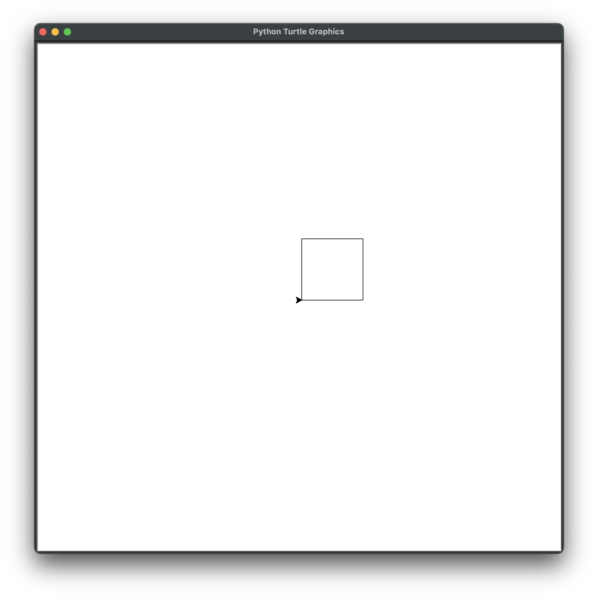](screenshot_first_square.png)

The steps given to the program are:

1. Move forward 100 steps. (The turtle starts facing to the right.)
1. Turn 90 degrees to the left.
1. Move forward 100 steps.
1. Turn 90 degrees to the left.
1. Move forward 100 steps.
1. Turn 90 degrees to the left.
1. Move forward 100 steps. (The turtle is where it started.)
1. Turn 90 degrees to the left. (The turtle is facing the original direction.)
1. The program is done but the Turtle window should remain open so the user can look at the drawing.

With these nine steps, the turtle draws a square. Here is what you need to understand about each instruction in the program:

* The `# first_square.py` is a *comment* (see below) that is ignored by Python. You don't need to copy this part. It is here only to help identify the program names in this tutorial.

* The `from turtle import *` is an instruction needed at the beginning of all of your turtle programs. It imports the `turtle` module so you can do the turtle instructions.

* Blank lines are skipped by the Python interpreter.

* The instructions that begin with a `#` hashtag are *comments*. Everything on the line after the `#` hashtag is ignored by Python. Comments let you write notes to yourself about what the program does.

* You can skip typing the comments when copying the code in this tutorial. But including the comments may help you remember what the code does when you look at the program later.

* `forward()` is a function and `forward(100)` is a function call. A *function* is like a mini-program that contains code. Your program can run the code in functions by making a *function call*. Function calls can have values passed to them, like the `100` in `forward(100)`. These are called *function arguments* or just *arguments*.

* The `forward(100)` makes the turtle move forward in its current direction by 100 steps.

* The `left()` function makes the turtle turn its direction its left. "Left" means counterclockwise because imagine we are looking down at the turtle. The `left(90)` function call in our program makes the turtle turn left 90 degrees.

* (If you want the turtle to turn right, there is also a `right()` function your programs can call.)

* The `done()` function pauses the program until you close the Turtle window. In some code editors like IDLE, you don't need this in your program. In other code editors like Visual Studio Code, the window will immediately close at the end of the program without it. You should always add `done()` at the end of your Turtle programs so the user can see the drawing.

* The `done()` function call has no arguments, but you still need to type the `()` parentheses after `done`.

There are many functions like `left()`, `forward()`, and `done()`. This tutorial explains many of the functions in the `turtle` module. When you learn more of these functions, you will be able to draw many different shapes and beautiful pictures!

But let's make some more simple Turtle programs first.

### Drawing a Smaller Square

We can change `forward(100)` to `forward(25)` to draw a smaller square. Create and save a new file with the name *square_smaller.py*. Change the four function calls to `forward(100)` to look like this:

```python
# square_smaller.py
from turtle import *

forward(25)  # Now the turtle moves forward only 25 steps.
left(90)
forward(25)
left(90)
forward(25)
left(90)
forward(25)
left(90)
done()
```

When you run the program, it draws a smaller square because the lines are only 25 steps long instead of 100 steps.

[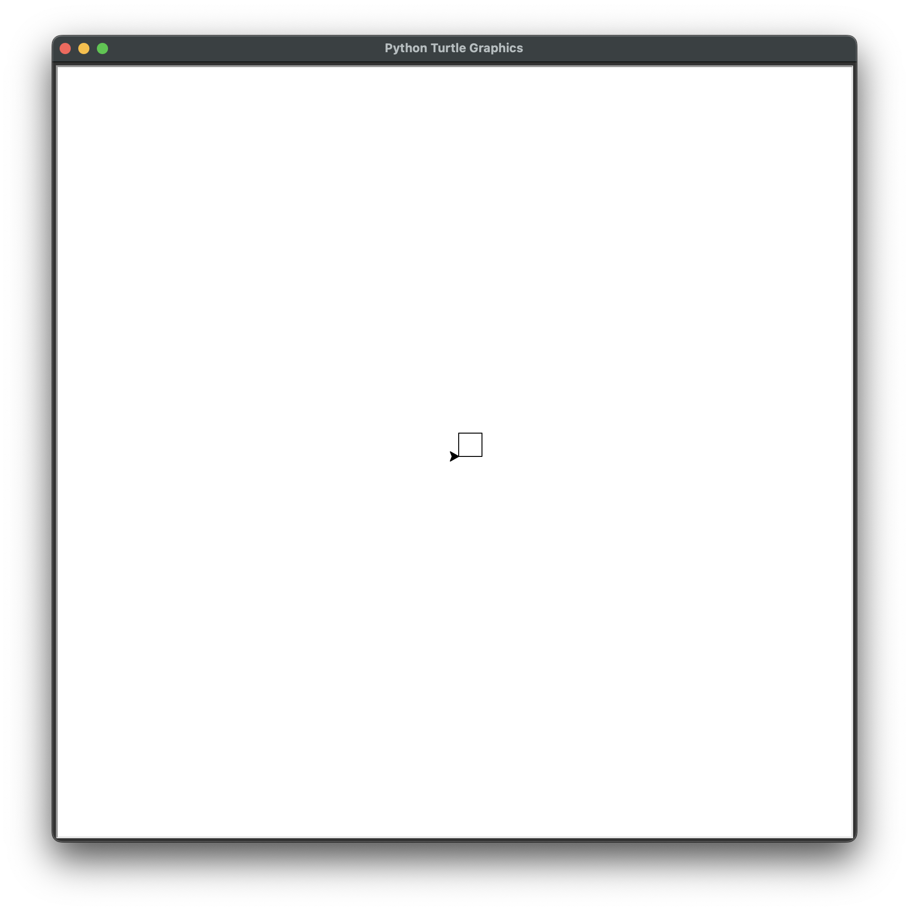](screenshot_square_smaller.png)

Remember that you must change all four places with `forward(100)` to `forward(25)`, or else the square will come out wrong. For example, I made program named *square_smaller_bug.py* that only made the change in three places:

```python
# square_smaller_bug.py
from turtle import *

forward(25)
left(90)
forward(25)
left(90)
forward(100)  # Uh oh, we forgot to change this line!
left(90)
forward(25)
left(90)
done()
```

This program has a *bug* in it, and draws the square wrong:

[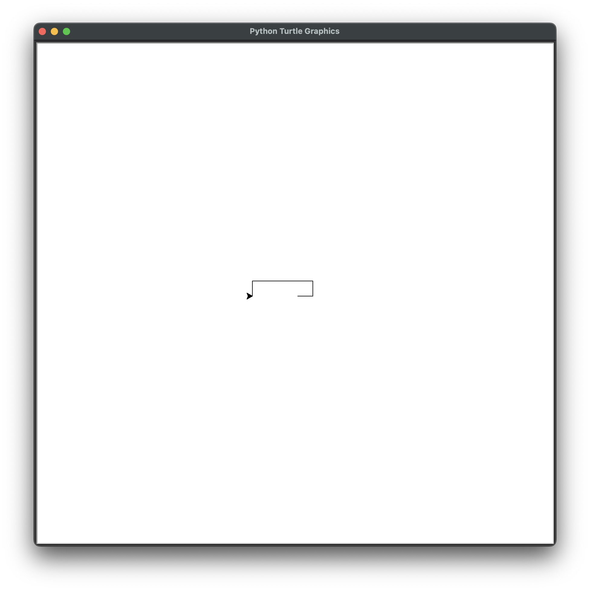](screenshot_square_smaller_bug.png)

Your computer does exactly what you tell it to do. But it is up to you to make sure what you *want* the computer to do is what you *told* the computer to do. If your program has a bug, carefully read your code and try to figure out what it is doing.

### Drawing a Square with a Variable Size

Instead of typing `25` in `forward(25)`, let's create a *variable* instead. Write the following code and save it as *square_variable.py*. The name of the variable is `line_length`, and the value in the variable is `25`:

```python
# square_variable.py
from turtle import *

line_length = 25  # This variable stores the number 25.
forward(line_length)  # The turtle moves 25 steps because line_length is 25.
left(90)
forward(line_length)
left(90)
forward(line_length)
left(90)
forward(line_length)
left(90)
done()
```

When we run this program, it draws the same square as before:

[](screenshot_square_smaller.png)

However, now we only have one thing to change if we want to change the size of the square. Try changing the `line_length` variable to a few other sizes, like `line_length = 300` or `line_length = 5`.

### Draw a Square with a Loop

Let's rewrite this program using a `for` loop instead. Save the file with the new name, *square_for_loop.py*. We can tell the program to call `forward(line_length)` and `left(90)` four times:

```python
# square_for_loop.py
from turtle import *

# The indented lines of code run 4 times:
for i in range(4):  
    forward(100)
    left(90)
done()
```

The indented code after `for i in range(4):` will run four times because we pass `4` to the `range()` function.

Be sure to have exactly four spaces of indentation before the `forward(line_length)` and `left(90)` lines of code! If they have different amounts of indentation, you will get an error that says `IndentationError: unindent does not match any outer indentation level`.

This program makes the same square drawing as before:

[](screenshot_first_square.png)

Let's change the code so that the turtle turns left by 86 degrees instead of 90 degrees. Save this program as *square_for_loop_86.py*:

```python
# square_for_loop_86.py
from turtle import *

for i in range(4):  
    forward(100)
    left(86)  # Turn left 86 degrees instead of 90.
done()
```

This draws a slightly different image that is not quite a square:

[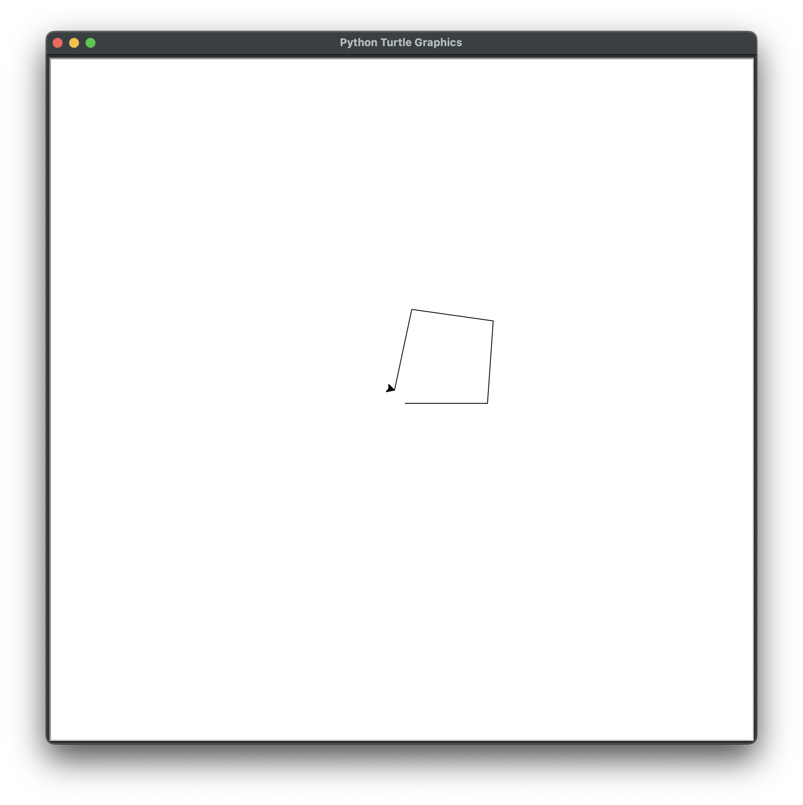](screenshot_square_for_loop_86.png)

Instead of turning left 86 degrees in the loop 4 times, let's do the loop 50 times. Make the following program and save it as *square_circle_86.py*:

```python
# square_circle_86.py
from turtle import *

speed('fastest')
for i in range(50):  # Loop 50 times instead of 4.
    forward(100)
    left(86)
hideturtle()
done()
```

This program does a lot more drawing than our previous programs, so we call the new `speed()` function and pass it the argument `'fastest'` to make the turtle move faster. Unlike `100` or `86`, this value is a *text string* and it must start and end with a quote character: `'fastest'` or `"fastest"`.

This program also calls the `hideturtle()` function to make the turtle arrow disappear at the end of the program.

This produces something that looks quite different from a simple square:

[](screenshot_square_circle_86.png)

By experimenting with different code and numbers, we can make all sorts of images. We can also have Python make random numbers for the left turns. Write the following code and save it as *square_random.py*. This program makes turns between 80 and 100 degrees:

```python
# square_random.py
from turtle import *
import random

speed('fastest')
for i in range(50):
    forward(100)
    # Turn left a random number of degrees between 80 and 100:
    left(random.randint(80, 100))
hideturtle()
done()
```

Because this program uses random numbers, the picture will look different each time you run the program:

[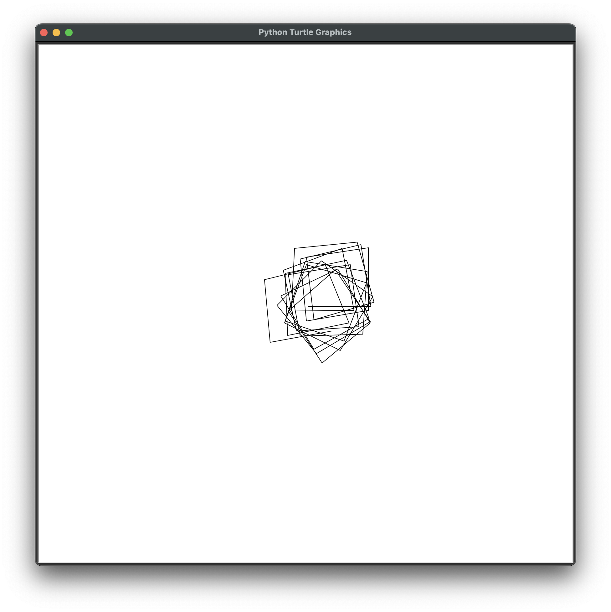](screenshot_square_random1.png)
[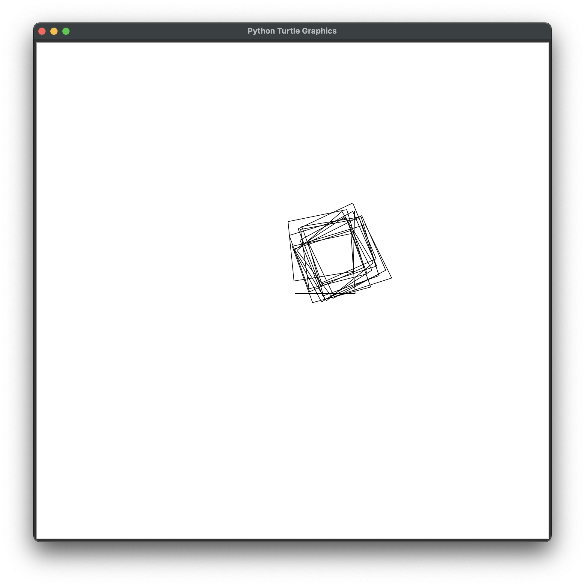](screenshot_square_random2.png)
[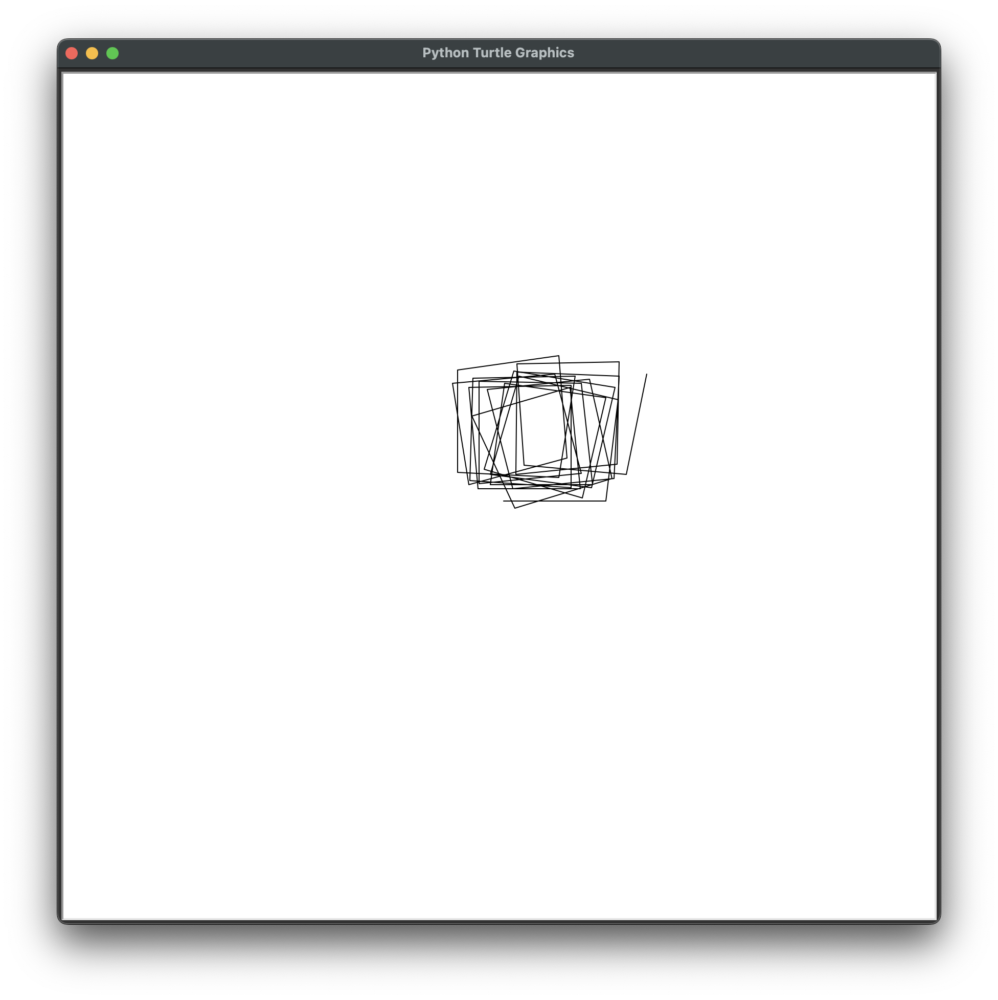](screenshot_square_random3.png)

There are a lot of different images we can learn to make with Turtle!

## Square Spirals Examples

Let's create a square spiral program. Open a new file and save it as *spiral.py*. Enter the following code.

```python
# spiral.py
from turtle import *

speed('fastest')
for i in range(300):
    forward(i)  # Use the i variable for the function argument.
    left(91)
hideturtle()
done()
```

[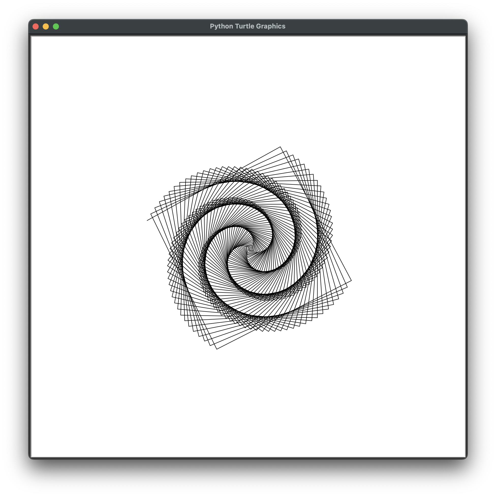](screenshot_spiral.png)


*spiral_red.py*

```python
# spiral_red.py
from turtle import *

speed('fastest')
pencolor('red')  # Make the lines red.
for i in range(300):
    forward(i)
    left(91)
hideturtle()
done()
```

[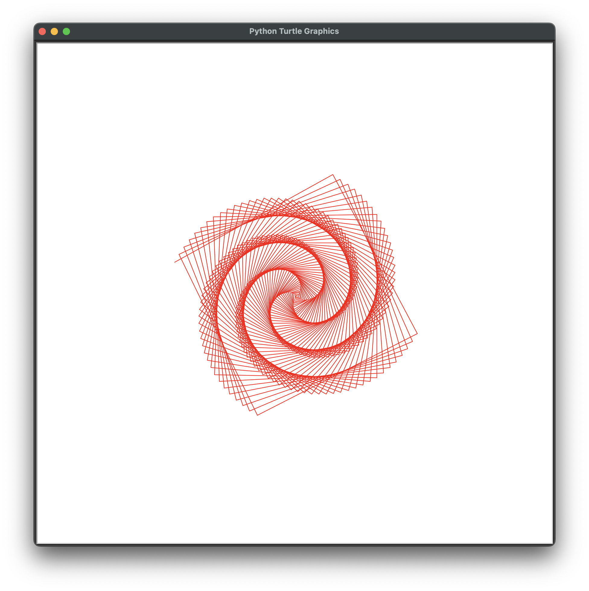](screenshot_spiral_red.png)

Try changing 91 to 30, 45, 60, 90, 120, 150, and 46, 61, 91, 120, 151. Finally, try 179 and 180.

*spiral_color.py*

```python
# spiral_color.py
from turtle import *
import random

colors = ['red', 'orange', 'yellow', 'blue', 'green', 'purple']

speed('fastest')
for i in range(300):
    pencolor(random.choice(colors))
    forward(i)
    left(91)
hideturtle()
done()
```

[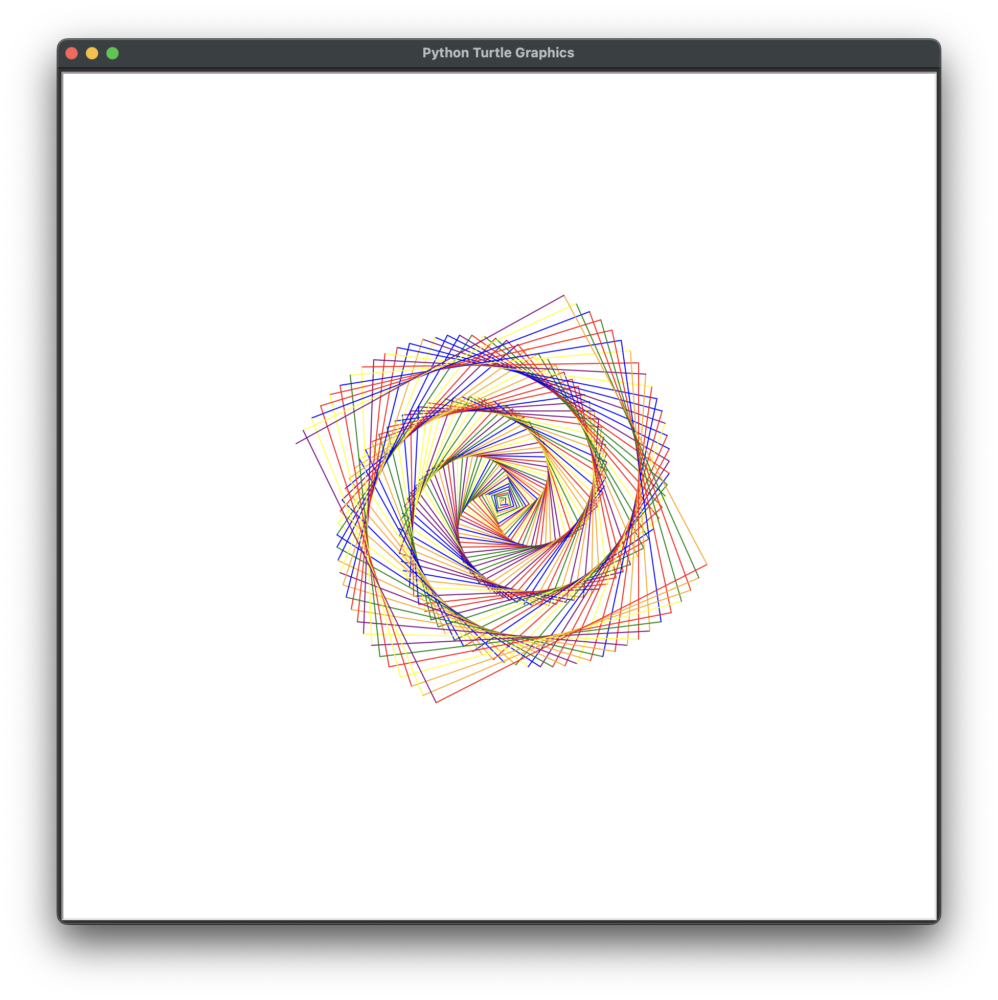](screenshot_spiral_color.png)


*spiral_black_bg.py*

```python
# spiral_black_bg.py
from turtle import *
import random

colors = ['red', 'orange', 'yellow', 'blue', 'green', 'purple']

speed('fastest')
pensize(3)
bgcolor('black')
for i in range(300):
    pencolor(random.choice(colors))
    forward(i)
    left(91)
hideturtle()
done()
```

[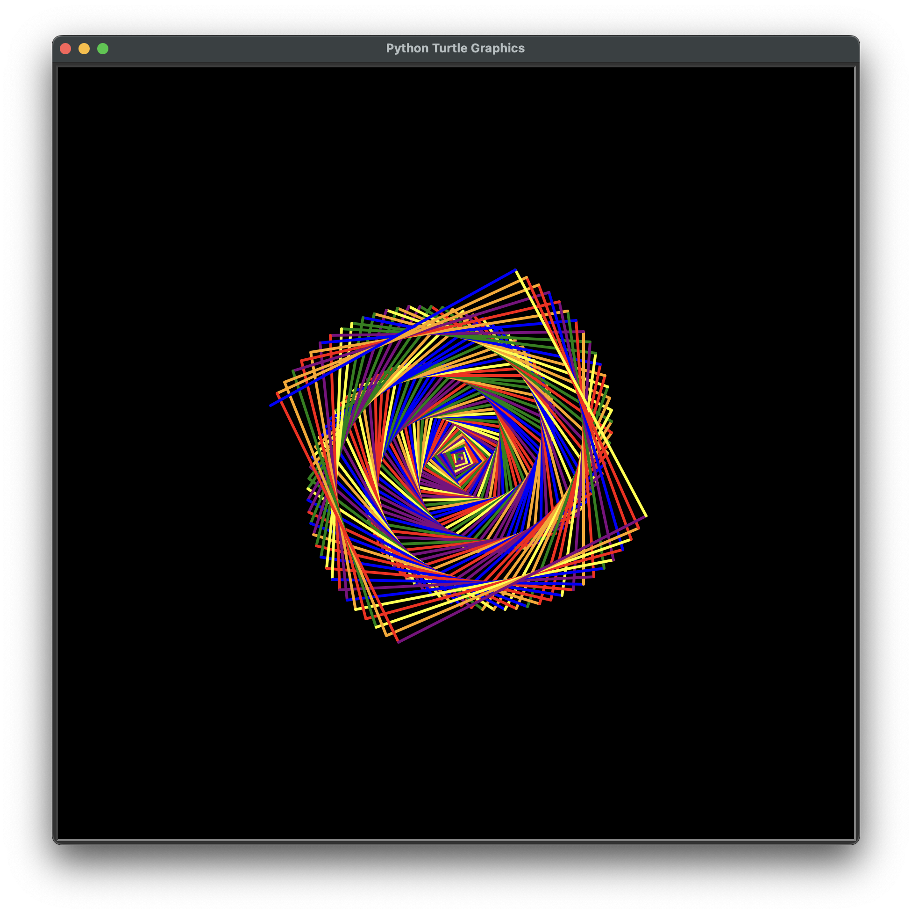](screenshot_spiral_black_bg.png)


*spiral_pretty.py*

```python
# spiral_pretty.py
from turtle import *

speed('fastest')
pensize(3)
bgcolor('black')

pencolor('red')
for i in range(60):
    forward(i)
    left(91)

pencolor('orange')
for i in range(60):
    forward(60 + i)
    left(91)

pencolor('yellow')
for i in range(60):
    forward(120 + i)
    left(91)

pencolor('green')
for i in range(60):
    forward(180 + i)
    left(91)

pencolor('blue')
for i in range(60):
    forward(240 + i)
    left(91)

pencolor('purple')
for i in range(60):
    forward(300 + i)
    left(91)

done()
```

[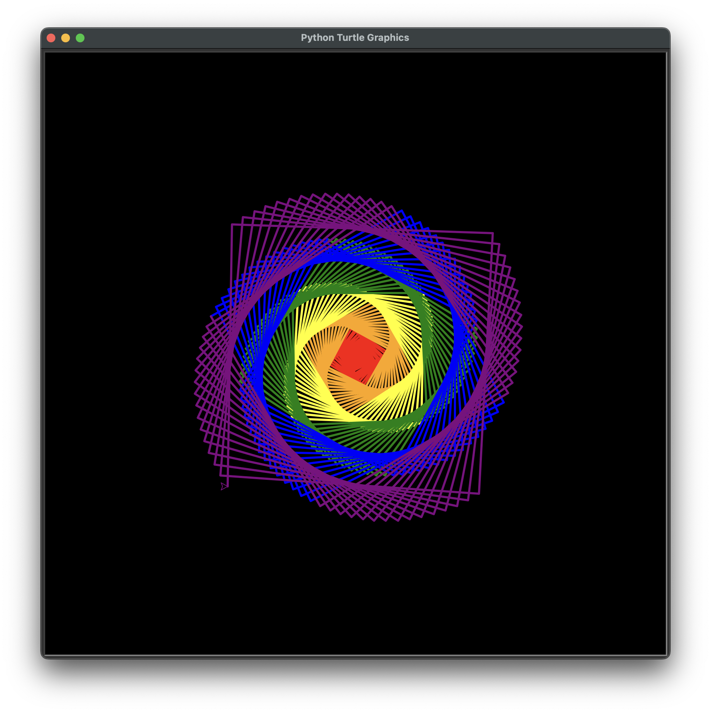](screenshot_spiral_pretty.png)


## Interactive Square Drawing

*click_square.py*

```python
# click_square.py
from turtle import *

speed('fastest')

def draw_square(x, y):
    goto(x, y)  # TODO
    for i in range(4):
        forward(100)
        left(90)

# When the turtle window is clicked, call draw_square():
getscreen().onclick(draw_square)
done()
```


*click_square_no_line.py*


```python
from turtle import *

speed('fastest')

def draw_square(x, y):
    penup()  # TODO 
    goto(x, y)
    pendown()  # TODO
    for i in range(4):
        forward(100)
        left(90)
    update()

getscreen().onclick(draw_square)
done()
```


```python
from turtle import *
import random

tracer(1000, 0)  # TODO

def draw_spiral(x, y):
    penup()
    goto(x, y)
    pendown()
    setheading(0)
    line_length = random.randint(50, 200)
    turn_radius = random.randint(50, 70)
    for i in range(100):
        forward(i)
        left(turn_radius)
    update()

getscreen().onclick(draw_spiral)
done()  # Make turtle wait for clicks.
```

```python
from turtle import *
import random

tracer(1000, 0)

def draw_spiral(x, y):
    penup()
    goto(x, y)
    pendown()
    setheading(0)
    line_length = random.randint(50, 200)
    turn_radius = random.randint(50, 70)
    for i in range(100):
        forward()
        left(turn_radius)
    update()

# When the turtle window is clicked, call draw_spiral():
getscreen().onclick(draw_spiral)

listen()  # Put the turtle window in focus.
done()  # Make turtle wait for clicks.
```


```python
# Draw a rose.
from turtle import *
import random

tracer(1000, 0)

def draw_square(x, y):
    penup()
    goto(x, y)
    pendown()
    setheading(0)
    for i in range(100):
        pencolor((random.random(), 0, 0))
        pensize(random.randint(2, 5))
        forward(i)
        left(random.randint(50, 70))
    update()


bgcolor('black')
pencolor('red')
pensize(4)

# When the turtle window is clicked, call draw_sqaure():
getscreen().onclick(draw_square)

listen()  # Put the turtle window in focus.
done()  # Make turtle wait for clicks.
```


This is a program that draws blue flowers:

```python
from turtle import *
import random

tracer(1000, 0)

for n in range(50):
    penup()
    x = random.randint(-300, 300)
    y = random.randint(-300, 300)
    goto(x, y)
    pendown()

    pencolor((0, 0, random.random()))

    circle_size = random.randint(10, 40)
    pensize(random.randint(1, 5))

    for i in range(6):
        circle(circle_size)
        left(60)
update()
done()
```

[](blue_flowers.png)

## Moving

By calling these functions, the turtle can be made to move around the screen. Imagine the turtle holding a pen down on the ground and drawing a line as it moves around.

The turtle's position is two numbers: the X coordinate and Y coordinate. The turtle also

### forward(*distance*)

The forward() function moves the turtle *distance* number of steps in the current direction. If the pen is down (see pendown() and penup()) a line will be drawn as the turtle moves forward. If *distance* is a negative number, the turtle will move backwards.

### backward(*distance*)

The backward() function moves the turtle *distance* number of steps in **opposite direction** the current direction. If the pen is down (see pendown() and penup()) a line will be drawn as the turtle moves backward. If *distance* is a negative number, the turtle will move forward.

### right(*angle*)

The right() function will change the current direction clockwise by *angle* degrees. If you imagine being above the turtle looking down, the turtle turning right looks like it is turning clockwise. The turtle will not move; it will only change the direction it is facing.

This example moves the turtle forward, then turns right by 90 degrees, then moves forward again:

This example moves the turtle forward, then turns left by 90 degrees, then moves forward again:

```python
from turtle import *
forward(100)
right(90)
forward(100)
```

[](turn_right.png)

### left(*angle*)

The left() function will change the current direction counter-clockwise or anti-clockwise by *angle* degrees. If you imagine being above the turtle looking down, the turtle turning left looks like it is turning counter-clockwise or anti-clockwise. The turtle will not move; it will only change the direction it is facing.

This example moves the turtle forward, then turns left by 90 degrees, then moves forward again:

```python
from turtle import *
forward(100)
left(90)
forward(100)
```

[](turn_left.png)

### goto(*x*, *y*)

The goto() function will immediately move the turtle to the given *x* and *y* coordinates. If the pen is down (see pendown() and penup()) a line will be drawn from the previous coordinates to the new coordinates.

This example moves the to several x and y coordinates while drawing a line behind it:

```python
from turtle import *

goto(50, 50)
goto(-50, 50)
goto(100, -50)
goto(-50, -50)
```

[](goto.png)

### setx(*x*)

The goto() function will immediately move the turtle to the given *x* coordinate. The turtle's y coordinate will stay the same. If the pen is down (see pendown() and penup()) a line will be drawn from the previous coordinates to the new coordinates.

### sety(*y*)

The goto() function will immediately move the turtle to the given *y* coordinate. The turtle's x coordinate will stay the same. If the pen is down (see pendown() and penup()) a line will be drawn from the previous coordinates to the new coordinates.

### setheading(*heading*)

The setheading() function will change the current direction to the *heading* angle. If you imagine being above the turtle looking down, the turtle turning left looks like it is turning counter-clockwise or anti-clockwise. The turtle will not move; it will only change the heading it is facing.

```python
from turtle import *

for angle in range(0, 360, 15):
    setheading(angle)
    forward(100)
    write(str(angle) + '°')
    backward(100)
```

[](setheading.png)

### undo()

The undo() function will undo the turtle's last action. It will be as though the last action was never made. For example, if the last action was a call to the forward(100) function, calling undo will move the turtle backwards 100 steps and erase any line that was drawn. The undo() function can be called many times to erase more and more of the turtle

```python
from turtle import *

for i in range(10):
    forward(100)
    left(90)
    forward(10)
    left(90)
    forward(100)
    right(90)
    forward(10)
    right(90)

for i in range(30):
    undo()
```

[](undo_before.png) [](undo_after.png)


### home()

The home() function will move the turtle to it's original position at the coordinates (0, 0) and set it's direction to 0 degrees. Calling home() is the same as calling goto(0, 0) and setheading(0). If the pen is down (see pendown() and penup()) a line will be drawn as the turtle moves back home.

```python
from turtle import *

forward(100)
right(90)
forward(100)
home()
```

[](home.png)

## Drawing

### pendown()

The pendown() function will cause the turtle to draw as it moves around. The line it draws can be set with the pencolor() and pensize() functions.

### penup()

The penup() function will cause the turtle to draw as it moves around. The line it draws can be set with the pencolor() and pensize() functions.

### pensize(*size*)

The pensize() function sets the width of the line that the turtle draws as it moves.

[](pensize.png)

### pencolor(), pencolor(*color*), pencolor((*red*, *green*, *blue*)), pencolor(*red*, *green*, *blue*)

The pencolor() function sets the color of the line that the turtle draws. The pencolor() function can be passed a string of the color, such as 'red' or 'black'. Or, the pencolor() function can be passed an "RGB color tuple" (see the [Color](#color) section).

```python
from turtle import *

pensize(20)
pencolor('red')
forward(50)
pencolor(0, 1.0, 0)
forward(50)
pencolor((0, 0.5, 0.5))
forward(50)

pensize(10)
goto(-400, 50)

for red in range(4):
    for green in range(4):
        for blue in range(4):
            pencolor(red / 4.0, green / 4.0, blue / 4.0)
            forward(10)
```

[](pencolor.png)

### clear()

The clear() function will erase all the line drawings on the screen. This function does not move the turtle.

### reset()

The reset()) function will erase all the line drawings on the screen and return the turtle to the (0, 0) coordinate and facing 0 degrees. This function does the same thing as calling the clear() and home() function.

## Color

Red, green, and blue are the three primary colors of light.

The float value 0.0 represents none of that color. The float value 1.0 represents a full color. So the color red is represented by the RGB color tuple (1.0, 0, 0). The color purple is half-red and half-blue, so it is represented by the RGB color tuple (0.5, 0.0, 0.5). Full red and blue makes pink: (1.0, 0.0, 1.0)

Here are some RGB color tuples:


<table>
<tbody><tr>
<td class="color_td" style="background:#330000; color: #FFFFFF">(0.2, 0.0, 0.0)</td>
<td class="color_td" style="background:#331900; color: #FFFFFF">(0.2, 0.1, 0.0)</td>
<td class="color_td" style="background:#333300; color: #FFFFFF">(0.2, 0.2, 0.0)</td>
<td class="color_td" style="background:#193300; color: #FFFFFF">(0.1, 0.2, 0.0)</td>
<td class="color_td" style="background:#003300; color: #FFFFFF">(0.0, 0.2, 0.0)</td>
<td class="color_td" style="background:#003319; color: #FFFFFF">(0.0, 0.2, 0.1)</td>
<td class="color_td" style="background:#003333; color: #FFFFFF">(0.0, 0.2, 0.2)</td>
<td class="color_td" style="background:#001933; color: #FFFFFF">(0.0, 0.1, 0.2)</td>
<td class="color_td" style="background:#000033; color: #FFFFFF">(0.0, 0.0, 0.2)</td>
<td class="color_td" style="background:#190033; color: #FFFFFF">(0.1, 0.0, 0.2)</td>
<td class="color_td" style="background:#330033; color: #FFFFFF">(0.2, 0.0, 0.2)</td>
<td class="color_td" style="background:#330019; color: #FFFFFF">(0.2, 0.0, 0.1)</td>
<td class="color_td" style="background:#000000; color: #FFFFFF">(0.0, 0.0, 0.0)</td>
</tr>
<tr>
<td class="color_td" style="background:#660000; color: #FFFFFF">(0.4, 0.0, 0.0)</td>
<td class="color_td" style="background:#663300; color: #FFFFFF">(0.4, 0.2, 0.0)</td>
<td class="color_td" style="background:#666600; color: #FFFFFF">(0.4, 0.4, 0.0)</td>
<td class="color_td" style="background:#336600; color: #FFFFFF">(0.2, 0.4, 0.0)</td>
<td class="color_td" style="background:#006600; color: #FFFFFF">(0.0, 0.4, 0.0)</td>
<td class="color_td" style="background:#006633; color: #FFFFFF">(0.0, 0.4, 0.2)</td>
<td class="color_td" style="background:#006666; color: #FFFFFF">(0.0, 0.4, 0.4)</td>
<td class="color_td" style="background:#003366; color: #FFFFFF">(0.0, 0.2, 0.4)</td>
<td class="color_td" style="background:#000066; color: #FFFFFF">(0.0, 0.0, 0.4)</td>
<td class="color_td" style="background:#330066; color: #FFFFFF">(0.2, 0.0, 0.4)</td>
<td class="color_td" style="background:#660066; color: #FFFFFF">(0.4, 0.0, 0.4)</td>
<td class="color_td" style="background:#660033; color: #FFFFFF">(0.4, 0.0, 0.2)</td>
<td class="color_td" style="background:#202020; color: #FFFFFF">(0.13, 0.13, 0.13)</td>
</tr>
<tr>
<td class="color_td" style="background:#990000; color: #FFFFFF">(0.6, 0.0, 0.0)</td>
<td class="color_td" style="background:#994C00; color: #FFFFFF">(0.6, 0.3, 0.0)</td>
<td class="color_td" style="background:#999900; color: #FFFFFF">(0.6, 0.6, 0.0)</td>
<td class="color_td" style="background:#4C9900; color: #FFFFFF">(0.3, 0.6, 0.0)</td>
<td class="color_td" style="background:#009900; color: #FFFFFF">(0.0, 0.6, 0.0)</td>
<td class="color_td" style="background:#00994C; color: #FFFFFF">(0.0, 0.6, 0.3)</td>
<td class="color_td" style="background:#009999; color: #FFFFFF">(0.0, 0.6, 0.6)</td>
<td class="color_td" style="background:#004C99; color: #FFFFFF">(0.0, 0.3, 0.6)</td>
<td class="color_td" style="background:#000099; color: #FFFFFF">(0.0, 0.0, 0.6)</td>
<td class="color_td" style="background:#4C0099; color: #FFFFFF">(0.3, 0.0, 0.6)</td>
<td class="color_td" style="background:#990099; color: #FFFFFF">(0.6, 0.0, 0.6)</td>
<td class="color_td" style="background:#99004C; color: #FFFFFF">(0.6, 0.0, 0.3)</td>
<td class="color_td" style="background:#404040; color: #FFFFFF">(0.25, 0.25, 0.25)</td>
</tr>
<tr>
<td class="color_td" style="background:#CC0000; color: #FFFFFF">(0.8, 0.0, 0.0)</td>
<td class="color_td" style="background:#CC6600; color: #FFFFFF">(0.8, 0.4, 0.0)</td>
<td class="color_td" style="background:#CCCC00; color: #FFFFFF">(0.8, 0.8, 0.0)</td>
<td class="color_td" style="background:#66CC00; color: #FFFFFF">(0.4, 0.8, 0.0)</td>
<td class="color_td" style="background:#00CC00; color: #FFFFFF">(0.0, 0.8, 0.0)</td>
<td class="color_td" style="background:#00CC66; color: #FFFFFF">(0.0, 0.8, 0.4)</td>
<td class="color_td" style="background:#00CCCC; color: #FFFFFF">(0.0, 0.8, 0.8)</td>
<td class="color_td" style="background:#0066CC; color: #FFFFFF">(0.0, 0.4, 0.8)</td>
<td class="color_td" style="background:#0000CC; color: #FFFFFF">(0.0, 0.0, 0.8)</td>
<td class="color_td" style="background:#6600CC; color: #FFFFFF">(0.4, 0.0, 0.8)</td>
<td class="color_td" style="background:#CC00CC; color: #FFFFFF">(0.8, 0.0, 0.8)</td>
<td class="color_td" style="background:#CC0066; color: #FFFFFF">(0.8, 0.0, 0.4)</td>
<td class="color_td" style="background:#606060; color: #FFFFFF">(0.38, 0.38, 0.38)</td>
</tr>
<tr>
<td class="color_td" style="background:#FF0000">(1.0, 0.0, 0.0)</td>
<td class="color_td" style="background:#FF8000">(1.0, 0.5, 0.0)</td>
<td class="color_td" style="background:#FFFF00">(1.0, 1.0, 0.0)</td>
<td class="color_td" style="background:#80FF00">(0.5, 1.0, 0.0)</td>
<td class="color_td" style="background:#00FF00">(0.0, 1.0, 0.0)</td>
<td class="color_td" style="background:#00FF80">(0.0, 1.0, 0.5)</td>
<td class="color_td" style="background:#00FFFF">(0.0, 1.0, 1.0)</td>
<td class="color_td" style="background:#0080FF">(0.0, 0.5, 1.0)</td>
<td class="color_td" style="background:#0000FF">(0.0, 0.0, 1.0)</td>
<td class="color_td" style="background:#7F00FF">(0.5, 0.0, 1.0)</td>
<td class="color_td" style="background:#FF00FF">(1.0, 0.0, 1.0)</td>
<td class="color_td" style="background:#FF007F">(1.0, 0.0, 0.5)</td>
<td class="color_td" style="background:#808080">(0.5, 0.5, 0.5)</td>
</tr>
<tr>
<td class="color_td" style="background:#FF3333">(1.0, 0.2, 0.2)</td>
<td class="color_td" style="background:#FF9933">(1.0, 0.6, 0.2)</td>
<td class="color_td" style="background:#FFFF33">(1.0, 1.0, 0.2)</td>
<td class="color_td" style="background:#99FF33">(0.6, 1.0, 0.2)</td>
<td class="color_td" style="background:#33FF33">(0.2, 1.0, 0.2)</td>
<td class="color_td" style="background:#33FF99">(0.2, 1.0, 0.6)</td>
<td class="color_td" style="background:#33FFFF">(0.2, 1.0, 1.0)</td>
<td class="color_td" style="background:#3399FF">(0.2, 0.6, 1.0)</td>
<td class="color_td" style="background:#3333FF">(0.2, 0.2, 1.0)</td>
<td class="color_td" style="background:#9933FF">(0.6, 0.2, 1.0)</td>
<td class="color_td" style="background:#FF33FF">(1.0, 0.2, 1.0)</td>
<td class="color_td" style="background:#FF3399">(1.0, 0.2, 0.6)</td>
<td class="color_td" style="background:#A0A0A0">(0.63, 0.63, 0.63)</td>
</tr>
<tr>
<td class="color_td" style="background:#FF6666">(1.0, 0.4, 0.4)</td>
<td class="color_td" style="background:#FFB266">(1.0, 0.7, 0.4)</td>
<td class="color_td" style="background:#FFFF66">(1.0, 1.0, 0.4)</td>
<td class="color_td" style="background:#B2FF66">(0.7, 1.0, 0.4)</td>
<td class="color_td" style="background:#66FF66">(0.4, 1.0, 0.4)</td>
<td class="color_td" style="background:#66FFB2">(0.4, 1.0, 0.7)</td>
<td class="color_td" style="background:#66FFFF">(0.4, 1.0, 1.0)</td>
<td class="color_td" style="background:#66B2FF">(0.4, 0.7, 1.0)</td>
<td class="color_td" style="background:#6666FF">(0.4, 0.4, 1.0)</td>
<td class="color_td" style="background:#B266FF">(0.7, 0.4, 1.0)</td>
<td class="color_td" style="background:#FF66FF">(1.0, 0.4, 1.0)</td>
<td class="color_td" style="background:#FF66B2">(1.0, 0.4, 0.7)</td>
<td class="color_td" style="background:#C0C0C0">(0.75, 0.75, 0.75)</td>
</tr>
<tr>
<td class="color_td" style="background:#FF9999">(1.0, 0.6, 0.6)</td>
<td class="color_td" style="background:#FFCC99">(1.0, 0.8, 0.6)</td>
<td class="color_td" style="background:#FFFF99">(1.0, 1.0, 0.6)</td>
<td class="color_td" style="background:#CCFF99">(0.8, 1.0, 0.6)</td>
<td class="color_td" style="background:#99FF99">(0.6, 1.0, 0.6)</td>
<td class="color_td" style="background:#99FFCC">(0.6, 1.0, 0.8)</td>
<td class="color_td" style="background:#99FFFF">(0.6, 1.0, 1.0)</td>
<td class="color_td" style="background:#99CCFF">(0.6, 0.8, 1.0)</td>
<td class="color_td" style="background:#9999FF">(0.6, 0.6, 1.0)</td>
<td class="color_td" style="background:#CC99FF">(0.8, 0.6, 1.0)</td>
<td class="color_td" style="background:#FF99FF">(1.0, 0.6, 1.0)</td>
<td class="color_td" style="background:#FF99CC">(1.0, 0.6, 0.8)</td>
<td class="color_td" style="background:#E0E0E0">(0.88, 0.88, 0.88)</td>
</tr>
<tr>
<td class="color_td" style="background:#FFCCCC">(1.0, 0.8, 0.8)</td>
<td class="color_td" style="background:#FFE5CC">(1.0, 0.9, 0.8)</td>
<td class="color_td" style="background:#FFFFCC">(1.0, 1.0, 0.8)</td>
<td class="color_td" style="background:#E5FFCC">(0.9, 1.0, 0.8)</td>
<td class="color_td" style="background:#CCFFCC">(0.8, 1.0, 0.8)</td>
<td class="color_td" style="background:#CCFFE5">(0.8, 1.0, 0.9)</td>
<td class="color_td" style="background:#CCFFFF">(0.8, 1.0, 1.0)</td>
<td class="color_td" style="background:#CCE5FF">(0.8, 0.9, 1.0)</td>
<td class="color_td" style="background:#CCCCFF">(0.8, 0.8, 1.0)</td>
<td class="color_td" style="background:#E5CCFF">(0.9, 0.8, 1.0)</td>
<td class="color_td" style="background:#FFCCFF">(1.0, 0.8, 1.0)</td>
<td class="color_td" style="background:#FFCCE5">(1.0, 0.8, 0.9)</td>
<td class="color_td" style="background:#FFFFFF">(1.0, 1.0, 1.0)</td>
</tr>
</tbody></table>

RGB Color Tuple: <input type="text" id="RGBTupleField" />


## Filling in Shapes

The turtle can draw the outline of a shape and then fill it in with color using the fill functions. The filling process starts when the begin_color() function is called. The turtle can move around as normal. When the end_fill() function is called, the shape the turtle was drawing will be filled with the fill color. The fill color is separate from the pen color.

```python
from turtle import *

fillcolor('purple')
pensize(10)
pencolor('black')
forward(100)

begin_fill()
forward(100)
left(90)
forward(100)
left(90)
forward(100)
left(90)
forward(100)
left(90)
end_fill()
```

[](fill.png)

### fillcolor(), fillcolor(*color*), fillcolor((*red*, *green*, *blue*)), fillcolor(*red*, *green*, *blue*)

The fillcolor() function sets the color of the filled in shape when end_fill() is called. The fillcolor() function can be passed a string of the color, such as 'red' or 'black'. Or, the fillcolor() function can be passed an "RGB color tuple" (see the [Color](#color) section).

### begin_fill()

The begin_fill() starts recording the moves that will be the outline of the filled-in shape. The filled-in shape will not be drawn until end_fill() is called.

### end_fill()

The end_fill() function will stop recording the moves for the filled-in shape and draw the shape.


## Stamping

### stamp()

```python
from turtle import *

penup()

for i in range(30, -1, -1):
    stamp()
    left(i)
    forward(20)
```

[](stamp.png)

### clearstamp()

### clearstamps()


## Animation

### tracer()


## Turtle Status

### position()

### towards()

### distance()

### degrees()

### radians()

### isdown()

### isvisible()


## Input


## Events

### listen()

### onkey()

```python
from turtle import *

def up():
    setheading(90)
    forward(100)

def down():
    setheading(270)
    forward(100)

def left():
    setheading(180)
    forward(100)

def right():
    setheading(0)
    forward(100)

listen()

onkey(up, 'Up')
onkey(down, 'Down')
onkey(left, 'Left')
onkey(right, 'Right')

onkey(up, 'w')
onkey(down, 's')
onkey(left, 'a')
onkey(right, 'd')
```

[](onkey.png)

up, right, down, down, left, left, up


### onkeypress()

```python
from turtle import *

def blue_screen():
    bgcolor(0.7, 1.0, 1.0)

def white_screen():
    bgcolor(1.0, 1.0, 1.0)

listen()
onkeypress(blue_screen, 'space')
onkey(white_screen, 'space')
```

### onclick()

### ontimer()

### done()

### exitonclick()


## The Turtle

### showturtle()

### hideturtle()

### shape()


## The World

### bgcolor()

### bgpic()

### title()

### screensize()

### window_height()

### window_width()

### listen()