<meta charset="UTF-8">


# A Simple Turtle Tutorial for Python's turtle.py Module

**This document is still being written and not yet complete.**

This is a Turtle programming tutorial written by Al Sweigart, author of *Automate the Boring Stuff with Python* and other books. You can read all of his books for free online at [https://inventwithpython.com](https://inventwithpython.com)


## Table of Contents

1. [Introduction](#Introduction)
1. [Drawing a Square](#Drawing-a-Square)
1. [Drawing a Smaller Square](#Drawing-a-Smaller-Square)
1. [Common Bugs and Error Messages](#Common-Bugs-and-Error-Messages)
1. [Drawing a Square with a Variable Size](#Drawing-a-Square-with-a-Variable-Size)
1. [Draw a Square with a Loop](#Draw-a-Square-with-a-Loop)
1. [Quick Review 1](#Quick-Review-1)
1. [Practice Exercises 1](#Practice-Exercises-1)
1. [Writing Text in the Turtle Window](#Writing-Text-in-the-Turtle-Window)
1. [Angles](#Angles)
1. [XY Cartesian Coordinates](#XY-Cartesian-Coordinates)
1. [Raising and Lowering the Pen](#Raising-And-Lowering-the-Pen)
1. [Stamping](#Stamping)
1. [Square Spirals Examples](#Square-Spirals-Examples)
1. [Interactive Drawing](#Interactive-Drawing)


## Introduction

Turtle graphics is an easy way to learn programming by drawing with code. You program a small virtual object, called the *turtle*, to move around the screen and draw lines as it goes. This lets people make pictures with a computer while learning how to program. You can think of the turtle as an [Etch A Sketch](https://en.wikipedia.org/wiki/Etch_A_Sketch) controlled by your program.

This guide explains how to use Python's *turtle.py* module. It does not teach the Python language itself. It's good to already know some basic Python ideas, like variables, operators, loops, functions, importing modules, and random numbers.

Before starting, you need to install the *Python interpreter* (the software that runs Python code) from [python.org](https://python.org). You also need a code editor, like IDLE, Mu, or Visual Studio Code. 

Programs written in Python are called Python programs. Not all Python programs use turtle graphics. But in this guide, we will call programs that use the turtle module "Turtle programs."

Turtle graphics is a simple way to learn programming by making drawings with code. A small moving object, called the "turtle," moves around the screen and draws lines as it goes. This helps people create computer drawings and learn programming at the same time.

This tutorial only explains how to use Python's *turtle.py* module. It does not teach the Python language itself. It helps to already know some basic Python ideas, like variables, operators, loops, function calls, importing modules, and random numbers. You also need to first install the *Python interpreter*, the software that runs Python code, from [https://python.org](https://python.org) and a code editor like IDLE, Mu, or Visual Studio Code. However, even if you don't know how to program, you can still copy and run the example programs on your computer.


## Drawing a Square


Let's make a program that draws a square. Create a new file in your code editor. Save it as *first_square.py*. Enter the following Python code:

```python
# first_square.py

# This is a comment.
# Everything after # is a "comment" and is not run as code.
# Use comments to make notes to yourself about your code.

from turtle import *

pensize(4)  # Make the lines thicker than normal.

forward(200)  # Move the turtle forward 200 steps.
left(90)  # Turn the turtle left by 90 degrees.

# Move forward and turn three more times:
forward(200)
left(90)
forward(200)
left(90)
forward(200)
left(90)

done()  # Without this, the Turtle window may immediately close before you can see the picture.
```

Save the file after entering the code. Then run the program. (In IDLE, you can press F5 or click the Run > Run Module menu item. In Visual Studio Code, click the Run > Run Without Debugging menu item. In other editors, the steps to run a program may be different.)

When you run this program, a new window (which we will call the *Turtle window*) will appear with the following drawing:

[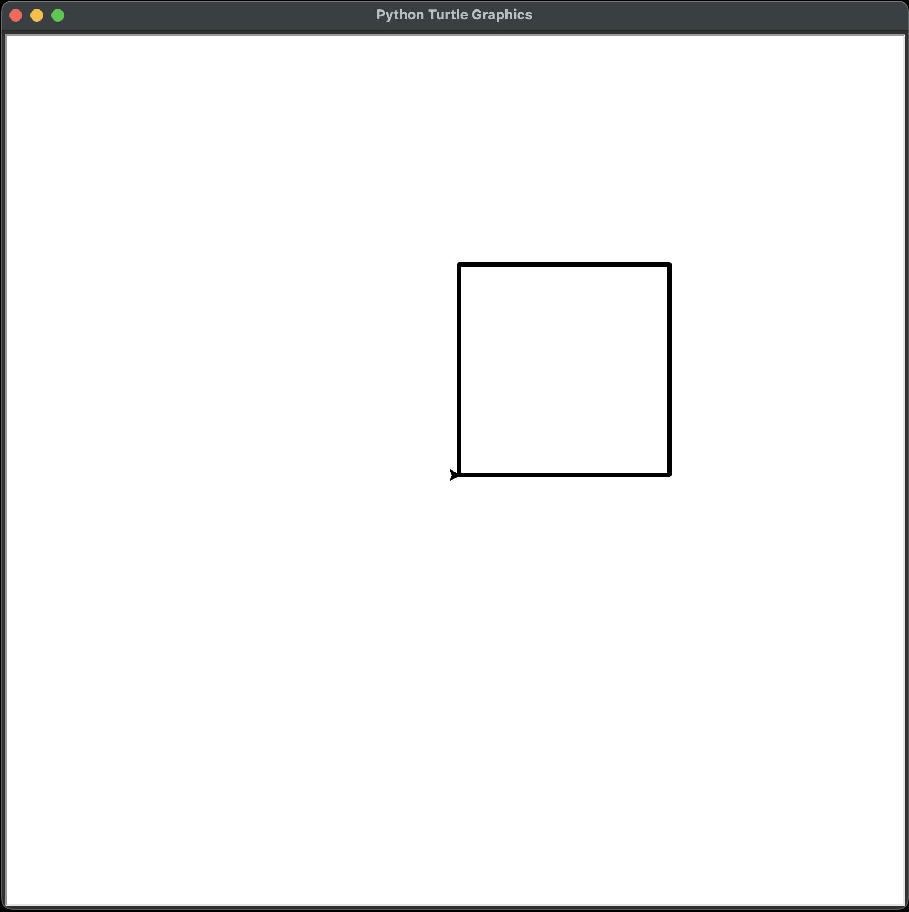](screenshot_first_square.jpg)

In the Turtle window, the turtle appears as a triangle. Imagine the turtle is holding a pen on the ground and drawing as it moves. The Python code tells it how to move:

1. Move forward 200 steps. (The turtle starts facing to the right.)
1. Turn 90 degrees to the left.
1. Move forward 200 steps.
1. Turn 90 degrees to the left.
1. Move forward 200 steps.
1. Turn 90 degrees to the left.
1. Move forward 200 steps. (The turtle is where it started.)
1. Turn 90 degrees to the left. (The turtle is facing the original direction.)
1. The program is done but the Turtle window should remain open so the user can look at the drawing.

With these nine steps, the turtle draws a square. Here is what you need to understand about each instruction in the program:

```python
# first_square.py

# This is a comment.
# Everything after # is a "comment" and is not run as code.
# Use comments to make notes to yourself about your code.
```

The `# first_square.py` line is a *comment* (see below) that is ignored by the Python interpreter. You don't need to copy the comments into your program. This is here only to help identify the program names in this tutorial.

Blank lines are skipped by the Python interpreter.

The next three lines are also comments. These comments explain what comments are.

```python
from turtle import *
```

You MUST have `from turtle import *` at the top of all of your turtle programs. It imports the `turtle` module so you can call the turtle functions in the rest of the programs. If you forget this line, your program will stop with a `NameError: name is not defined` error.

```python
pensize(4)  # Make the lines thicker than normal.
```

`pensize` is a function and `pensize(4)` is a function call. A *function* is like a mini-program that contains code. Your program can run the code in functions by making a *function call*. Function calls can have values passed to them, like the `4` in `pensize(4)`. These are called *function arguments* or just *arguments*.

In this tutorial, we always add parentheses to the name of a function so it is easy to see that it is a function: "the `pensize()` function"

```python
forward(200)  # Move the turtle forward 200 steps.
left(90)  # Turn the turtle left by 90 degrees.

# Move forward and turn three more times:
forward(200)
left(90)
forward(200)
left(90)
forward(200)
left(90)
```

The `forward(100)` makes the turtle move forward in its current direction by 100 steps. As the turtle moves, it draws a line behind it. Imagine a turtle animal with a black marker in its mouth, drawing lines on the ground as it moves.

The `left()` function makes the turtle turn its direction its left. Imagine we are in the sky looking down at the turtle in the program's window. The turtle's left is counterclockwise. The `left(90)` function call in our program makes the turtle turn left 90 degrees.

(If you want the turtle to turn right or clockwise, there is also a `right()` function.)

```python
done()  # Without this, the Turtle window may immediately close before you can see the picture.
```

The `done()` function pauses the program until you close the Turtle window. Python programs end immediately after the last instruction runs. This can cause the Turtle window to close as soon as your drawing has finished. You should always add `done()` at the end of your Turtle programs so the window stays open and the user can see the drawing.

The `done()` function call has no arguments, but you still need to type the `()` parentheses after `done`.

There are many functions like `left()`, `forward()`, and `done()`. This tutorial explains many of the functions in the `turtle` module. When you learn more of these functions, you will be able to draw many different shapes and beautiful pictures!

But let's make some more simple Turtle programs first.


## Drawing a Smaller Square

Let's make a program that draws a smaller square. We can change `forward(200)` to `forward(25)` to draw a smaller square. Create a new file in your code editor. Save it as *square_smaller.py*. Enter the following Python code:

```python
# square_smaller.py
from turtle import *

pensize(4)
forward(25)  # Now the turtle moves forward only 25 steps.
left(90)
forward(25)
left(90)
forward(25)
left(90)
forward(25)
left(90)
done()
```

When you run the program, it draws a smaller square because the lines are only 25 steps long instead of 100 steps.

[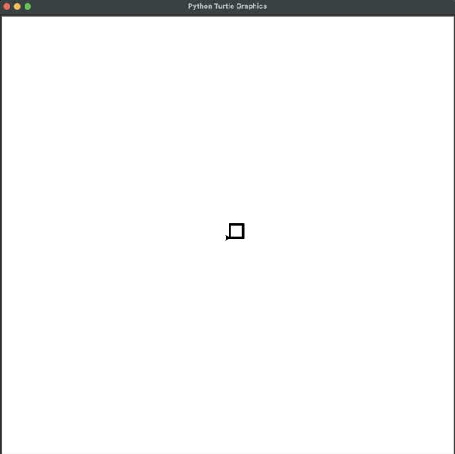](screenshot_square_smaller.jpg)

Remember that you must change all four places with `forward(200)` to `forward(25)`, or else the square will come out wrong. For example, I made program named *square_smaller_bug.py* that only made the change in three places:

```python
# square_smaller_buy.py
from turtle import *

pensize(4)
forward(25)
left(90)
forward(25)
left(90)
forward(200)  # Uh oh, we forgot to change this line!
left(90)
forward(25)
left(90)
done()
```

This program has a *bug* in it, and draws the square wrong:

[](screenshot_square_smaller_bug.jpg)

It's okay to make mistakes! You can fix them. Your computer does exactly what you tell it to do. But it is up to you to make sure what you *want* the computer to do is what you *told* the computer to do. If your program has a bug, carefully read your code and figure out where it is going wrong.


## Common Bugs and Error Messages

As you write Python code, you may get error messages when you try to run the program. Pay attention to the error message, especially where it tells you what line number the error happens. Here are some common error messages you might see and what causes them:

* **`ModuleNotFoundError: No module named 'trutle'`** - You made a typo in your `from turtle import *`. This specific error message was caused by the typo was `from trutle import *`.
* **`NameError: name 'froward' is not defined`** - You made a typo with a function or variable name. This specific error message was caused by the typo was `froward(100)`.
* **`TypeError: forward() missing 1 required positional argument: 'distance'`** - You made a function call but forgot to include an argument. This specific error message was caused by `forward()` which doesn't have the distance argument like in `forward(200)`
* **`TypeError: left() takes 1 positional argument but 2 were given`** - You made a function call but used too many arguments. This specific error message was caused by `left(90, 45)` but the `left()` function expects only one argument like `left(90)`.
* **`IndentationError: unexpected indent`** - There are too many spaces in front of the line of code.
* **`IndentationError: expected an indented block after 'for' statement on line 5`** - You did not increase the amount of indentation after the beginning of a `for i in range(4):` loop.
* **`SyntaxError: invalid syntax`** - There is a general problem with your code. Python can't understand it, but also doesn't know what correction to suggest. It can tell you the line number where it detected the problem though! If you write code by randomly mashing the keyboard, you will probably get this error message.

When the error message says the error happens on, say, line number 5 in your program, it is possible that the true source of the error happens on the previous line: line number 4. The Python interpreter was unable to notice the error until line 5.


## Drawing a Square with a Variable Size

Instead of typing `25` in `forward(25)`, let's create a *variable* instead. The name of the variable will be `line_length`. The value in the variable will be `25`.

Create a new file in your code editor. Save it as *square_variable.py*. Enter the following Python code:

```python
# square_variable.py
from turtle import *

pensize(4)
line_length = 25  # This variable stores the number 25.
forward(line_length)  # The turtle moves 25 steps because line_length is 25.
left(90)
forward(line_length)
left(90)
forward(line_length)
left(90)
forward(line_length)
left(90)
done()
```

When we run this program, it draws the same square as before:

[](screenshot_square_smaller.jpg)

However, now we only have one thing to change if we want to change the size of the square. Try changing the `line_length` variable to a few other sizes, like `line_length = 300` or `line_length = 5`.

## Draw a Square with a Loop

Let's write program to draw a square using a `for` loop. Create a new file in your code editor. Save it as *square_for_loop.py*. Enter the following Python code:

Let's rewrite this program using a `for` loop instead. Save the file with the new name, *square_for_loop.py*. We can tell the program to call `forward(line_length)` and `left(90)` four times:

```python
# square_for_loop.py
from turtle import *

pensize(4)

# The indented lines of code run 4 times:
for i in range(4):  
    forward(200)
    left(90)
done()
```

The indented code after `for i in range(4):` will run four times because we pass `4` to the `range()` function.

Be sure to have exactly four spaces of indentation before the `forward(line_length)` and `left(90)` lines of code! If they have different amounts of indentation, you will get an error that says `IndentationError: unindent does not match any outer indentation level`.

This program makes the same square drawing as before:

[](screenshot_first_square.jpg)

Our program only needs to call `pensize(4)` once, so we put it before the loop.

Let's change the code so that the turtle turns left by 86 degrees instead of 90 degrees. Create a new file in your code editor. Save it as *square_for_loop_86.py*. Enter the following Python code:

```python
# square_for_loop_86.py
from turtle import *

pensize(4)

for i in range(4):  
    forward(200)
    left(86)  # Turn left 86 degrees instead of 90.
done()
```

This draws a slightly different image that is not quite a square:

[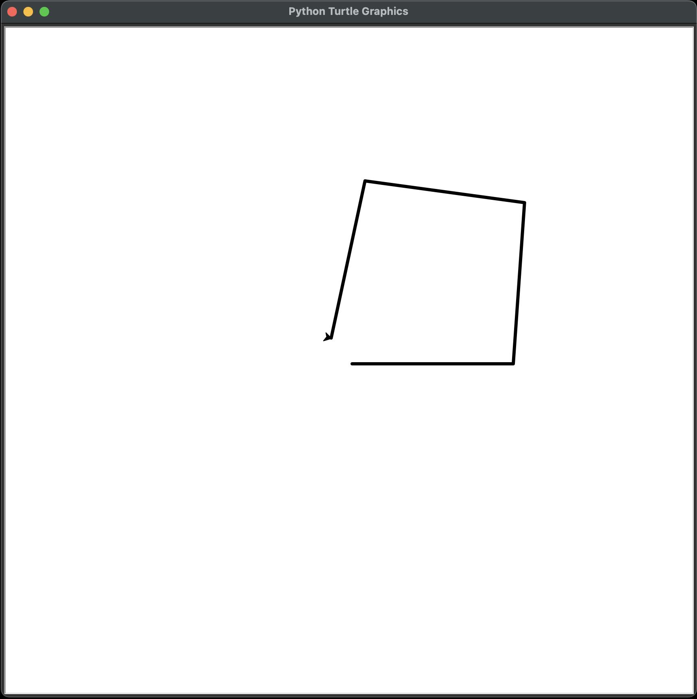](screenshot_square_for_loop_86.jpg)

Instead of turning left 86 degrees in the loop 4 times, let's do the loop 50 times. Let's make a program that draws a square. Create a new file in your code editor. Save it as *square_circle_86.py*. Enter the following Python code:

```python
# square_circle_86.py
from turtle import *

pensize(4)
speed('fastest')

for i in range(50):  # Loop 50 times instead of 4.
    forward(200)
    left(86)
hideturtle()
done()
```

This program does a lot more drawing than our previous programs, so we call the new `speed()` function and pass it the argument `'fastest'` to make the turtle move faster. Unlike `100` or `86`, this value is a *text string* and it must start and end with a quote character: `'fastest'` or `"fastest"`.

The arguments you can pass to `speed()` are `'fastest'`, `'fast'`, `'normal'`, `'slow'`, and `'slowest'`.

This program also calls the `hideturtle()` function to make the turtle triangle cursor disappear at the end of the program.

This produces something that looks quite different from a simple square:

[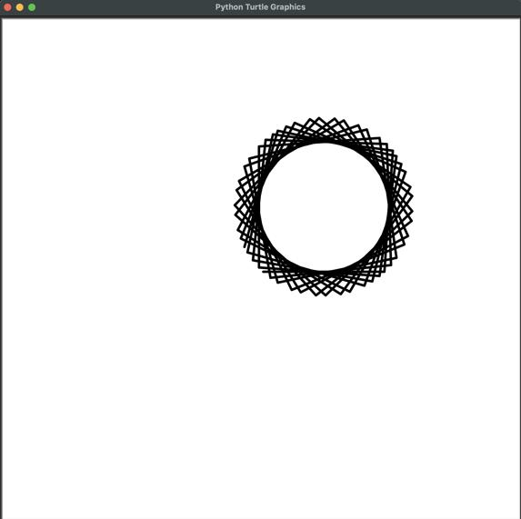](screenshot_square_circle_86.jpg)

By experimenting with different code and numbers, we can make all sorts of images. We can also have Python use random numbers for the left turns. Let's make a program that draws a square. Create a new file in your code editor. Save it as *square_random.py*. This program makes turns between 80 and 100 degrees:

```python
# square_random.py
from turtle import *
from random import *

pensize(4)
speed('fastest')

for i in range(50):
    forward(200)
    # Turn left a random number of degrees between 80 and 100:
    left(randint(80, 100))
hideturtle()
done()
```

Because this program uses random numbers, the picture will look different each time you run the program:

[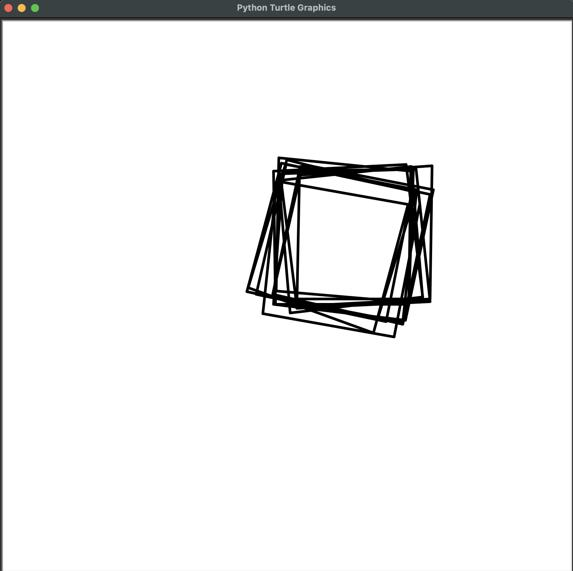](screenshot_square_random1.jpg)
[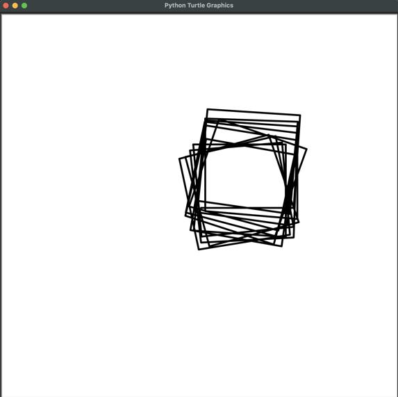](screenshot_square_random2.jpg)
[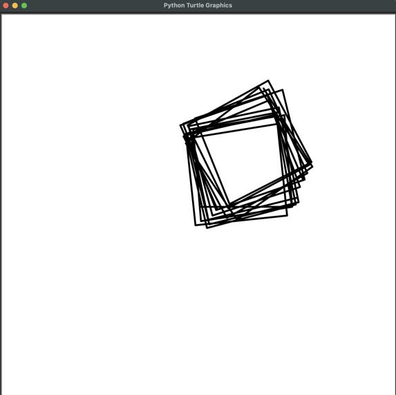](screenshot_square_random3.jpg)
[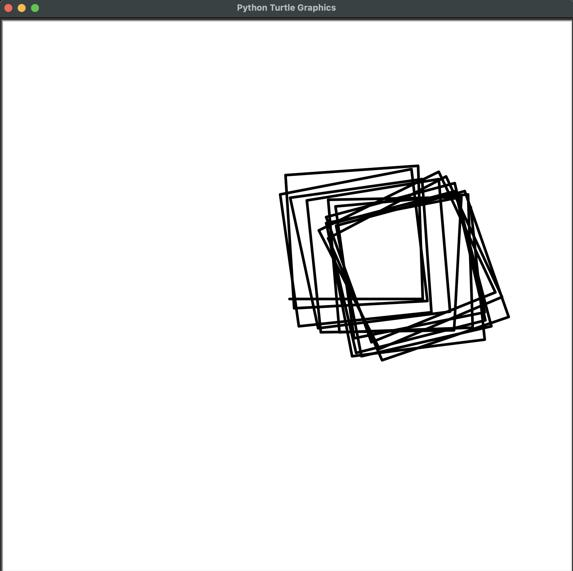](screenshot_square_random4.jpg)

There are a lot of different images we can learn to make with Turtle!


## Quick Review 1

Let's review the Python instructions we've seen so far:

```python
# This is a comment.
```

Everything after the `#` hashtag until the end of a the line is a comment. Comments are notes you can write to remind yourself what the program does. You can write anything in a commnet. They do not change how your program works.

```python
from turtle import *
```

The turtle module must imported before you can call the turtle function. Put `from turtle import *` at the top of your program.

```python
forward(100)  # Move the turtle forward 100 steps.
backward(100)  # Move the turtle backward 100 steps.
forward(-100)  # Move the turtle backward 100 steps.
```

You can move the turtle forward and backward by calling the `forward()` and `backward()` functions. 

```python
left(90)  # Turn left 90 degrees.
right(45)  # Turn right 45 degrees.
```

You can turn the turtle left (counterclockwise) or right (clockwise) by passing the number of degrees to turn to the `left()` and `right()` functions. The turtle only turns and does not change position.

```python
pensize(4)
```

Changes the thickness of the lines that the turtle draws. The default is `1`, but you can pass a larger number as the argument to make thicker lines.


```python
done()
```

Call the `done()` function at the very end of your program so that the Turtle window doesn't automatically close before you can see the finished drawing.


```python
line_length = 25  # This variable stores the number 25.
forward(line_length)
```

You can store values (such as `25`) in variables (such as `line_length`) and use them in other places in your program.


```python
for i in range(4):  
    forward(200)
    left(90)
```

A `for` loop will repeat the indented instructions after it. In this example, the `forward(200)` and `left(90)` code is run four times because of the `range(4)`. This draws the four sides of a square.


```python
speed('fastest')
```

If your program draws a lot of lines, you can speed up the turtle by calling `speed('fastest')`.


```python
hideturtle()
```

If you don't want the triangle of the turtle cursor to appear in the window, call the `hideturtle()` function.

```python
from random import *
forward(randint(1, 100))
```

Instead of a number, you can call the `randint()` function to get a random number. The function call `randint(1, 100)` returns a random number between 1 and 100. You must run `from random import *` before using this function.


## Practice Exercises 1

Create programs that draw the pictures in this section. The solutions are the end of this tutorial. Your code and your pictures don't have to match the pictures here exactly, but they should look about the same. There are many different ways to write the code for these programs.


Create a program named *solution_equilateral_triangle.py* that draws the following picture. *Hint: All lines in the equilateral triangle are 200 steps long. The first turn is 60 degrees. The later turns are 120 degrees.*

[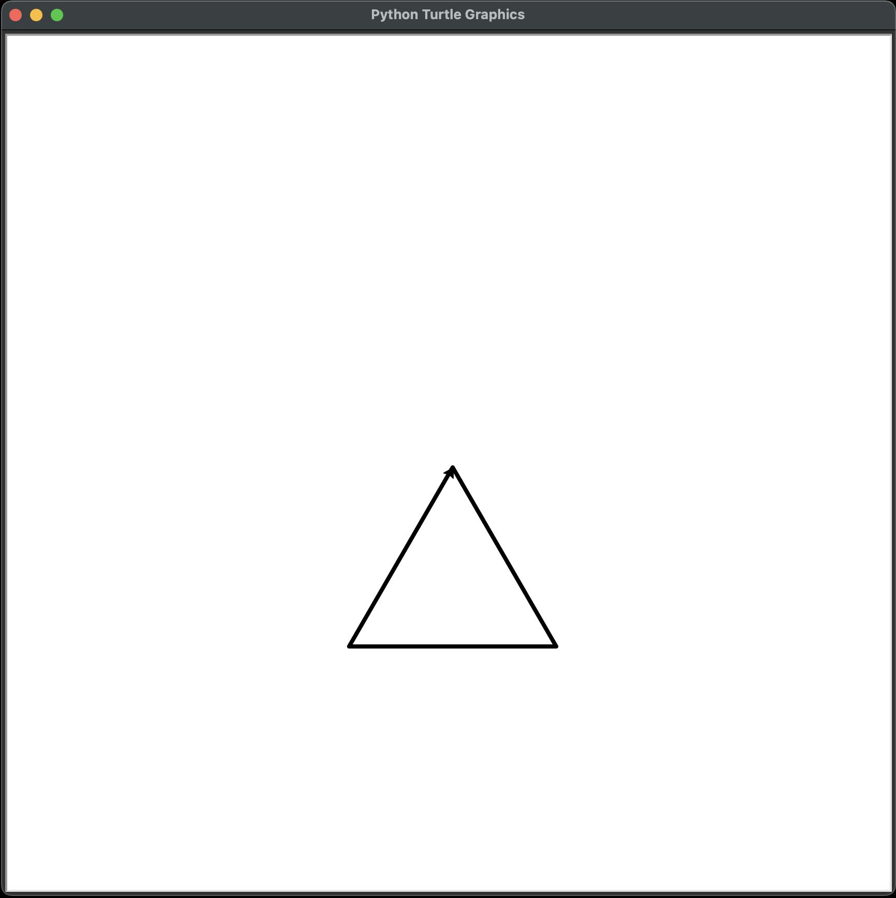](screenshot_solution_equilateral_triangle.jpg)


Create a program named *solution_pentagon.py* that draws the following picture. *Hint: All lines in the pentagon are 200 steps long. All turns are 72 degrees.*

[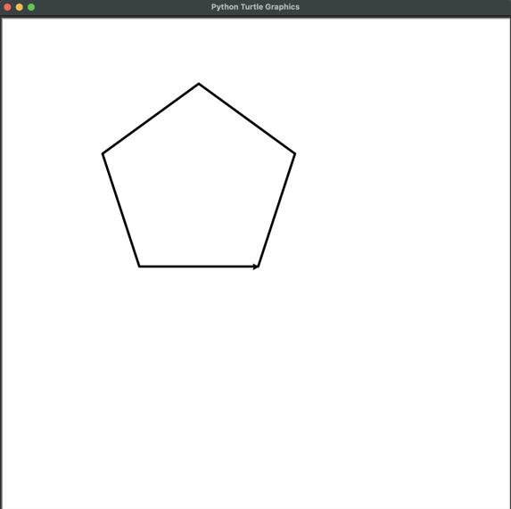](screenshot_solution_pentagon.jpg)


Create a program named *solution_hexagon.py* that draws the following picture. *Hint: All lines in the hexagon are 200 steps long. All turns are 60 degrees.*

[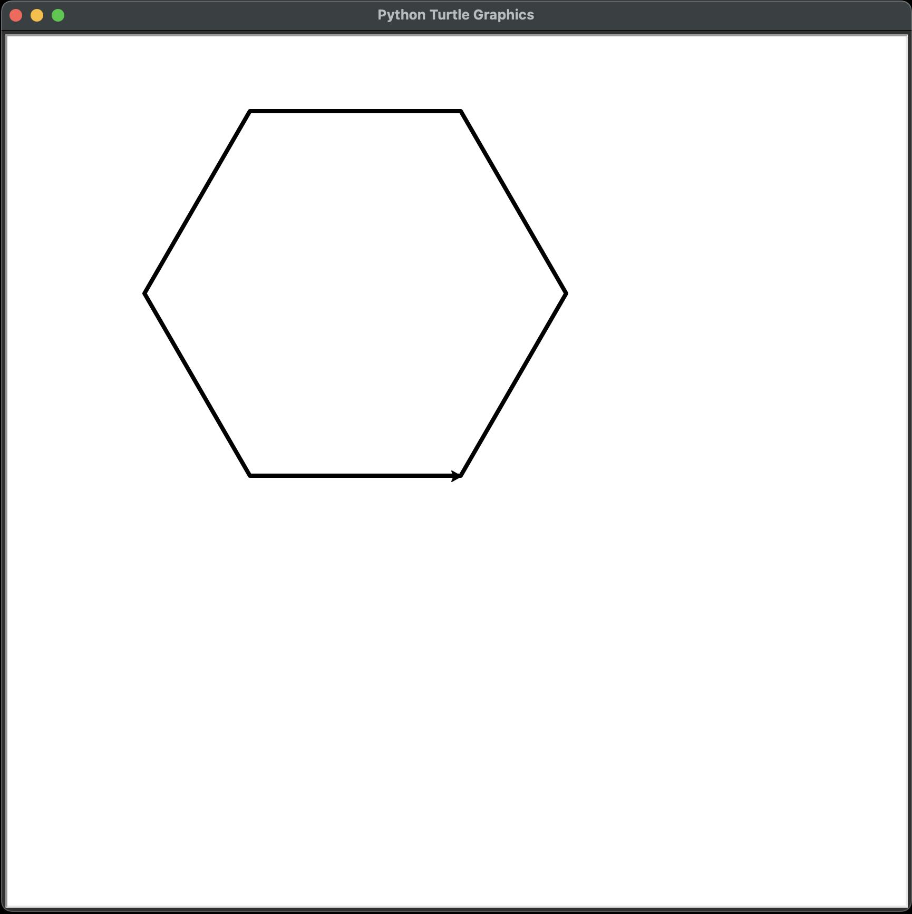](screenshot_solution_hexagon.jpg)


Create a program named *solution_octogon.py* that draws the following picture. *Hint: All lines in the octogon are 100 steps long. All turns are 45 degrees.*

[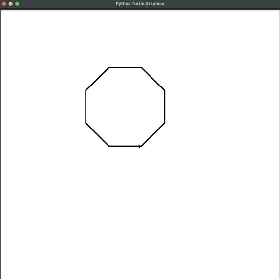](screenshot_solution_octogon.jpg)


Create a program named *solution_right_triangle.py* that draws the following picture. *Hint: For the right triangle, one turn is 90 degrees and the other turn is 135 degrees. Two sides are 200 steps long. According to the Pythagorean Theorem, the third side is 282.8 steps long.*

[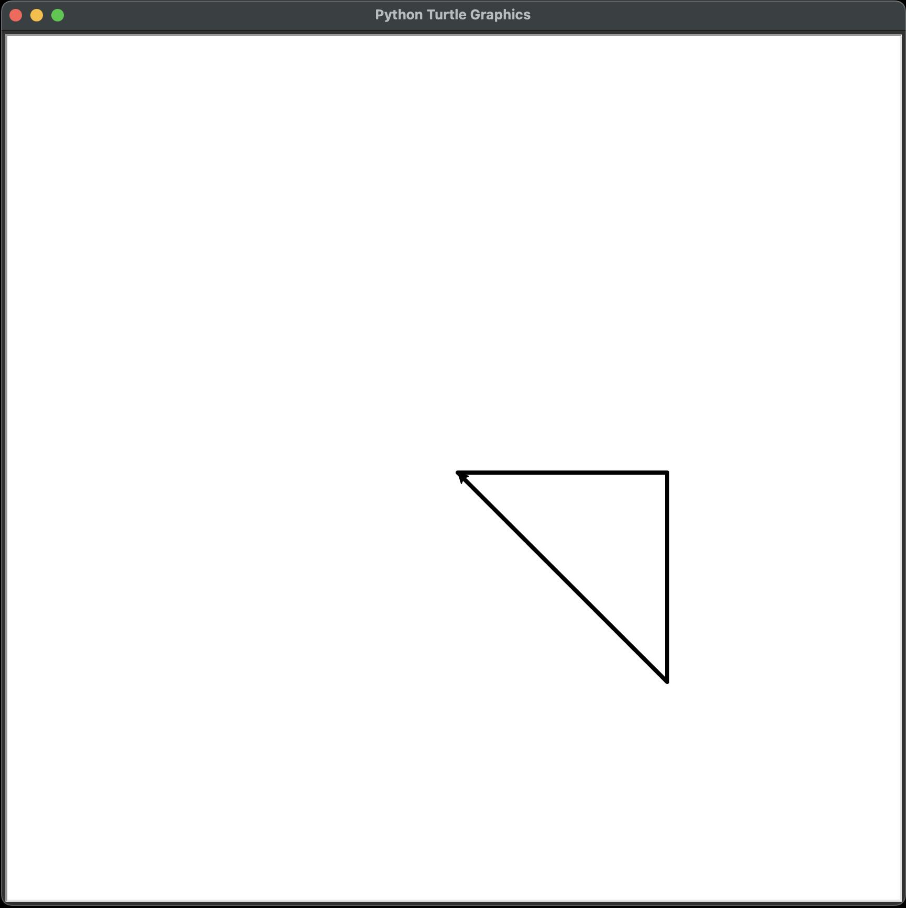](screenshot_solution_right_triangle.jpg)


Create a program named *solution_star.py* that draws the following picture. *Hint: All lines in the star are 200 steps long. All turns are 144 degree turns.*

[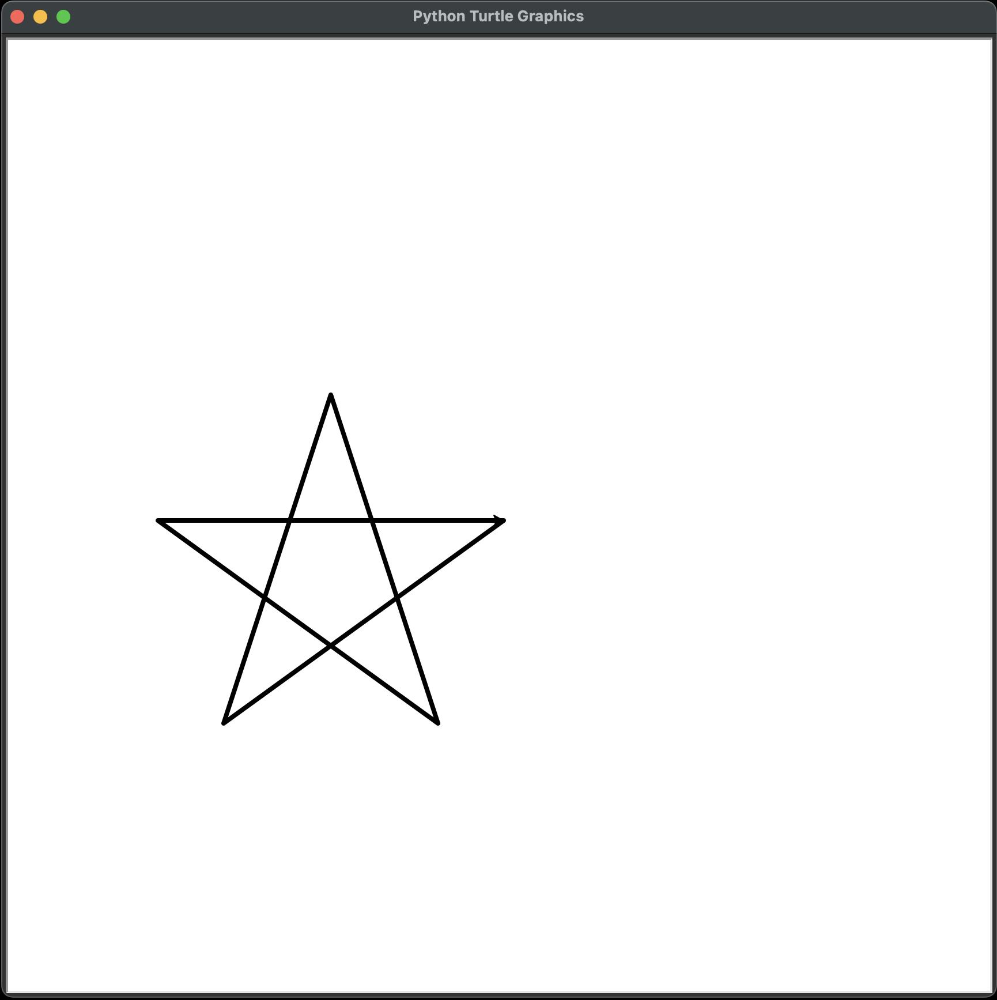](screenshot_solution_star.jpg)


Create a program named *solution_nested_squares.py* that draws the following picture. *Hint: Draw a square with sides of length `100`. Then draw another square with sides of length `150`, then `200`, then `250`, then `300`.*

[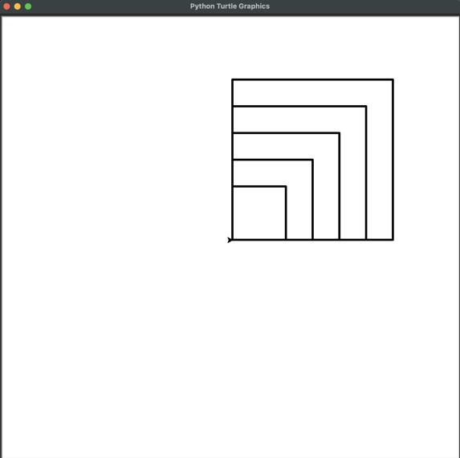](screenshot_solution_nested_squares.jpg)


Create a program named *solution_cross.py* that draws the following picture. *Hint: All lines in the cross are 100 steps long. All turns are 90 degrees, but you must make both left and right turns.*

[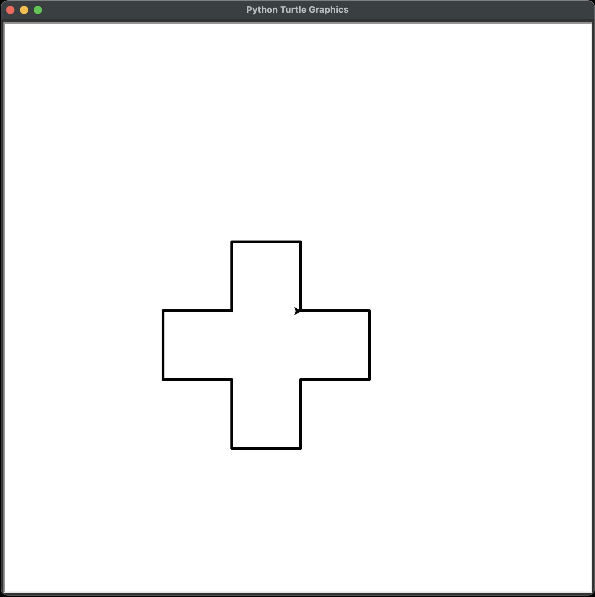](screenshot_solution_cross.jpg)


Create a program named *solution_cube.py* that draws the following picture. *Hint: All lines are 100 steps long.All turns are either 45, 90, or 135 degrees. You might need to overlap some lines to draw the entire cube. You can always run `forward(100)` followed by `backward(100)` if you want to draw a line but return to the original position.*

[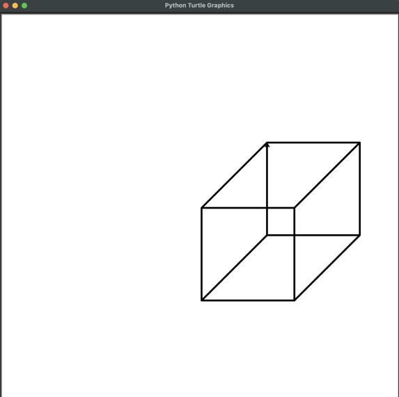](screenshot_solution_cube.jpg)


Create a program named *solution_triforce.py* that draws the following picture. *Hint: There are many ways to draw this. You can overlap lines. All turns are either 60 degrees or 120 degrees. If the outside triangle's line lengths are 100 steps, you may want to sometimes only move the turtle by 50 steps.*

[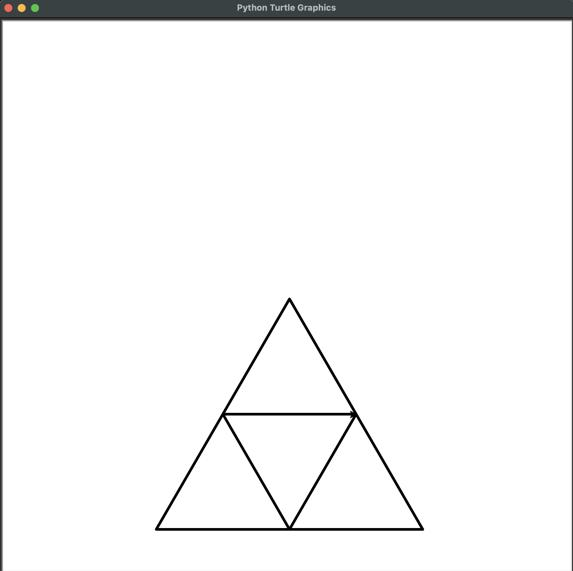](screenshot_solution_triforce.jpg)


## Writing Text in the Turtle Window

The turtle can write text in the Turtle window just like it can draw lines. The `write()` function takes a text string argument and will write it where the turtle is. Let's make a program that writes text in the window. Create a new file in your code editor. Save it as *write_hello.py*. Enter the following Python code:

```python
# write_hello.py

from turtle import *

write('Hello, world!')
forward(80)
right(45)
forward(50)
write('123456789', font=('Arial', 48, 'normal'))
right(45)
forward(30)
write('oOoOoOoOoOo')
done()
```

When you run this program, it looks like this:

[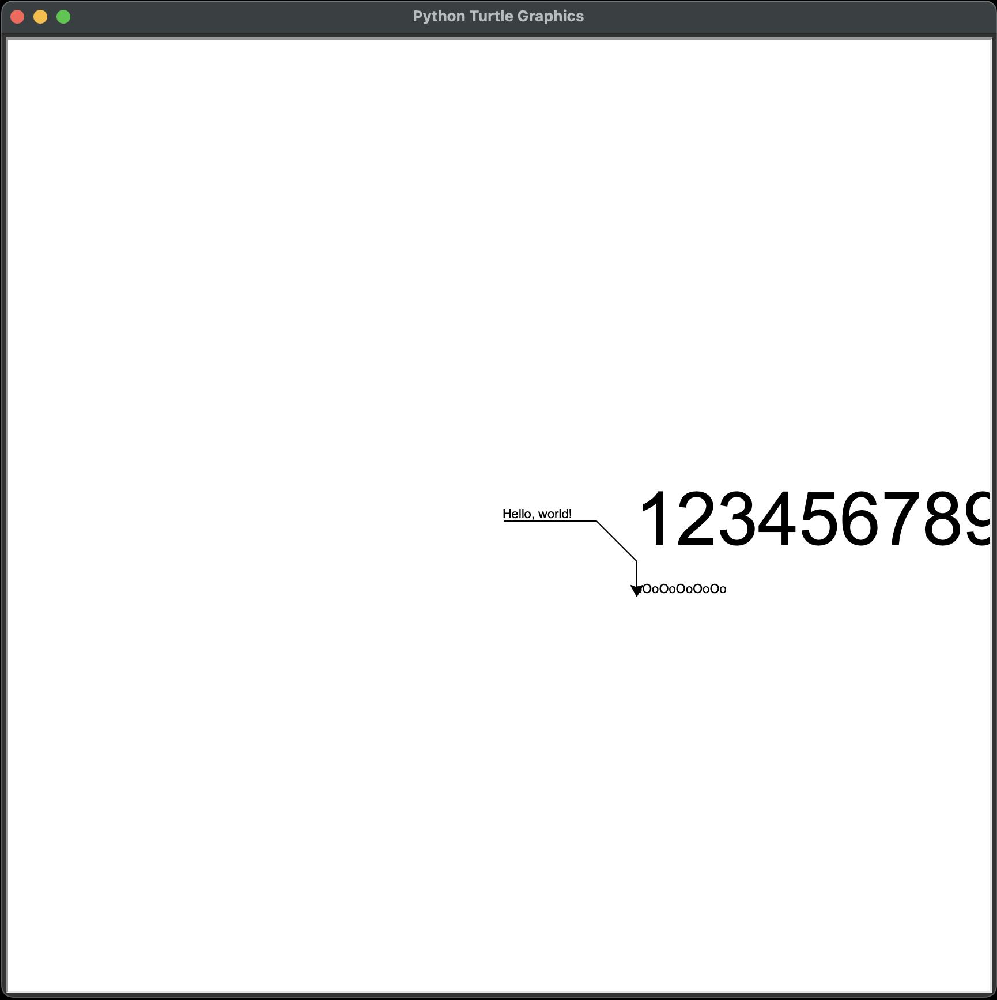](screenshot_write_hello.jpg)

The bottom left corner of the text is at the turtle's location. For example, the code `write('Hello, world!')` appears at the center of the Turtle window where the turtle starts. Then the turtle moves with `forward(80)`, `right(45)`, and `forward(50)`. When `write('123456789', font=('Arial', 24, 'normal'))` runs, the text "123456789" appears at the turtle's new position.

The function call `write('123456789', font=('Arial', 24, 'normal'))` also has a *keyword parameter* named  `font=`. We can pass an argument like `('Arial', 24, 'normal')` to change the font used to write the text in the Turtle window.

There are three parts to the `font=` parameter's argument: 

* The name of the font. (`'Arial'`)
* The size of the font. (`24`)
* The style of the font. (`'normal'`)

If you don't pass an argument, the default font is `('Arial', 8, 'normal')`. You can change the name of the font but it must be installed on your computer. The font size argument must be a number and not a text string: you must pass `8` but not `'8'`. The style argument can either be `'normal'`, `'bold'`, `'italic'`, `'underline'`, or any combination of those words like `'bold italic'`.


## Angles

In Turtle programs, we can measure distance in steps. For example, `forward(100)` moves the turtle a distance of 100 steps. There are also ways that we can measure turns and position using numbers as well.

Imagine yourself in the sky and looking down at the turtle on the ground. If the turtle turns "right" then the turtle is turning clockwise. If the turtle turns to its left, then to us it looks like the turtle is turning counterclockwise.

We measure turning in "degrees." A full turn around is 360 degrees. If the turtle turns 180 degrees, then it ends up facing the opposite direction. A "regular" right or left turn is 90 degrees. If you make four 90 degree turns to the right, you end up facing the original direction. This is because 90 + 90 + 90 + 90 = 360.

We can also use degrees to describe what *heading* or *direction* the turtle is currently facing. When your program first starts, the turtle always begins by facing to the right. This direction is `0` degrees. As the turtle turns **left** (or **counterclockwise**), the direction increases. Facing up is `90` degrees, facing left is `180` degrees, and facing down is `270` degrees. Both `360` and `0` degrees are the same direction: facing right.

The `heading()` function returns the number of what direction the turtle is currently facing. We can pass this to `write()` to make the turtle's current heading appear on the turtle window.

Create a new program called `turtle_directions.py` with the following code:

```python
# turtle_directions.py
from turtle import *

for i in range(24):
    forward(100)  # Move forward in the current direction.
    write(heading(), font=('Arial', 20, 'normal'))  # Write the degrees of the direction.
    backward(100)  # Move back to the center.
    left(15)  # Turn left by 15 degrees and repeat.
done()
```

When you run this program, the Turtle window looks like this:

[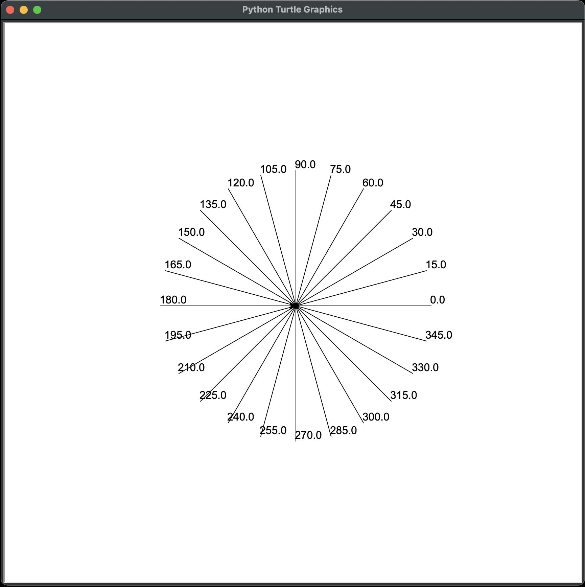](screenshot_turtle_directions.jpg)

The `left()` and `right()` functions make the turtle turn based on its current direction. If the turtle is facing 45 degrees and your program calls `left(90)`, then the turtle's new direction will be 135 because 45 + 90 = 135. However, the `setheading()` function can make the turtle face a new direction no matter what it's current direction is.

The `heading()` function returns a number value of the turtle's current heading.

For example, create a new program named `setheading_turtle.py` with the following code:

```python
# setheading_turtle.py

from turtle import *
from random import *

pensize(4)
left(randint(0, 360))
write(heading())
forward(200)

setheading(45)
write(heading())
forward(200)

done()
```

When you run this program, it turns the turtle to face a random direction, writes the heading (as returned by `heading()`) to the window, and then moves forward in that direction by 200 steps. Then, the `setheading(45)` function call sets the direction of the turtle to 45 degrees. Because of this, the second `write(heading())` line always writes "45.0" to the window. The turtle now points to the top right of the window. Then the turtle moves 200 steps in this new direction.

This means that no matter what heading the turtle had before, `setheading(45)` makes the turtle always face to the top-right. If you run this program several times, it would look something like this:

[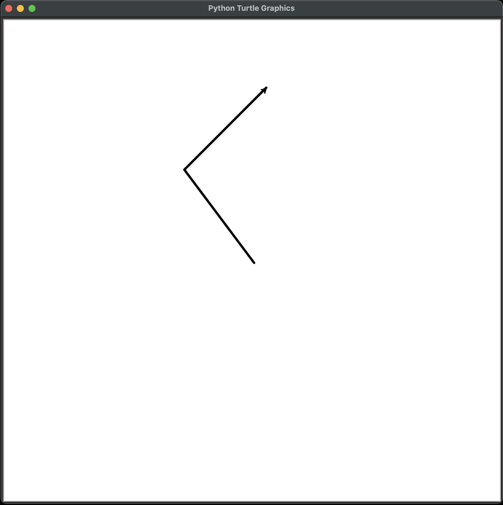](screenshot_setheading_turtle1.jpg)
[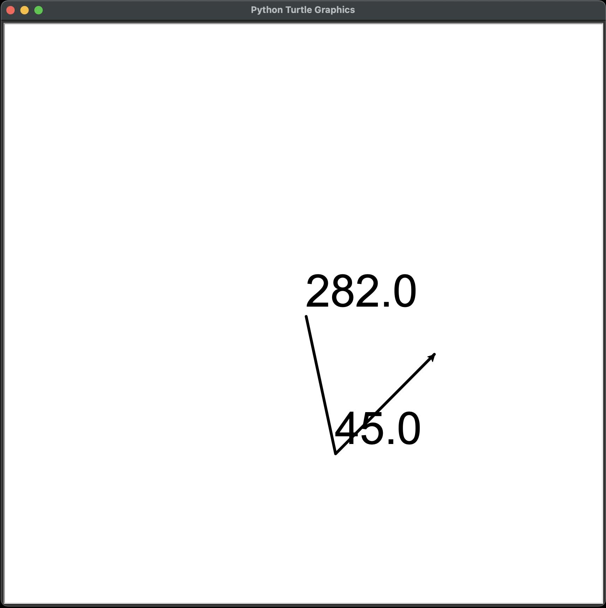](screenshot_setheading_turtle2.jpg)
[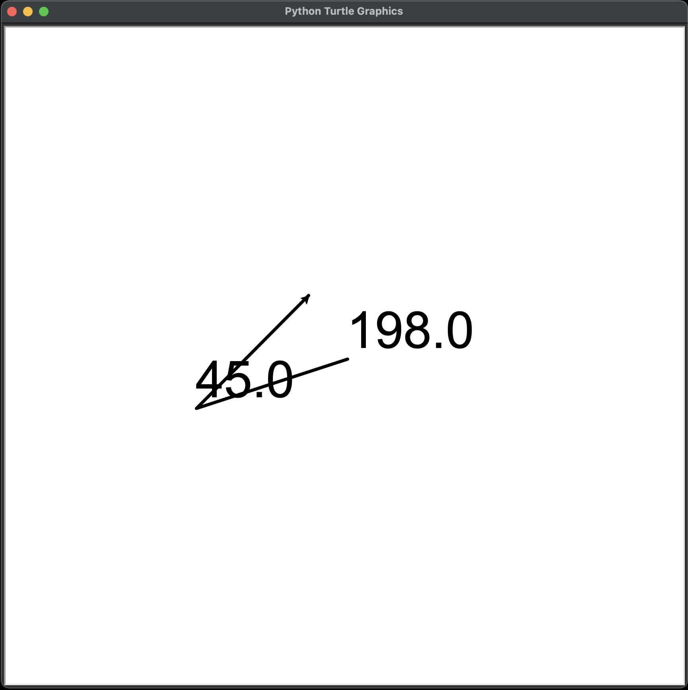](screenshot_setheading_turtle3.jpg)
[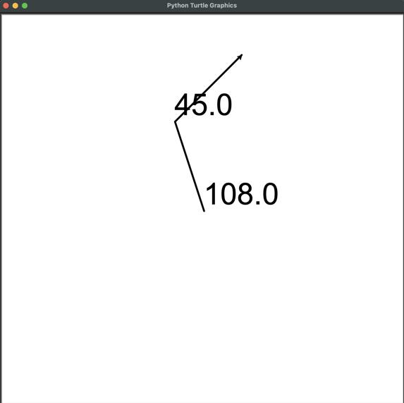](screenshot_setheading_turtle4.jpg)


## XY Cartesian Coordinates

Just as degrees are numbers that can describe where the turtle is facing and how much of a turn it should make, the *position* of the turtle can be represented by two numbers. In the *Cartesian coordinate system*, the *X coordinate* represents how far left or right the turtle is. The *Y coordinate* represents how far up or down the turtle is. Together, the XY coordinates tell you exactly where the turtle is.

* The center of the window is called the *origin* and has XY coordinates of `0` and `0`.
* When written together, the X coordinate is always written first and the Y coordinate second. The coordinates (4, -7) mean the X coordinate is 4 and the Y coordinate is -7.
* The X coordinates increase going right and decrease going left.
* The Y coordinates increase going up and decrease going down.
* A turtle in the left half of the window always has a negative X coordinate.
* A turtle in the right half always has a positive X coordinate.
* A turtle in the bottom half of the window always has a negative Y coordinate.
* A turtle in the top half of the window always has a positive Y coordinate.

This image from Wikipedia shows a Cartesian coordiante system with some example points:

[](cartesian.png)

Let's make a program that writes the XY coordinates in the window as the turtle moves around. Create a new file in your code editor. Save it as *random_position.py*. Enter the following Python code:


```python
# random_position.py
from turtle import *
from random import *

for i in range(8):
    write(position())
    left(randint(0, 90))
    forward(100)

done()
```

When you run this program, the output will look something like this:

[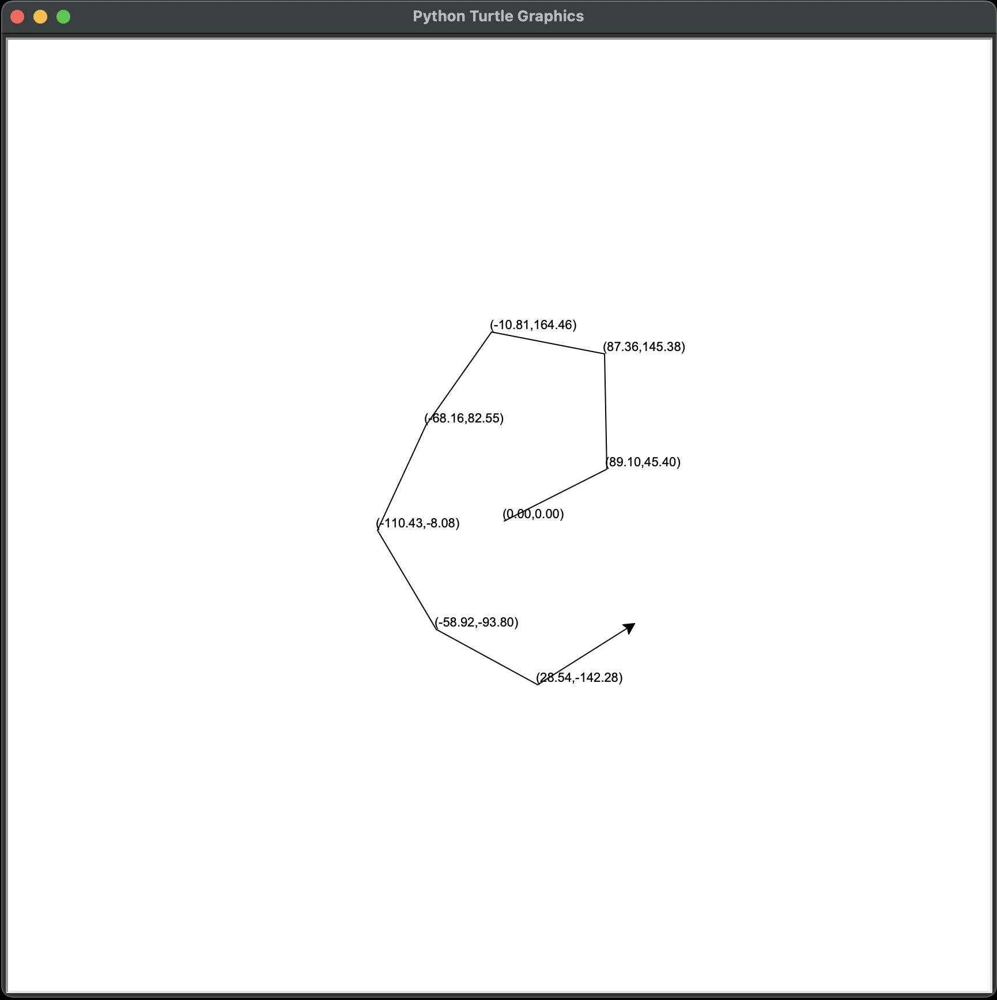](screenshot_random_position.jpg)

The turtle begins at the origin, that is, the XY coordinates 0, 0. Notice that as the turtle moves right or up, the X and Y coordinates increase. As the turtle moves left or down, the X and Y coordinates decrease.

The `forward()` and `backward()` functions always move from the turtle's current position. However, you can move the turtle to specific XY coordinates by calling the `goto()` function and passing the X and Y coordinate.

Let's make a program that moves the turtle to random coordinates. Create a new file in your code editor. Save it as *random_position.py*. Enter the following Python code:

```python
# random_goto.py
from turtle import *
from random import *

pensize(4)

for i in range(6):    
    x = randint(-400, 400)
    y = randint(-400, 400)
    goto(x, y)
    write(position(), font=('Arial', 18, 'normal'))

done()
```

When you run this program, the output will look something like this:

[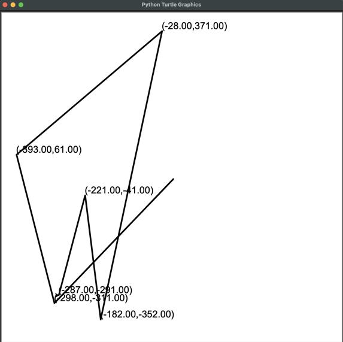](screenshot_random_goto1.jpg)
[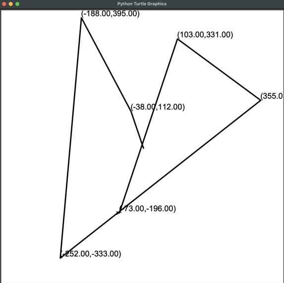](screenshot_random_goto2.jpg)
[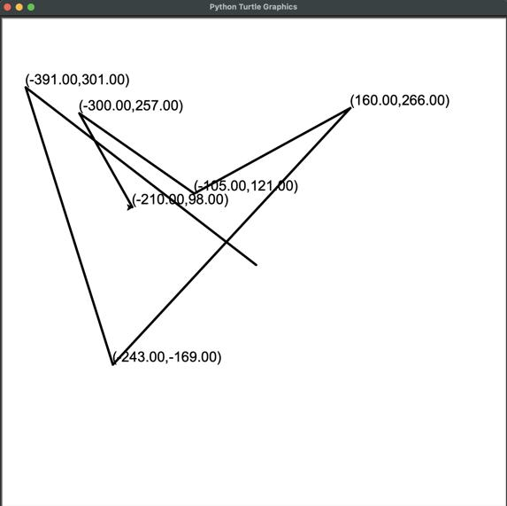](screenshot_random_goto3.jpg)
[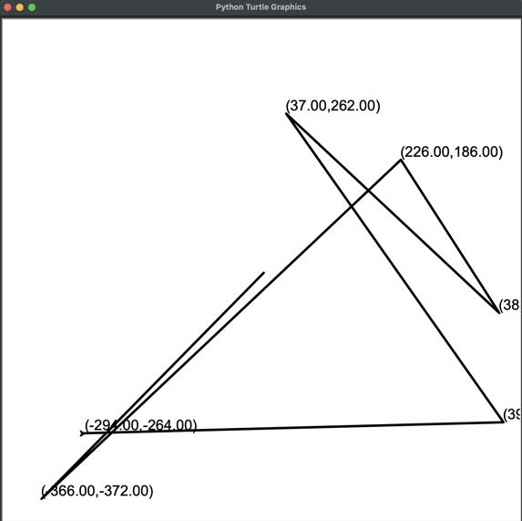](screenshot_random_goto4.jpg)

The `x = randint(-400, 400)` instruction saves a random integer (that is, a random whole number) to the variable `x`. The `y = randint(-400, 400)` instruction does this again for the `y` variable. Then `goto(x, y)` moves the turtle to the coordinates of these random numbers.

These could be 

TODO


## Raising and Lowering the Pen

Imagine the turtle as holding a pen in its mouth. When the pen is touching the ground, the turtle draws a line as it moves. If the pen is raised up off the ground, the turtle does not draw a line as it moves. The `pendown()` and `penup()` functions can control if the turtle draws a line as it moves.

Turtle programs always begin with the pen lowered down on the ground.

Let's create a program that draws a dashed line. Create a new file in your code editor. Save it as *dashed_lines.py*. Enter the following Python code:

```python
# dashed_lines.py
from turtle import *
from random import *

pensize(4)
speed('fastest')

for i in range(12):
    # Face a random direction:
    setheading(randint(0, 360))

    # Make a dashed line in that direction:
    for j in range(6):
        pendown()
        forward(10)  # Draw a line segment.
        penup()
        forward(10)  # Move without drawing a line segment.
    
    # Make one last line segment:
    pendown()
    forward(10)

done()
```


## Stamping

Python's turtle cursor looks like a triangle, not a cursor. However, you can change this by calling the `shape()` function. The `shape()` function takes one of the following arguments: `'arrow'`, `'turtle'`, `'circle'`, `'square'`, `'triangle'`, or `'classic'`.

You can make a copy of this image appear at 

Let's create a program that draws a square spiral. Create a new file in your code editor. Save it as *stamp_lines.py*. Enter the following Python code:


```python
# stamp_lines.py
from turtle import *
from random import *

shape('turtle')
speed('fastest')
penup()

for i in range(12):
    # Face a random direction:
    setheading(randint(0, 360))

    for j in range(6):
        forward(30)  # 30 step gap in between stamps.
        stamp()

done()
```


```python
# sierpinski_game.py
from turtle import *
from random import *

shape('circle')  # Make the turtle cursor a circle.
speed('fast')
penup()

# Set up the coordinates of the three points of the triangle: A, B, and C
# (You can change these coordinates to anything you like!)

# Point A is at the top-middle:
AX = 0
AY = 400
goto(AX, AY)
stamp()

# Point B is at the lower left:
BX = -400
BY = -400
goto(BX, BY)
stamp()

# Point C is at the lower right:
CX = 400
CY = -400
goto(CX, CY)
stamp()

# Start the turtle at point A:
x, y = AX, AY

# Make 1,200 circle stamps:
for i in range(1200):
    # Randomly pick one of the three points to move towards:
    r = randint(1, 3)

    if r == 1:
        # Move to halfway to point A:
        setheading(towards(AX, AY))
        forward(distance(AX, AY) / 2)
    if r == 2:
        # Move to halfway to point B:
        setheading(towards(BX, BY))
        forward(distance(BX, BY) / 2)
    if r == 3:
        # Move to halfway to point C:
        setheading(towards(CX, CY))
        forward(distance(CX, CY) / 2)

    # Stamp at the new location.
    stamp()

done()
```


## Square Spirals Examples

Let's create a program that draws a square spiral. Create a new file in your code editor. Save it as *spiral.py*. Enter the following Python code:

```python
# spiral.py
from turtle import *

speed('fastest')
for i in range(300):
    forward(i)  # Use the i variable for the function argument.
    left(91)
hideturtle()
done()
```

When you run this program, it looks like this:

[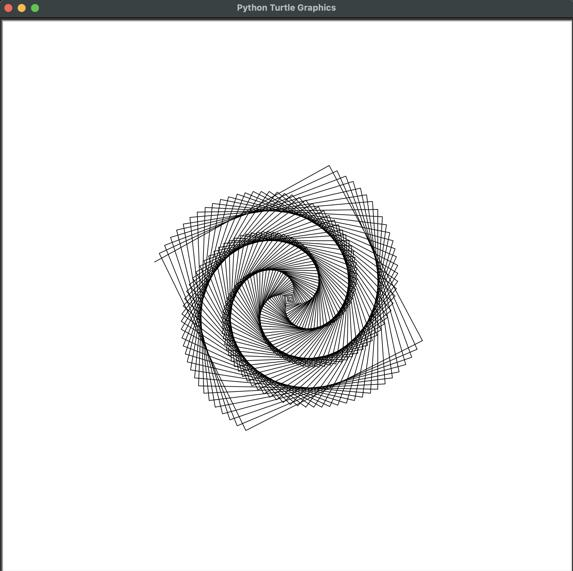](screenshot_spiral.jpg)

In our previous programs with `for` loops, we have ignored the `i` variable. But in this program, we use `i` variable in the line `forward(i)`.

In this `for` loop, the variable `i` is set to `0` when it runs the code inside the loop. The instruction `forward(i)` is really running `forward(0)`. On the next time through the loop, `i` is set to `1` and `forward(i)` now means `forward(1)`. The `for` loop keeps increasing the `i` variable and running the code in the loop. 

The `i` variable goes up to, but not including, `300` because we wrote the code `for i in range(300):`. This means that on the last time through the loop, the `i` variable is set to `299`.

This means our program does this:

```python
from turtle import *

speed('fastest')

forward(0)
left(91)
forward(1)
left(91)
forward(2)
left(91)
forward(3)
left(91)
forward(4)
left(91)

# Several more lines of code go here...

forward(297)
left(91)
forward(298)
left(91)
forward(299)
left(91)

hideturtle()
done()
```

Using the `for` loop saves us from a lot of typing!


*spiral_red.py*

```python
# spiral_red.py
from turtle import *

speed('fastest')
pencolor('red')  # Make the lines red.
for i in range(300):
    forward(i)
    left(91)
hideturtle()
done()
```

[](screenshot_spiral_red.jpg)

Try changing 91 to 30, 45, 60, 90, 120, 150, and 46, 61, 91, 120, 151. Finally, try 179 and 180.

*spiral_color.py*

```python
# spiral_color.py
from turtle import *
from random import *

colors = ['red', 'orange', 'yellow', 'blue', 'green', 'purple']

speed('fastest')
for i in range(300):
    pencolor(choice(colors))
    forward(i)
    left(91)
hideturtle()
done()
```

[](screenshot_spiral_color.jpg)


*spiral_black_bg.py*

```python
# spiral_black_bg.py
from turtle import *
from random import *

colors = ['red', 'orange', 'yellow', 'blue', 'green', 'purple']

speed('fastest')
pensize(3)
bgcolor('black')
for i in range(300):
    pencolor(choice(colors))
    forward(i)
    left(91)
hideturtle()
done()
```

[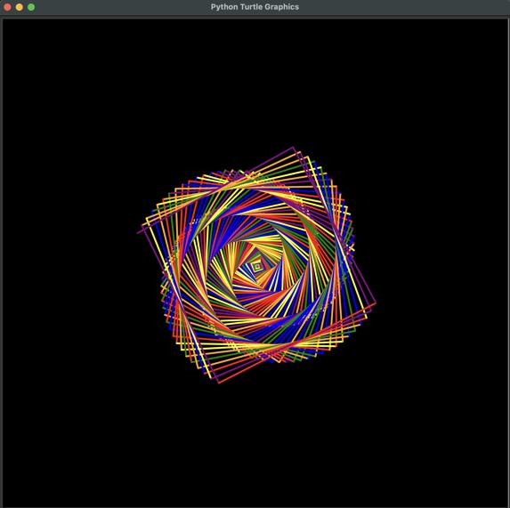](screenshot_spiral_black_bg.jpg)


*spiral_pretty.py*

```python
# spiral_pretty.py
from turtle import *

speed('fastest')
pensize(3)
bgcolor('black')

pencolor('red')
for i in range(60):
    forward(i)
    left(91)

pencolor('orange')
for i in range(60):
    forward(60 + i)
    left(91)

pencolor('yellow')
for i in range(60):
    forward(120 + i)
    left(91)

pencolor('green')
for i in range(60):
    forward(180 + i)
    left(91)

pencolor('blue')
for i in range(60):
    forward(240 + i)
    left(91)

pencolor('purple')
for i in range(60):
    forward(300 + i)
    left(91)

done()
```

[](screenshot_spiral_pretty.jpg)


## Interactive Drawing

*click_square.py*

```python
# click_square.py
from turtle import *

speed('fastest')

def draw_square(x, y):
    goto(x, y)  # TODO
    for i in range(4):
        forward(100)
        left(90)

# When the turtle window is clicked, call draw_square():
getscreen().onclick(draw_square)
done()
```


*click_square_no_line.py*


```python
from turtle import *

speed('fastest')

def draw_square(x, y):
    penup()  # TODO 
    goto(x, y)
    pendown()  # TODO
    for i in range(4):
        forward(100)
        left(90)
    update()

getscreen().onclick(draw_square)
done()
```


```python
from turtle import *
from random import *

tracer(1000, 0)  # TODO

def draw_spiral(x, y):
    penup()
    goto(x, y)
    pendown()
    setheading(0)
    line_length = randint(50, 200)
    turn_radius = randint(50, 70)
    for i in range(100):
        forward(i)
        left(turn_radius)
    update()

getscreen().onclick(draw_spiral)
done()  # Make turtle wait for clicks.
```

```python
from turtle import *
from random import *

tracer(1000, 0)

def draw_spiral(x, y):
    penup()
    goto(x, y)
    pendown()
    setheading(0)
    line_length = randint(50, 200)
    turn_radius = randint(50, 70)
    for i in range(100):
        forward()
        left(turn_radius)
    update()

# When the turtle window is clicked, call draw_spiral():
getscreen().onclick(draw_spiral)

listen()  # Put the turtle window in focus.
done()  # Make turtle wait for clicks.
```


```python
# Draw a rose.
from turtle import *
from random import *

tracer(1000, 0)

def draw_square(x, y):
    penup()
    goto(x, y)
    pendown()
    setheading(0)
    for i in range(100):
        pencolor((random(), 0, 0))
        pensize(randint(2, 5))
        forward(i)
        left(randint(50, 70))
    update()


bgcolor('black')
pencolor('red')
pensize(4)

# When the turtle window is clicked, call draw_sqaure():
getscreen().onclick(draw_square)

listen()  # Put the turtle window in focus.
done()  # Make turtle wait for clicks.
```


## Filled-In Shapes


TODO


## Draw Circles


TODO

TODO - draw snowpal


## Example Programs

https://inventwithpython.com/recursion/chapter9.html

TODO - simple polygons

TODO - click to draw a splat (random color, num lines, lengths, and pen size)

TODO - checkboard

TODO - random grid of various sizes

TODO - racing game? key press spamming

TODO - rainbow

TODO - randow walk (with 0, 90, 180, or 270 degree turns and random starting angle)

TODO - fractal tree

TODO - sierpinski triangle

TODO - hilbert curve


This is a program that draws blue flowers:

```python
from turtle import *
from random import *

tracer(1000, 0)

for n in range(50):
    penup()
    x = randint(-300, 300)
    y = randint(-300, 300)
    goto(x, y)
    pendown()

    pencolor((0, 0, random()))

    circle_size = randint(10, 40)
    pensize(randint(1, 5))

    for i in range(6):
        circle(circle_size)
        left(60)
update()
done()
```

[](blue_flowers.jpg)


## For More Information

https://docs.python.org/3/library/turtle.html

https://docs.python.org/3/library/turtle.html#turtle-methods


